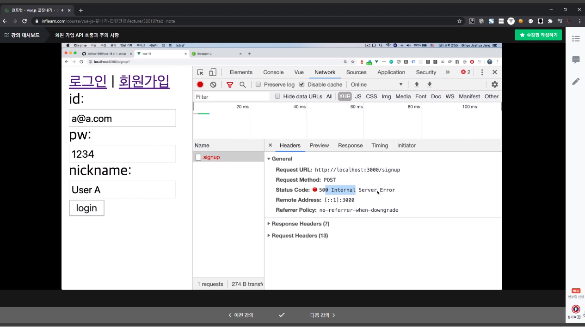
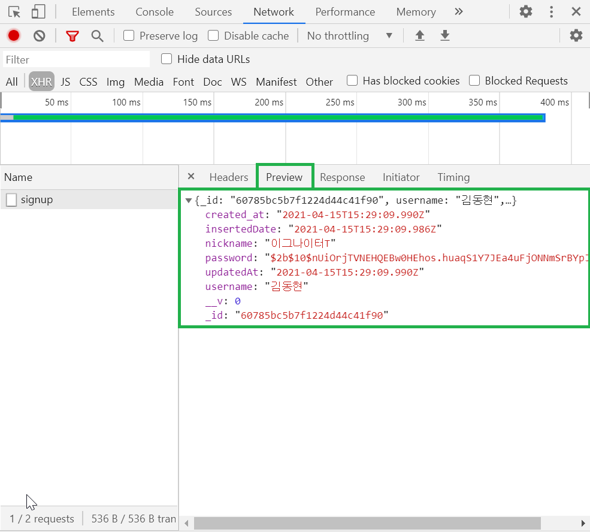
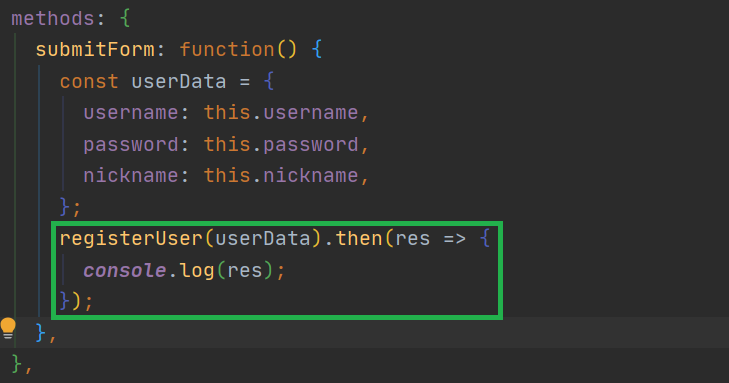
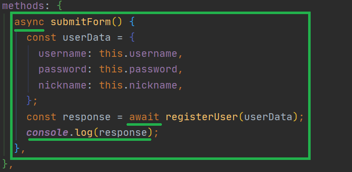

📌 axios
-
* 비동기 요청을 편하게 하기 위한 자바스크립트 라이브러리가 있다.


<br/>

📌 axios 설치
-
* axios라는 라이브러리인데, 아래와 같은 명령어로 설치할 수 있다.
```text
npm i axios
```

* 설치하고 나면, 아래와 같은 라이브러리가 package.json에 추가됨을 알 수 있다.
```text
"axios": "^0.21.1",
```


<br/>

📌 axios 기본 사용법
-
```javascript
// 포함
import axios from 'axios';

// 요청
axios.post();
```


<br/>


📌 axios 별도 관리
-
* 기본적으로 프론트엔드에선 axios를 많이 사용할 것이기 때문에 아래와 같은 형식으로 별도 파일에서 구조화 하여 관리 할 수 있도록 합니다.
```javascript
import axios from 'axios';

function registerUser() {
    ...
}

export {
    registerUser
}
```

* 완성된 소스는 아래와 같습니다.
```javascript
import axios from 'axios';

function registerUser() {
  const url = 'http://localhost:3000/signup';
  return axios.post(url, undefined, undefined);
}

export { registerUser };
```

* 별도로 해더를 첨부하고 싶은 경우 아래와 같이 합니다
```javascript
import axios from 'axios';

function registerUser() {
  const url = 'http://localhost:3000/signup';
  return axios.post(url, undefined, {
                                        headers: {
                                          'X-AUTH-TOKEN': joinToken,
                                        },
                                      });
}

export { registerUser };
```


* 사용할 때는 아래와 같은 방법으로 사용합니다.
```javascript
import { registerUser } from '@/api/index';


// 메소드 호출하기
registerUser();
```

* api에 대한 응답 결과는 개발자 도구 Network 의 XHR 탭으로 확인을 하도록 합니다.

* preview를 통해서 확인하면 조금 더 간편합니다.



<br/>

📌 비동기에 대한 결과 처리
-
* axios는 기본적으로 promise 객체를 반환하기 때문에, 결과 처리를 위해서 then을 사용할 수 있다.



* async와 await를 이용한 방법
```javascript
async function 함수명() {
  await 비동기_처리_메서드_명();
}
```
* 여기서 async 키워드는 프로미스 객체를 반환함을 의미합니다. 저 키워드를 붙이면, 항상 프로미스 객체를 반환하기 때문에 await 키워드로 받을 수 있게 됩니다.
* await 키워드는 프로미스가 반환하는 결과를 기다립니다. then 메소드로 처리하는 것과 비슷합니다. 여기서 주의할 점은, await 키워드는 반환하는 객체가 프로미스일때만 정상 작동합니다.

* async 사용예제
```javascript
async function f() {
  return 1;
}

f().then(alert); // 1
```

* 실전 예제



<br/>

📌 api 공통화
-
```javascript
import axios from 'axios';

const config = {
  baseUrl: 'http://localhost:3000/',
};

function registerUser(userData) {
  return axios.post(`${config.baseUrl}signup`, userData, undefined);
}
```
> 이런식으로 공통으로 사용하는 url을 묶을 수 있다.
> 그러나, axios에서 기본 제공하는 함수를 사용해보자.


```javascript
import axios from 'axios';

const ins = axios.create({
  baseURL: 'http://localhost:3000/',
});

function registerUser(userData) {
  return ins.post('signup', userData, undefined);
}
```
> 코드가 굉장히 깔끔해졌다.


* 사용
```javascript
import { deletePost } from '@/api/posts';

... 중략
  methods: {
    async deleteItem() {
      if (confirm('You want to delete it?')) {
        await deletePost(this.postItem._id);
        this.$emit('refresh');
      }
    },
... 중략

```


    


