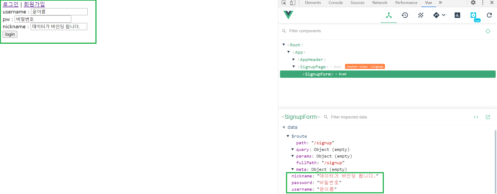
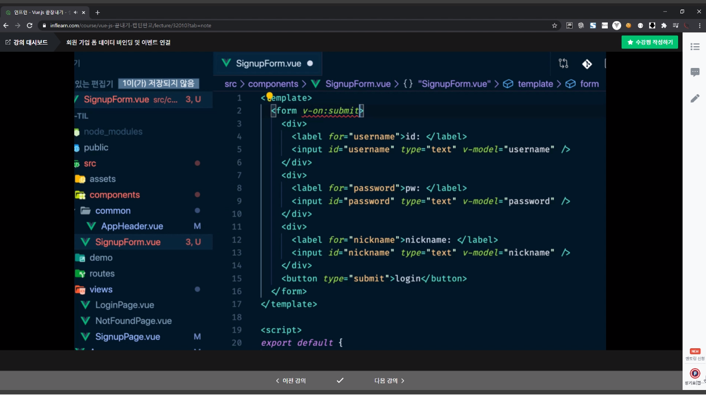

📌 vue 문법 정리
-
vue 문법에 대해 자세하게 알고 싶다면, 아래의 깃허브를 참고한다. 각각의 chapter의 md 파일 들을 확인하면 된다.
* <https://github.com/donghyeon0725/vue_tutorials>


<br/>

📌 양방향 바인딩
-
```javascript
// html 컴포넌트에
v-model="password"

// 뷰 인스턴스에
data() {
    return {
      password: '',
    };
},
```

* 확인 => 개발자 도구를 통해서 바인딩 되었는지 확인이 가능함



<br/>

📌 이벤트 버블링
-

* 이미지의 모습은, button에서 발생한 이벤트가 상위 태그인 form으로 전달이 되고 있음을 설명하고 있다.

> 이벤트 받기
```javascript
// DOM에 부착
v-on:submit="submitForm"
// 또는
@submit="submitForm"
// 응용 => 기본동작은 막기 (submit & 새로고침)
@submit:prevent="submitForm"
```


