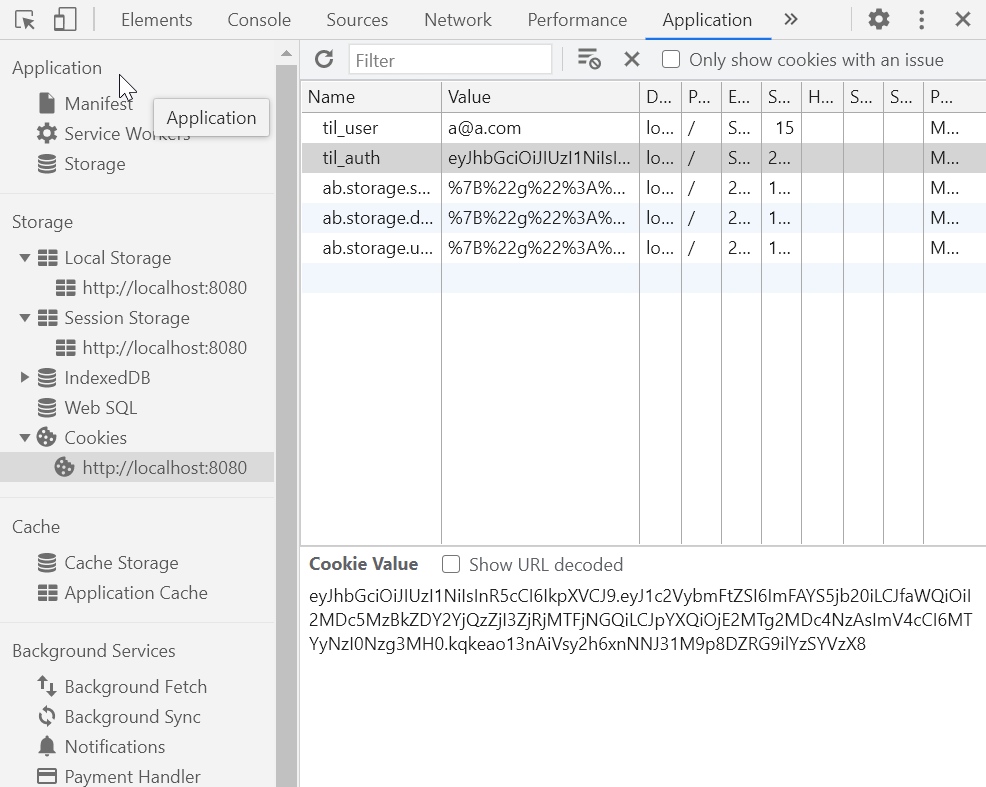
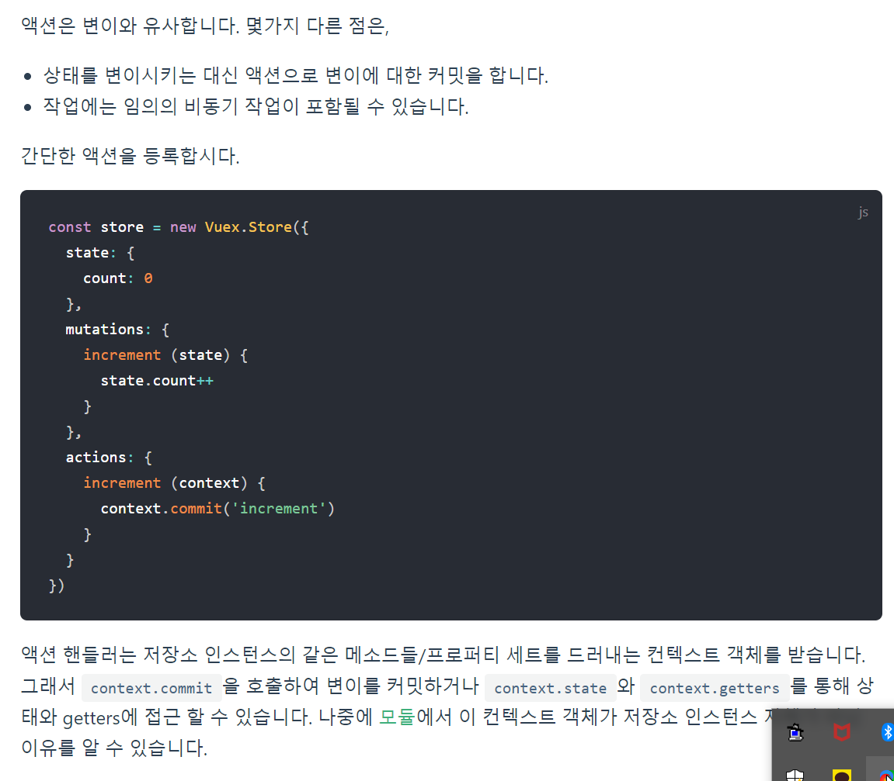

📌 쿠키 모듈화하기
-
* vuex를 사용하면, 자바스크립트 단에 저장을 하는 것이기 때문에 리로딩을 했을 때 페이지의 정보가 모두 날아간다. 따라서 쿠키에 저장할 필요가 있다. 
* 한편, 쿠기에 값을 set 하고 get 하는 것은 지속적으로 같은 로직으로 동작할 것이므로, 쿠키 setter getter 메소드는 자신이 직접 짤 필요 없이 기존에 있던 것을 가져다가 쓰면 됨. 예제 코드는 아래와 같다.
```javascript
function saveAuthToCookie(value) {
  document.cookie = `til_auth=${value}`;
}

function saveUserToCookie(value) {
  document.cookie = `til_user=${value}`;
}

function getAuthFromCookie() {
  return document.cookie.replace(
    /(?:(?:^|.*;\s*)til_auth\s*=\s*([^;]*).*$)|^.*$/,
    '$1',
  );
}

function getUserFromCookie() {
  return document.cookie.replace(
    /(?:(?:^|.*;\s*)til_user\s*=\s*([^;]*).*$)|^.*$/,
    '$1',
  );
}

// deleteCookie('til_auth'), deleteCookie('til_user')
function deleteCookie(value) {
  document.cookie = `${value}=; expires=Thu, 01 Jan 1970 00:00:01 GMT;`;
}

export {
  saveAuthToCookie,
  saveUserToCookie,
  getAuthFromCookie,
  getUserFromCookie,
  deleteCookie,
};

```


<br/>


📌 쿠키 저장소 확인하기
-
* 개발자 도구의 application 탭을 확인하면 된다.



<br/>


📌 vuex의 단점을 보완하기 위해서, 쿠키와 vuex 연결하기
-
> 값을 가져올 때
* state의 값을, cookie로 부터 꺼내오는 방법이 있다.
* vuex store 내부의 state 속성으로 아래와 같이 추가해준다.
* 이때, getAuthFromCookie 메소드와 getUserFromCookie 메소드는 위 예제 코드를 import 한 것이다.
```javascript
    // vuex store 내부의 state 속성으로 아래와 같이 추가해준다.
  state: {
    username: getAuthFromCookie() || '',
    token: getUserFromCookie() || '',
  },
```
* (위 코드는, 피연산자에 의해 true인 값이 return 된다.)

> 값을 세팅할 때
* vuex에 action 속성을 추가한다.
    * action이란 mutation의 메소드를 부르는 작업을 위치 시키는 곳으로 비동기 처리 또한 여기서 진행 될 수 있다.
    * [링크](https://vuex.vuejs.org/kr/guide/actions.html) 를 참고한다.
    

* 아래와 같이 사용한다.
    * 첫 번째 인자로는 commit 작업을 호출할 수 있는 객체를 받는다.
    ```javascript
    actions: {
        async LOGIN({ commit }, userData) {
          // 로그인을 수행해서, 토큰을 받아온다.
          const { data } = await loginUser(userData);
          
          // 커밋 작업으로 store에 값을 세팅한다. (또는 쿠키로 저장해두고 페이지를 리로드 처리한다)
          commit('setToken', data.token);
          commit('setUsername', data.user.username);
          
          // 쿠기로 저장한다.
          saveAuthToCookie(data.token);
          saveUserToCookie(data.user.username);
    
          return data;
        },
    }
    ```
   * 작성한 action 을 아래와 같은 방법으로 호출한다.
   ```javascript
   store.dispatch('LOGIN', {name:'kim'})
   // await this.$store.dispatch('LOGIN', userDataJson);
   ```
   * 이 때, await를 붙여준 이유는 LOGIN이 async 동작(비동기)이기 때문이다. 그리고 await를 사용한 메소는 프로미스 객체를 리턴해야 하므로 async 키워드를 메소드 앞에 붙여야한다.
  
  
   


<br/>

📌 흐름 요약
-   
* vuex의 store는 브라우저(자바스크립트단)에 저장되는 임시 저장소로 리로드하면 날아가버린다. 
* 허나 컴포넌트의 중앙 저장소이기 때문에 여기에 로그인 정보가 저장되어야 하는 것은 맞으나 쿠키와 연결해서 사용할 필요가 있다.
* 이 때, state 속성 값(로그인여부)을 변화 시키기 위해 사용 하는 속성은 mutation이고 이 작업을 호출하기 위해 사용하는 속성은 action 이다.
* 여기서 만든 action을 호출할 땐 dispatch 메소드를 이용한다.
