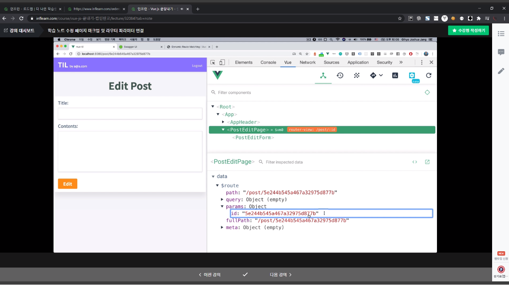
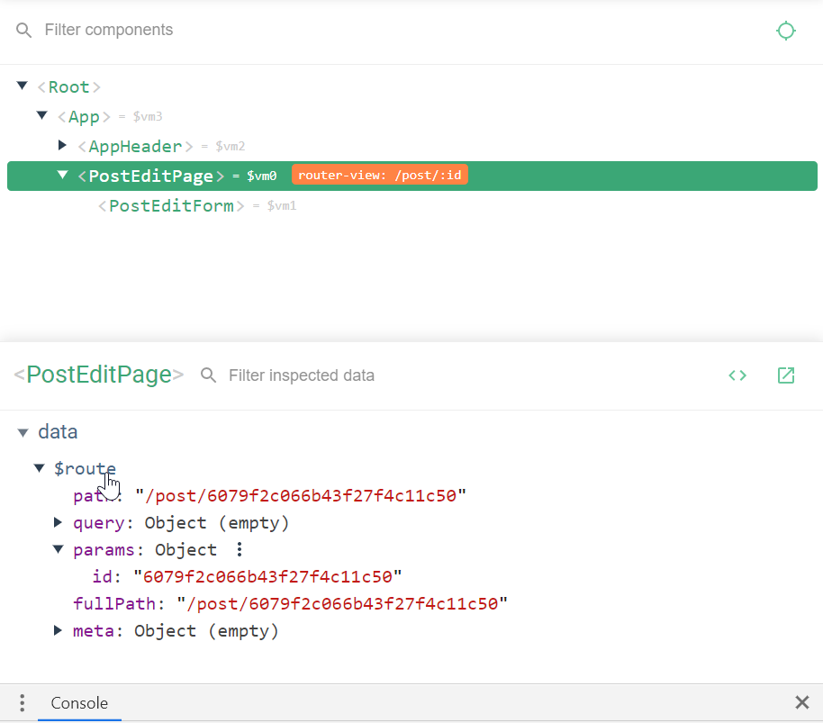

📌 다이나믹 라우팅 매칭
-
* 수정 페이지와 같이, "같은 url + 다른 id값" 형식의 url으로 요청하나, 같은 컴포넌트를 보여줘야 하는 경우가 있다. 이럴 때 필요한 것이 바로 다이나믹 라우트 매칭이다.
* [링크](https://router.vuejs.org/kr/guide/essentials/dynamic-matching.html) 를 참고하도록 하자


<br/>

📌 사용법
-
```javascript
{
  path: '/post/:id',
  component: () => import('@/views/PostEditPage.vue'),
},
// url : /post/1234 => PostEditPage.vue SHOW
// 넘어온 url 뒷 부분은 id 라는 키에 매칭
```


<br/>

📌 넘어온 url 값 받는 방법
-
*  개발자 도구를 열어보면 아래와 같은 값이, id 라는 키에 매칭이 되어 넘어온 것을 확인할 수 있다.

* 확대하면

* PostEditPage.vue 모듈에, id 라는 키에 값이 매칭되어 넘어왔다. 이를 아래와 같이 받을 수 있다.
```javascript
this.$route.params.id
```


