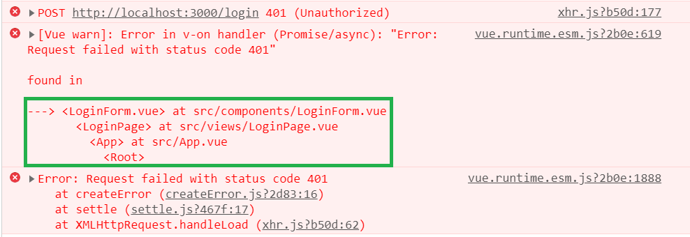
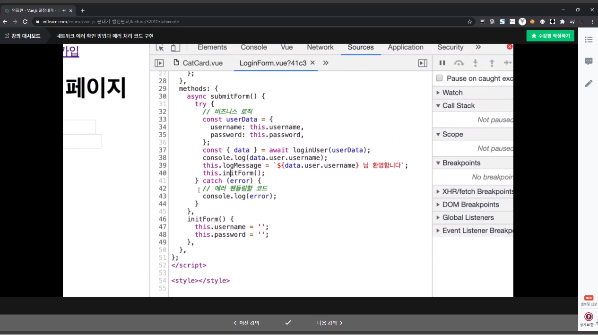

📌 에러 처리
-
* 보통 뷰에서, 에러는 아래와 같은 에러가 자주 발견되곤 한다.

* 이는 에러가 어디 즈음 났는지 정도만 알려주기 때문에, 제대로 된 디버깅이 어렵다. 따라서 아래와 같은 에러 핸들링 코드를 작성해주도록 한다.

```javascript
try {
    // 비지니스 로직
} catch (error) {
    // 에러 핸들링할 코드
}
```


* 아래와 같은 방법으로 사용했을 때, 에러가 어디서 나고 있는지 정확하게 알려주는 모습이다.
```javascript
try {
  const userData = {
    username: this.username,
    password: this.password,
  };

  const {
    data: { message, token },
  } = await loginUser(userData);

  console.log(token);
  this.loginMessage = `${message}님 환영합니다.`;
} catch (e) {
  console.log(e.response); // 에러 내용을 받아본다.
  this.loginMessage = e.response.data;
} finally {
  this.initForm();
}
```


* 특히, 2xx 코드가 아닌 경우, 에러 상태로 보고 코드 동작이 멈출 수 있기 때문에 에러 처리를 잘 해주어야 한다.


