📌 eslint가 제대로 설치되었는지 확인
-
```javascript
var a = 10;
```
위 코드를 입력했을 때 빨간줄이 생겨야 함

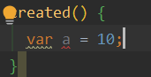


<br/>

📌 cannot find module 'eslint-plugin-vue' 에러가 나는 경우
-
아래와 같은 명령어로 설치를 진행 후 설정을 맞춰준다.
```text
npm install eslint-plugin-vue
```

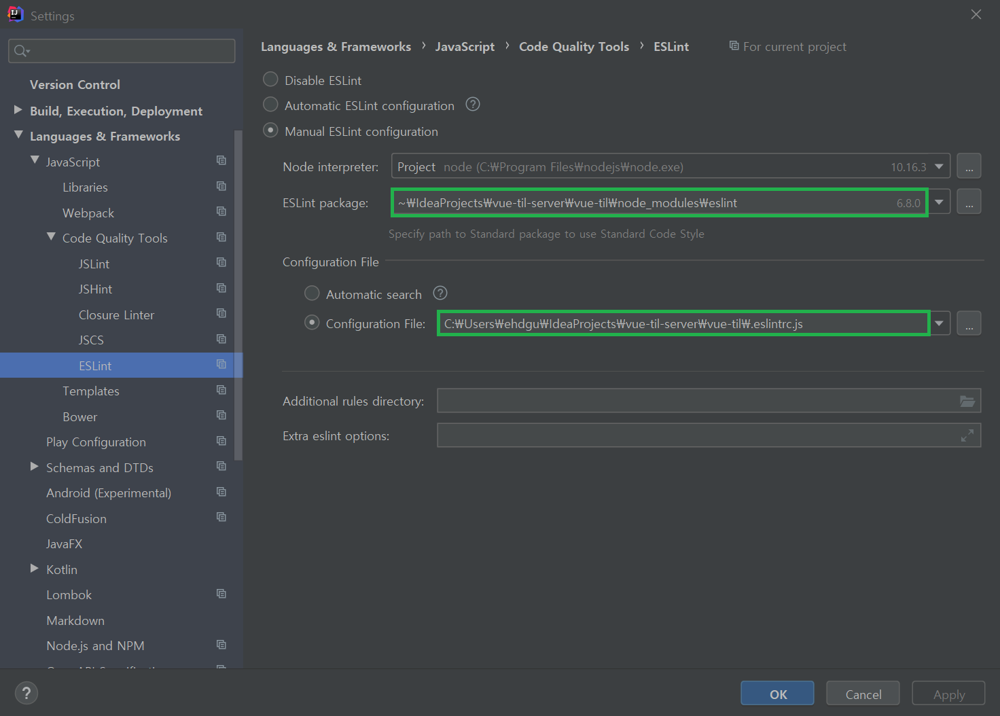
각각 설정 파일 위치를 vue 모듈이 있는 곳으로 맞춰주고, 해당 위치에서 eslint-plugin-vue을 설치해야 한다.


<br/>

📌 vue config 파일 생성
-
* root 경로에 vue.config.js 파일 생성
```javascript
module.exports = {
    devServer: {
        overlay: false // 웹팩 데브에서 제공하는 에러 화면 나타내 주는 기능을 끄는 것
    }
};
```
위 설정이 없으면 아래와 같은 현상이 발생함
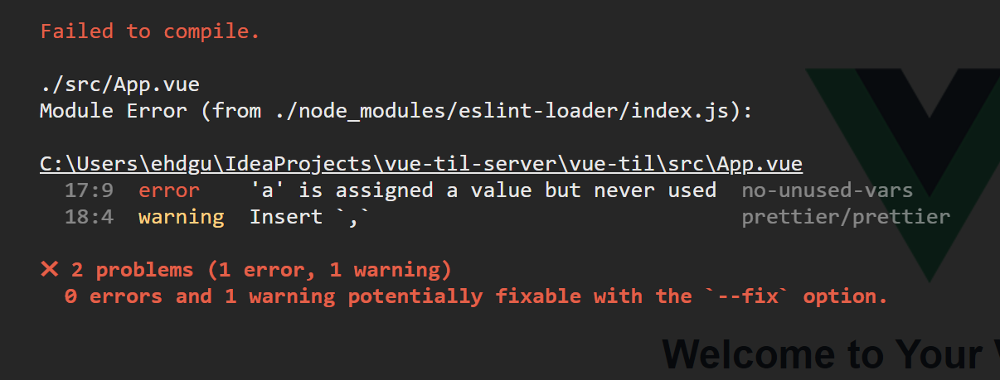
설정 적용 하면 위와 같은 에러가 콘솔 화면에만 나타남.


<br/>


📌 .eslintrc.js 파일
-
* javascript 에서 에러날 수 있는 모든 가능성을 제거해주는 플러그인 (문법 검사기)
* <https://eslint.org/> 링크에서 문법 확인이 가능하다.   
* 주의 해서 살펴 보아야 할 곳은 아래와 같다.
```javascript
rules: {
    "no-console": process.env.NODE_ENV === "production" ? "warn" : "off",
    "no-debugger": process.env.NODE_ENV === "production" ? "warn" : "off",
},
```
* "no-console" : "error"로 되어 있으면, console.log 사용시 아래와 같이 에러가 난다.
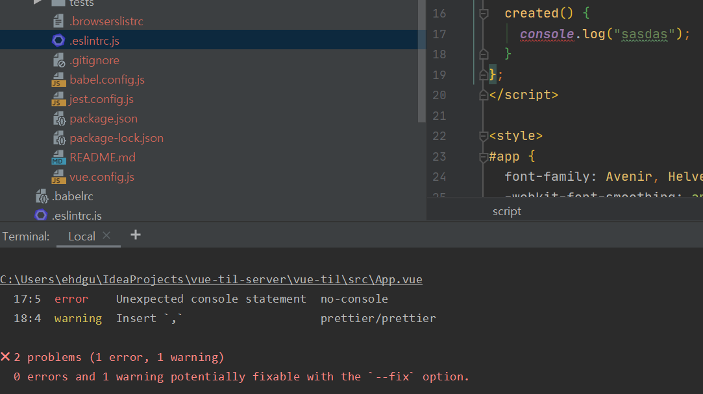

* extends 속성을 좀 더 살펴보자면
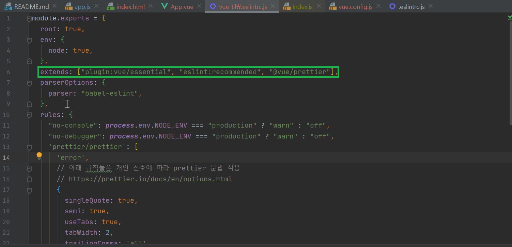

```java
@vue/prettier
```
위와 같은 코드가 있고, node_module 파일 내부에 @vue 라는 폴더 아래 eslint-config-prettier 라는 폴더가 있다. 해당 내용을 가져다가 사용하는 것이라고 보면 된다.
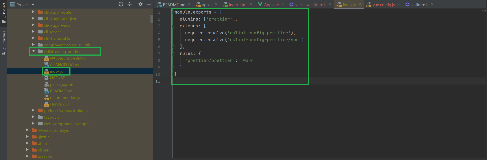

* 공식 사이트의 링크는 다음과 같다. <https://prettier.io/>
* https://prettier.io/docs/en/options.html 에서 확인할 수 있는 설정들은 다음과 같다.
    * 문자체
    * 계행
    * 세미콜론 찍는 여부 등등

* 아래와 같이 ".prettierrc" 파일을 생성해서 설정할 수 있다.
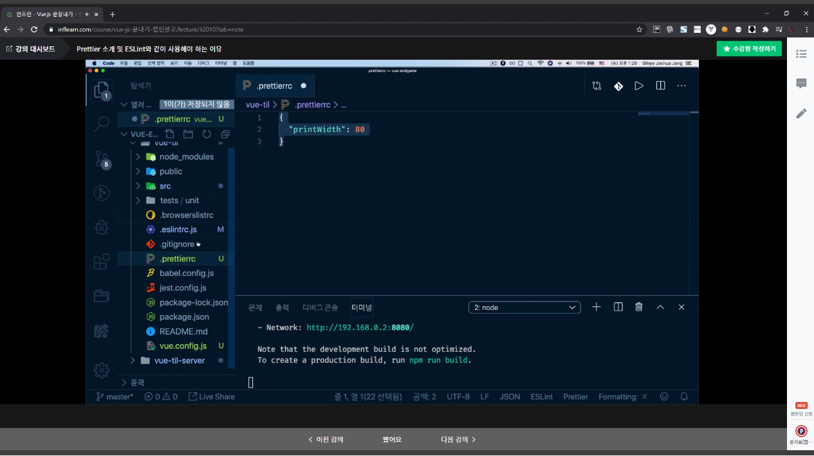
* 그러나 ".eslintrc.js" 파일의 rules와 충돌할 수 있기 때문에 아래와 같이 설정한다.
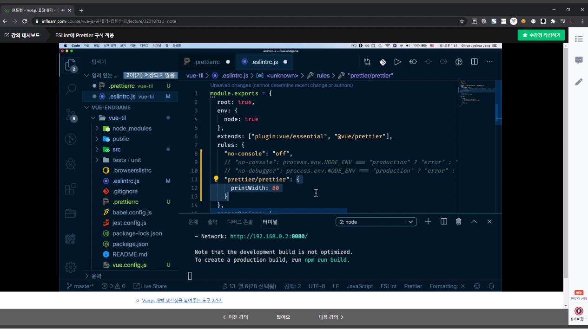
* 이렇게 설정함으로 써, eslint 적용시 prettier도 적용되도록 set up 하는 것이다. 코드는 다음과 같다.
```javascript
"prettier/prettier": ['error', {
    printWidth: 80
}]
```

* 이 프로젝트에선 기본적으로 많이 사용하는 세팅을 사용한다. 코드는 아래와 같다. [링크](https://joshua1988.github.io/web-development/vuejs/boost-productivity/) 에서 확인이 가능하다.
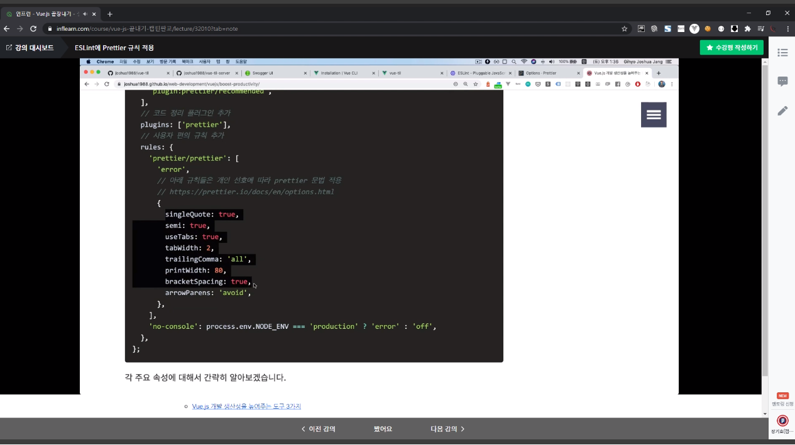
```javascript
  rules: {
    'prettier/prettier': [
      'error',
      // 아래 규칙들은 개인 선호에 따라 prettier 문법 적용
      // https://prettier.io/docs/en/options.html
      {
        singleQuote: true,
        semi: true,
        useTabs: true,
        tabWidth: 2,
        trailingComma: 'all',
        printWidth: 80,
        bracketSpacing: true,
        arrowParens: 'avoid',
      },
    ],
    'no-console': process.env.NODE_ENV === 'production' ? 'error' : 'off',
  },
```

* 위 세팅을 맞추고 나면 아래와 같은 에러를 만날 수 있음
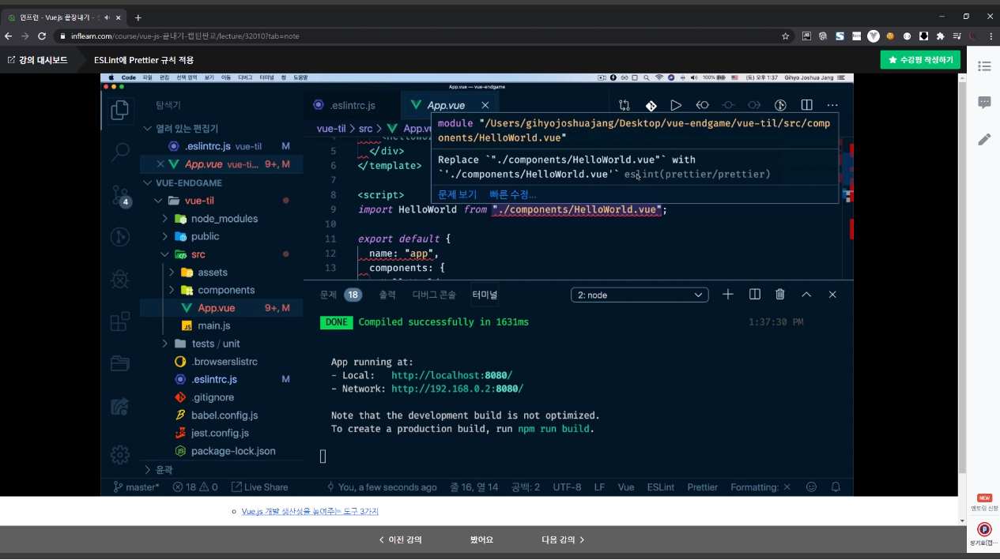
* prettier에서 설정된 문법 내용과 다르다는 말인데, 아래와 같은 방법으로 해결할 수 있다.
    1. alt+Enter 후 ESLint: Fix current file 
    2. 단축키에 별도로 설정하는 방법(이미지 참고)
    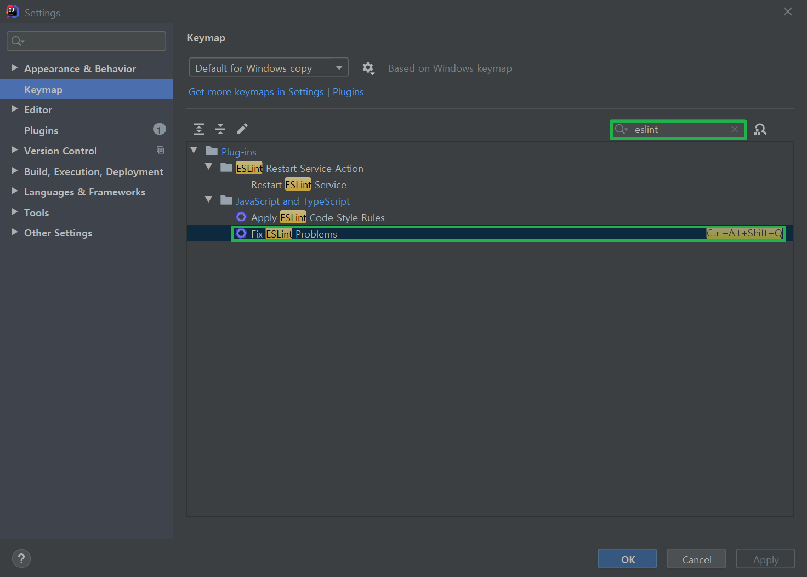
    


<br/>


📌 .eslintrc.js 설정 파일에 속성에 대한 설명
-
```javascript
// .eslintrc.js
module.exports = {
  // 현재 eslintrc 파일을 기준으로 ESLint 규칙을 적용
  root: true,
  // 추가적인 규칙들을 적용
  extends: [
    'eslint:recommended',
    'plugin:vue/essential',
    'prettier',
    'plugin:prettier/recommended',
  ],
  // 코드 정리 플러그인 추가
  plugins: ['prettier'],
  // 사용자 편의 규칙 추가
  rules: {
    'prettier/prettier': [
      'error',
      // 아래 규칙들은 개인 선호에 따라 prettier 문법 적용
      // https://prettier.io/docs/en/options.html
      {
        singleQuote: true,
        semi: true,
        useTabs: true,
        tabWidth: 2,
        trailingComma: 'all',
        printWidth: 80,
        bracketSpacing: true,
        arrowParens: 'avoid',
      },
    ],
    'no-console': process.env.NODE_ENV === 'production' ? 'error' : 'off',
  },
};
```
* root : 현재 폴더 위치를 기준으로 하위의 파일에 린트를 적용합니다. 상위 폴더에 린트를 적용하지 않습니다.
* extends: 린트의 기본적인 문법 검사 규칙 이외에 추가적인 규칙들을 적용합니다. 이미 누군가에 의해 정해진 몇 개의 규칙을 추가한다고 보면 됩니다.
* plugins: NPM으로 설치하여 사용할 수 있는 확장 규칙입니다. 대중적인 라이브러리와 결합하여 린트를 사용할 수 있습니다.
* rules: 린트를 실행할 때 사용자가 임의로 규칙을 추가하여 검사에서 제외 또는 추가하는 속성입니다.


<br/>


