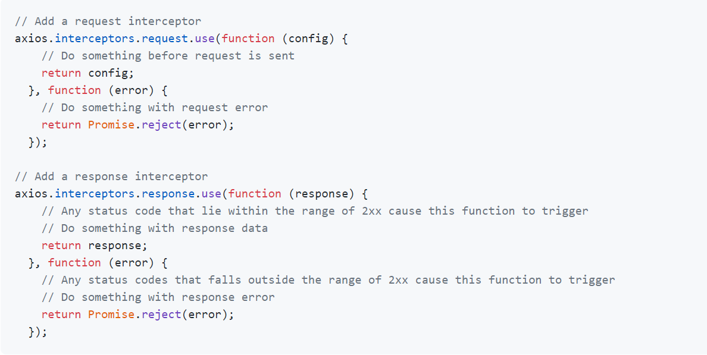

📌 store와 api/index.js 파일의 시점차이
-
* api 요청을 하는 파일의 일부를 보면 로그인 시에 얻은 토큰을, 헤더에 같이 넣어야만, 요청할 수 있는 api가 있다.
* 그런데 문제점은 우리가 api 를 모듈화하여 사용하고 있기 때문에 axios의 config json을 공통화해서 사용하고 있다는 점이다.
* js 파일이 export 될 당시에 json을 생성하고 그 때는 vuex store에 토큰값이 없다(로그인 하기 이전)
* 따라서, interceptor로 요청할 때 config 값을 추가해줄 필요성이 있다.


<br/>


📌 interceptor 공식 문서
-
* <https://github.com/axios/axios#interceptors>


<br/>

📌 사용법
-
* 공식 문서에는 아래와 같이 사용하라고 나와있다.

* 보면 axios 객체에 interceptor를 추가하고 있다. 따라서 우리는 별도의 interceptor를 장착해줄 메서드를 만들어서 관리할 것이다.

    1. intercept 해줄 메소드 생성하기 (src/api/common 아래 interceptor.js 생성하기)
    ```javascript
    import store from '@/store/index';
    
    export function setInterceptors(instance) {
      // Add a request interceptor
      instance.interceptors.request.use(
        function (config) {
          // Do something before request is sent
          // console.log(config);
  
          // => 이렇게 해더를 세팅해줄 수 있다.
          config.headers.Authorization = store.state.token;
          return config;
        },
        function (error) {
          // Do something with request error
          return Promise.reject(error);
        },
      );
    
      // Add a response interceptor
      instance.interceptors.response.use(
        function (response) {
          // Any status code that lie within the range of 2xx cause this function to trigger
          // Do something with response data
          return response;
        },
        function (error) {
          // Any status codes that falls outside the range of 2xx cause this function to trigger
          // Do something with response error
          return Promise.reject(error);
        },
      );
      return instance;
    }
    ```
    
    2. 만든 파일에서 호출
    ```javascript
    import { setInterceptors } from './common/interceptors';

    const instance = axios.create({
      baseURL: process.env.VUE_APP_API_URL,
    );
  
    // axios 객체에 인터셉터 장착
    setInterceptors(instance);
    ```
  
    3. 조금 더 깔끔하게 메소드로 정리
    ```javascript
    function getInstance() {
      const instance = axios.create({
        baseURL: process.env.VUE_APP_API_URL,
      });
      return setInterceptors(instance);
    }
    const instance = getInstance();
    ```
    
    

