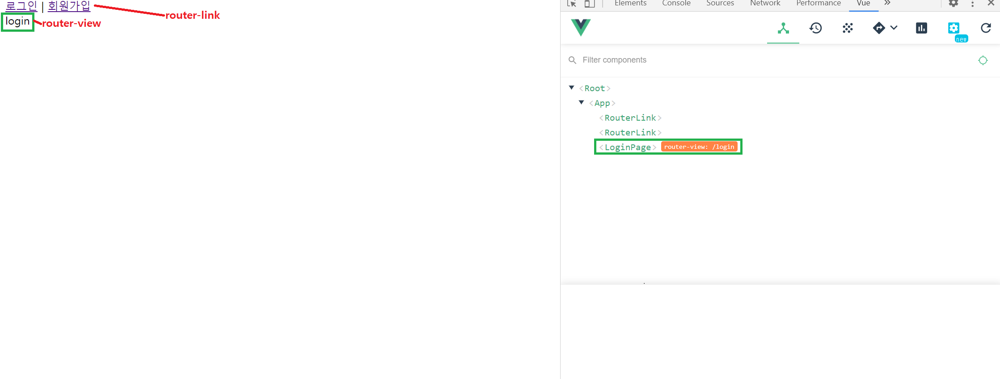

📌 뷰 라우터란?
-
일반적으로 뷰에서 화면이 전환될 때, 전환하는 행위를 Route라고 표현한다. 뷰에서는 SPA를 제작할 때 유용한 라우팅 라이브러리로 Vue Routers를 제공하고 있다.


<br/>

📌 뷰 라우터 설치하기
-
```javascript
npm i vue-router
```


<br/>

📌 공식문서
-
* <https://router.vuejs.org/guide/essentials/navigation.html>

<br/>

📌 뷰 라우터의 인스턴스 생성
-
* src/routes/index.js 파일을 생성해서 아래와 같은 코드를 집어넣는다.
```javascript
// vue 를 로드한다.
import Vue from 'vue'; 
// 설치한 라우터를 로드한다.
import VueRouter from 'vue-router'; 

// 라우터를 플러그인으로 사용할 것을 명시
Vue.use(VueRouter); 
// 새로운 라우터를 생성해서 export
export default new VueRouter(); 
```


<br/>

📌 뷰 인스턴스 장착
--

* src/main.js 파일에서 아래와 같은 코드를 집어 넣는다.
```javascript
import Vue from 'vue';
import App from './App.vue';
import router from '@/routes/index'; // 라우터 생성. 이때 굳이 .js는 사용하지 않아도 된다.

Vue.config.productionTip = false;

new Vue({
  render: h => h(App),
  router, // 라우터 장착
}).$mount('#app');
```


<br/>

📌 라우터 객체 생성
-
* 페이지 1개당 하나의 라우터 객체를 생성하면 된다.
* src/routes/index.js 파일에 아래 코드를 추가
```javascript
import Vue from 'vue';
import VueRouter from 'vue-router';
import LoginPage from '@/views/LoginPage.vue'; // 페이지를 로드한다.
import SignupPage from '@/views/SignupPage.vue';

Vue.use(VueRouter);

export default new VueRouter({
  routes: [
    {
      path: '/login', // 경로 선언
      component: LoginPage, // 장치 선택
    },
    {
      path: '/signup',
      component: SignupPage,
    },
  ],
});
```
* src/views 폴더 아래에, LoginPage.vue와 SignupPage.vue를 생성해서 아래와 같은 모듈 생성
```html
<template><div>login</div></template>

<script>
export default {
  name: 'LoginPage',
};
</script>

<style scoped></style>
```

* 이동 할 수 있는 link를 App.vue에 추가 (실행 시 가장 처음 보이는 페이지라고 생각하면 됨)
```html
<template>
  <div>
    <header>
      <router-link to="/login">로그인</router-link><!-- router-link를 통해서 다른 url로 보낼 수 있음 -->&nbsp;|&nbsp;
      <router-link to="/signup">회원가입</router-link><!-- to라는 속성을 통해서 링크를 보냄 -->
      <router-view></router-view><!-- 라우팅 된 모듈이 보이는 태그 -->
    </header>
  </div>
</template>

<script>
export default {};
</script>

<style scoped></style>
```

* 실행하면 아래와 같은 그림으로 확인이 가능하다.



<br/>

📌 원리
-
* router-link 태그를 통해서 새 페이지 요청
* vue의 router가 요청을 받아서 해당 페이지 반환
* url이 변경 될 때, SPA 이기 때문에 url을 변경할 때, 개발자 도구의 Network 탭을 확인해도 변화가 없다

> 보통 페이지의 전환은 html 파일을 로드하면서 일어나는데, vue의 경우 history api를 이용해서 url을 컨트롤하고 화면의 DOM을 컨트롤 하기 때문에 새로운 html 파일을 로드하지 않는다. 그래서 자원의 변화가 없는 것이다. 즉, 페이지의 전환이 없다.
* vue는 LoginPage.vue와 SignupPage.vue가 "페이지 로드 시점"에 app.js라는 하나의 파일을 만들어 클라이언트에게 보여준다.
    * 모든 페이지를 로드 시점에 app.js 파일에 넣어 사용자에게 보여준다면, 페이지의 로딩이 상당히 느려질 것이므로 페이지 이동 시점에 로드하도록 LazyLoading 기법이 필요하다.
    

<br/>

📌 LazyLoading 기법 (code spliting)
-
* code spliting은 라우터가 페이지 전환 처리를 할 때, 모듈을 로드하는 방식으로 구현을 한다.
* component를 로드하는 부분을, 함수로 변경함으로써, 페이지 전환 시점에 로드하도록 변경할 수 있다.
    * 변경 전
    ```javascript
    import SignupPage from '@/views/SignupPage.vue';
    ```
    * 변경 후
    ```javascript
    const SignupPage = () => import('@/views/SignupPage.vue');
  
    // 즉시 사용하는 방법
    component: () => import('@/views/LoginPage.vue'),
    ```
  

<br/>

📌 확인
-
* 개발자 도구의 Network를 살펴보면, 클릭시마다 새로운 페이지를 로드하는 것을 알수 있음


<br/>

📌 router를 통한, redirect
-
* 아직, /으로 접속할 경우, 어떤 페이지를 호출 할 것인지 정하지 않았다.
* 아래와 같은 코드를 넣어서, /으로 접속한 경우 로그인 페이지를 호출하도록 변경한다.
```javascript
{
  path: '/',
  redirect: 'login',
},
```


<br/>

📌 폴백 라우터 (Page Not Found)
-
* 없는 url에 대한 처리를 해줄 라우터를 폴백 라우터라고 함. 아래와 같은 코드를 추가해서 "맨 마지막에" 추가해서 폴백라우터를 추가해줄 수 있다.
```javascript
{
  path: '*',
  component: () => import('@/views/NotFountPage.vue'),
},
```


<br/>


📌 url의 # 제거하기
-
* 기본적으로 #이 붙어 있는 이유는, vue 자체가 history api를 통해서 페이지를 관리하는데, 이때 히스토리 api는 #(앵커)를 통해 페이지 기록을 관리하기 때문이다.
* "#"이 붙으면 서버에 요청을 날리지 않는다.
* 라우터에 아래와 같은 코드를 한 줄 추가해서 #을 제거할 수 있다.

```javascript
mode: 'history',
```

* 이렇게 되면 url에 #이 붙어있지 않기 때문에, 서버에 요청이 들어 왔을 때 뷰가 만든 페이지를 보여줘야 하는지, 서버에서 제공하는 페이지를 보여줘야 하는지 모른다.
* <https://router.vuejs.org/kr/guide/essentials/history-mode.html#%EC%84%9C%EB%B2%84-%EC%84%A4%EC%A0%95-%EC%98%88%EC%A0%9C> 이 링크로 들어가면, 히스토리 모드를 사용할 때, 아파치 등등의 서버에 어떤 설정을 해주어야 하는지 알 수 있다.
* 요약하자면 url에 대해 어떤 페이지를 찾아야 할지 모를 때, 대체 자원을 제공하는 방법에 관한 것이다. 
* 다만, local 개발 환경에서는 위와 같은 설정을 해주지 않아도 정상 동작한다.


<br/>


📌 라우터 페이지 이동
-
```javascript
await this.$router.push('/페이지');
```
* this.$router.push 메소드는 promise 객체를 반환하고 비동기로 작동하는 코드이기 때문에 await와 사용하는 것이 바람직하다.


<br/>


📌 잘못된 라우터의 사용
-
* 아래와 같은 에러가 발생할 수 있음
```text
Error in render: "TypeError: Cannot read property 'matched' of undefined"
```
* 위 내용은, 라우터의 이름을 router가 아닌 다른 이름으로 사용했을 경우 발생
* 예를들어서, routes 나 Router 같은 키를 의미 따라서, 아래와 같이 작성
```javascript
// 틀림
import Router from './router/index'

new Vue({
  render: h => h(App),
  Router, 
}).$mount('#app')

// 아래와 같이 작성
import router from './router/index'

new Vue({
  render: h => h(App),
  router,
}).$mount('#app')
```


