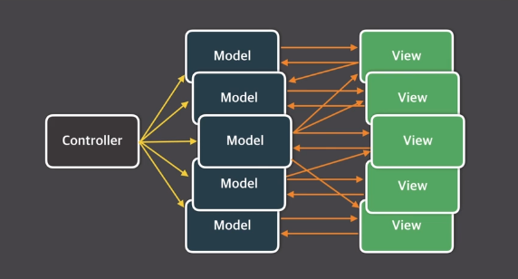
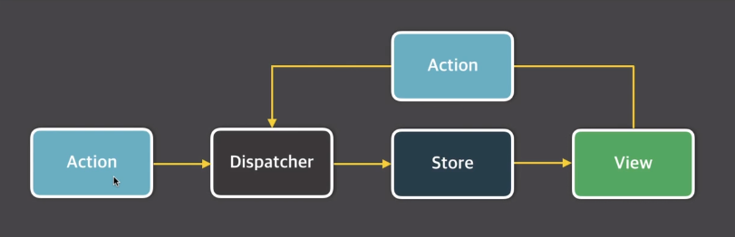
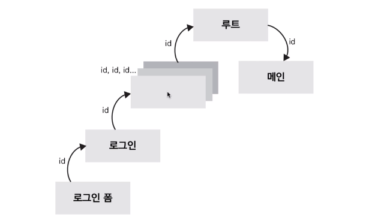
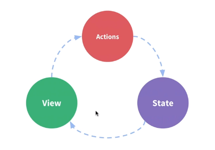
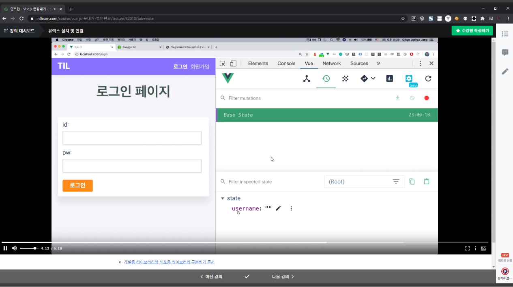
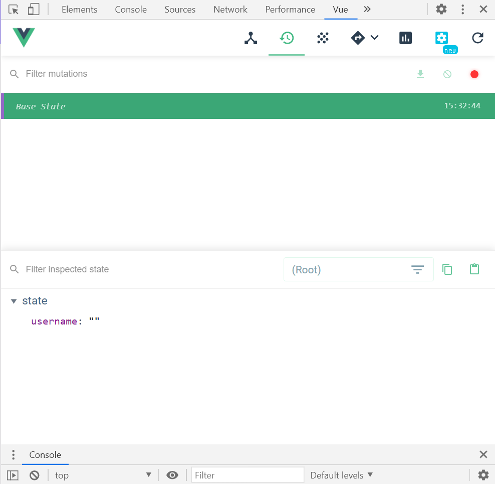
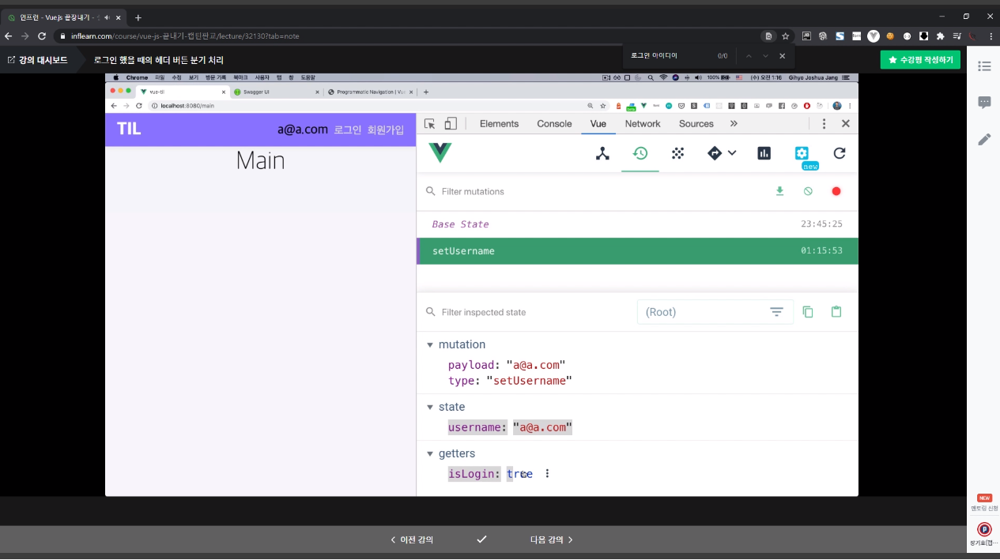

📌 Vuex란? (예제 코드는 맨 아래)
-
* 쉽게 요약해서 모든, vue 컴포넌트가 참고 할 수 있는 중앙 저장소라고 보면 된다.
* 상태 관리 패턴이자 라이브러리이다.
* 복잡한 어플리케이션의 컴포넌트들을 효율적으로 관리하기 위해서 Vuex가 탄생했다.
* React 의 Flux 패턴에서 유래했다.
* 내부적으로 vuex는 자바스크립트(브라우저) 단에 저장한다.( sessionStorage를 이용하는 것 같다.) 
    * 이는 브라우저 상에 데이터를 저장하는 api 중 하나이며, 기본적으로 메모리를 사용하나, localStorage는 거의 쿠키와 유사하게 저장하는 것 같으나 차이점은, 동일 컴퓨터, 동일 브라우저를 사용할 때만 유효하다.
    * 한편, 페이지를 리로딩하면, vuex의 데이터는 날아간다.
    * 따라서 스토어에 저장된 내용을 영속적으로 저장할 수 있으려면 쿠키가 필요하다.
    
<br/>


📌 Flux란?
-
* MVC 패턴의 복잡한 데이터 흐름을 해결하기 위해서 개발
* 아래 순서로 "단일 방향"으로만 데이터가 흘러간다.
    1. actions : 화면에서 발생하는 이벤트(사용자의 입력)
    2. dispatcher : 메서드 호출(데이터를 변경하는 방법)
    3. model : 화면에 표시할 데이터
    4. view : 사용자에게 비춰지는 화면
   

<br/>

📌 MVC 패턴의 문제점
-
* 뷰는, 뷰와 모델(data)이 양방향 통신이 가능하기 때문에, 하나의 컴포넌트에 변경이 있었을 때, 그 변경 내용을 다른 컴포넌트에 알리기 위해서 데이터가 컴포넌트 사이에서 전달, 전달 되어서 최종 컴포넌트에 도착하게 할 수 있다.
* 그러나, 위와 같은 방식은 어플리케이션이 복잡해지면 복잡해질 수록 그 관계를 파악하기가 매우 힘들어진다.
* 이는 기능 추가에 따른, 버그를 예측할 수 없게 하는 문제점이 있다.
* 앱이 복잡해질 수록 업데이트 루프도 매우 복잡해짐 (아래 그림 참고)

* 모델이나, view 에 변화가 일어났을 때 다른 컴포넌트나 모델로 데이터를 전달하는 방식이다.


<br/>

📌 Flux 패턴의 단방향 데이터 흐름
-
* 데이터 흐름이 여러갈래로 나뉘지 않고 단방향으로 처리
    * 데이터 흐름이 단방향이기 때문에 예측이 가능하다. Vue.js에서 생각하면 '상위에서 하위 뷰로 props가 내려가고, 하위에서 상위로 event가 올라가겠네?'



<br/>

📌 Vuex가 필요한 이유
-
* 복잡한 애플리케이션에서 컴포넌트의 개수가 많아지면 컴포넌트 간에 데이터 전달이 어려워진다.



* 이벤트 버스로 해결하기엔, 이벤트를 어디서 보냈고 어디서 받았는지 확인하기 어렵다
```javascript
// Login.vue
eventBus.$emit('fetch', loginInfo);
​
// List.vue
eventBus.$on('display', data => this.displayOnScreen(data));
​
// Chard.vue
eventBus.$emit('refreshData', chartData);

```
* 즉, 컴포넌트간 데이터 전달이 명시적이지 않다.


<br/>

📌 Vuex 컨셉
-
* State : 컴포넌트 간에 공유하는 데이터 data()
* View : 데이터를 표시하는 화면 template
* Action : 사용자의 입력에 따라 데이터를 변경하는 methods




<br/>


📌 Vuex 구조
-
* 뷰 컴포넌트 -> 비동기 로직 -> 동기 로직 -> 상태
    * 시작점은 Vue Components이다.
    * 컴포넌트에서 비동기 로직(Method를 선언해서 API 콜 하는 부분 등)인 Actions를 콜하고,
    * Actions는 비동기 로직만 처리할 뿐 State(Data)를 직접 변경하진 않는다.
    * Actions가 동기 로직인 Mutations를 호출해서 State(Data)를 변경한다.
    * Mutations에서만 State(Data)를 변경할 수 있다.
  

<br/>
  

📌 시작하기
-
* vuex 설치하기
    ```text
    npm i vuex
    ```
* src/store/index.js 에 파일 생성하고, vuex 선언하기
    ```javascript
    import Vue from 'vue';
    import Vuex from 'vuex';
    
    Vue.use(Vuex);
    
    export default new Vuex.Store({
      state: {
        username: '', // username 이라는 값을 어디에서든 사용할 수 있게 되었다.
      },
    });
    ```

* Vue를 사용하는 main.js 에서 vuex 포함시키기
    ```javascript
    ...
    import store from '@/store/index'; // vuex import
    ...
  
    new Vue({
      render: h => h(App),
      router,
      store, // vuex 추가
    }).$mount('#app');
    ```

* 저장소가 추가된 것이 보임




<br/>

📌 컴포넌트에서 vuex 에 접근하는 방법
-
* 데이터를 변경하고 싶을 때
    * mutations 속성 필요

1. store/index.js에서 데이터 변경할 수 있는 메소드 추가
    ```javascript
    // new Vuex.Store 내부 값으로 추가시켜주세요.
    mutations: {
        // 첫번째 인자로 state 를 받아야 한다.
        setUsername(state, username) {
          state.username = username;
        },
      },
    ```
2. 만든 메소드 호출하기
    ```javascript
    this.$store.commit('메소드 이름', '변경할 값');
    ```

* 데이터를 가져오고 싶을 때
    ```javascript
    {{ (this.)$store.state.username }}
    ```
* 메소드를 통해 데이터를 가져오고 싶을 때
    ```javascript
    // 이 값을 store에 추가한다.
    getters: {
      // 첫번째 인자로 state 를 받아야 한다.
      isLogin(state) {
        return state.username !== '';
      },
    },
    ```
    * 자동으로  state를 받아서 계산을 하기 때문에, 아래와 같이 내용이 보인다.
    
    
    * getter 호출하기
    ```javascript
    this.$store.getters.isLogin
    ```

* 실전 예제
    * 실전에서는 위에서 만든 메소드를, computed 속성을 통해 자동 호출해서 많이 사용한다.
        * 분기처리
        ```html
        <template v-if="isUserLogin">
          <span>{{ this.$store.state.username }}</span>
        </template>
        <template v-if="!isUserLogin">
          <router-link to="/login">로그인</router-link>
          <router-link to="/signup">회원가입</router-link>
        </template>
        ```

* 이제, 로그인 상태는 getters를 통해 자동 계산이 되므로, state의 값만 변화 시켜주면 로그아웃 기능까지 간편하게 개발할 수 있다.

    
    
    
