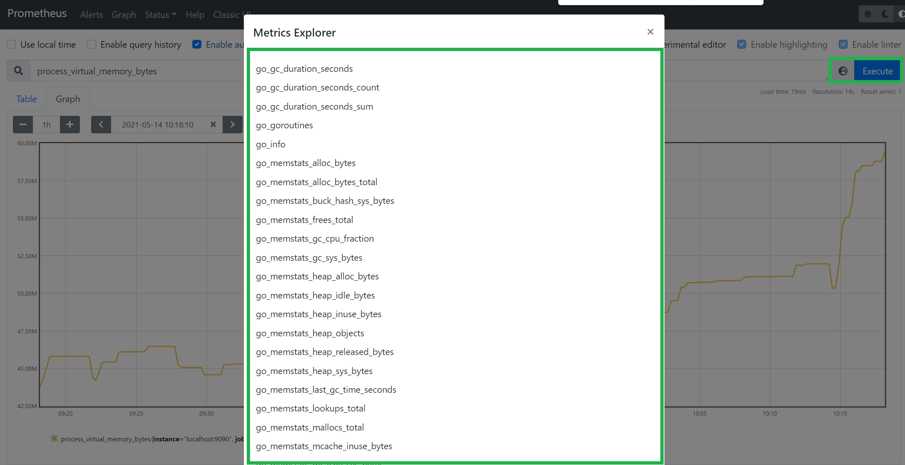
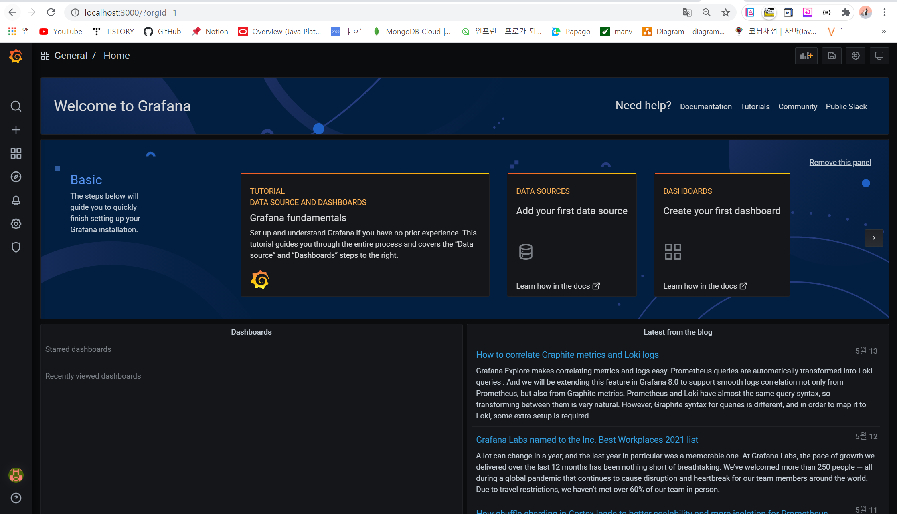
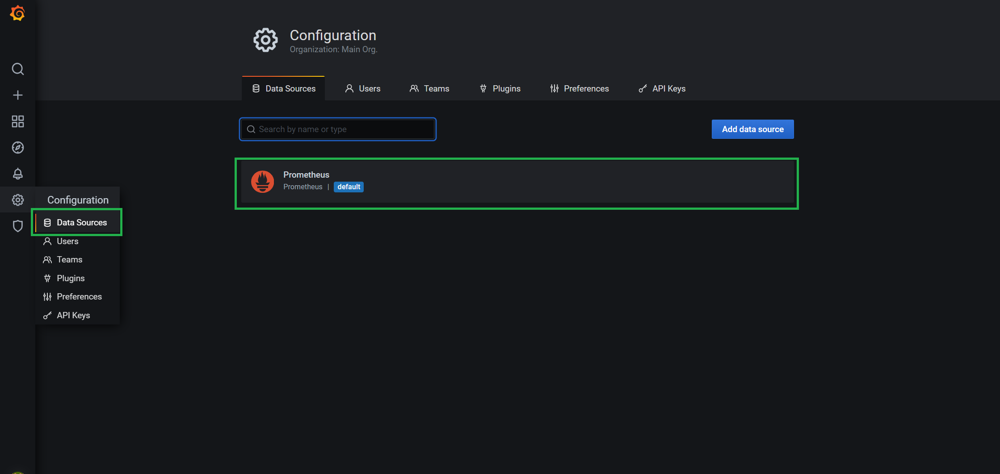
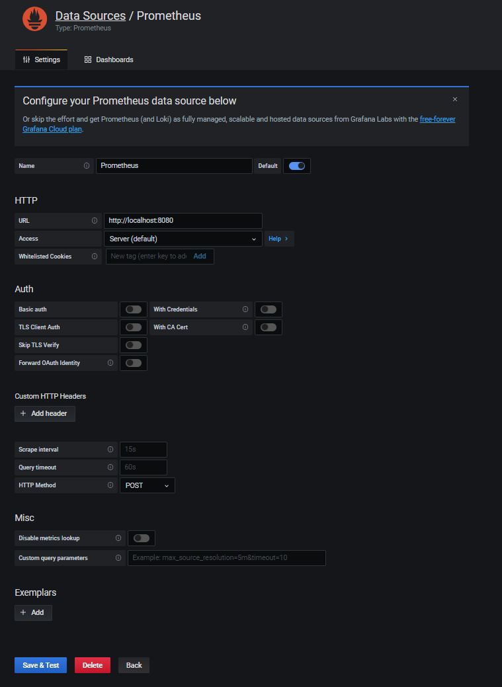
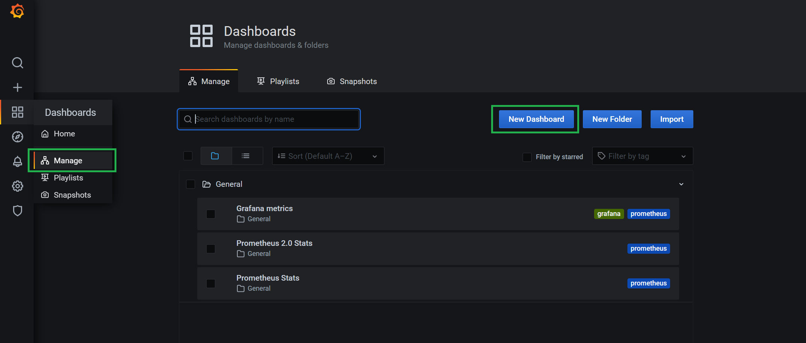
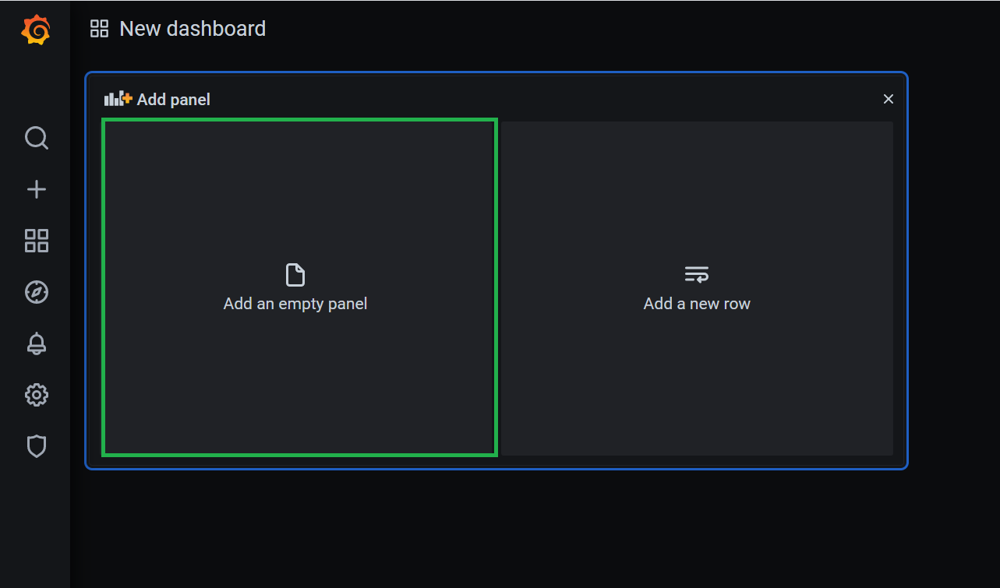
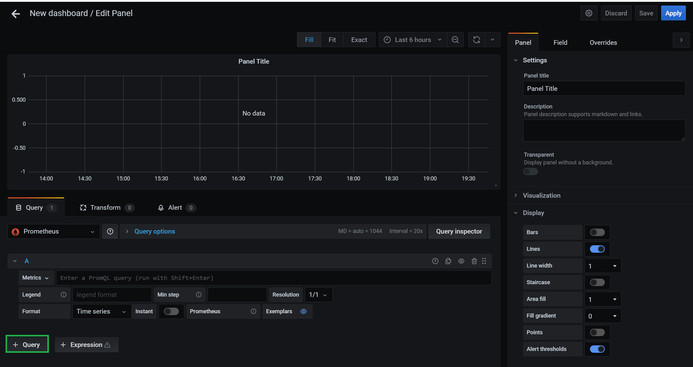
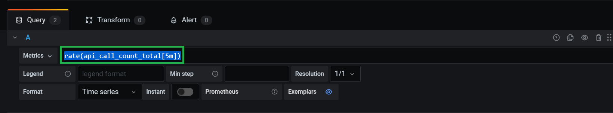

📌 모니터링 시스템 구축
-

* actuator + Prometheus을 이용해 모니터링 시스템을 구축할 예정


<br/>

📌 actuator 란?
-
* 모니터링을 손쉽게 할 수 있도록 돕는 라이브러리로 일종의 엔드 포인트(조작을 위한 창구)이다.
* Chaos Monkey 와 연동해서, 애플리케이션에 지연을 주거나 고의로 예외를 발생시키는 것이 가능하다.
* Prometheus 와 연동해서 모니터링을 위한 데이터(매트릭 등등)를 수집하게 하고 별도 Document Base DB 에 저장하게 할 수 있다.
    * Prometheus 가 수집한 데이터를 Grafana 와 연동해서 데이터를 DashBoard로 모니터링 할 수 있도록 만들수도 있다. 
    * 포인트(조작을 위한 창구)에 HTTP Request 를 날려 내부 DB에 값을 적재하는 방식으로 push 방식이 아닌 당겨오는 pull 방식이다.
<br/>

📌 actuator 적용하기 
-
* 디팬던시 추가 
```xml
<!-- actuator -->
<dependency>
    <groupId>org.springframework.boot</groupId>
    <artifactId>spring-boot-starter-actuator</artifactId>
</dependency>
```
* 재실행 후 아래 링크 실행

```java
http://localhost:8080/actuator/health
```
> 서버가 정상 실행 중인지 확인
 
```java
http://localhost:8080/actuator
```
> 자세한 정보 확인을 위해서 입력

* 노출할 정보는 아래 설정내용을 통해 수정할 수 있음 
```java
management:
  endpoints:
    web:
      exposure:
        include: health, info, prometheus
```


<br/>


📌 Prometheus 사용할 준비하기
-
참고링크 : <https://badcandy.github.io/2018/12/29/prometheus-practice/>


* SpringBoot 2.0이상부터는 Micrometer라는 메트릭 엔진을 지원한다.
* 이 엔진을 이용해서 모니터링 매트릭을 생성할 수 있도록 관련 디팬던시 추가

```xml
<!-- Micrometer core dependecy  -->
<dependency>
    <groupId>io.micrometer</groupId>
    <artifactId>micrometer-core</artifactId>
</dependency>
<!-- Micrometer Prometheus registry  -->
<dependency>
    <groupId>io.micrometer</groupId>
    <artifactId>micrometer-registry-prometheus</artifactId>
</dependency>
```

* 설정 파일에 metrics & prometheus 설정 추가
```yaml
management:
  # metrics 설정
  endpoint:
    metrics:
      enabled: true
    # metrics & prometheus 설정
    prometheus:
      enabled: true
  # prometheus 설정
  metrics:
    export:
      prometheus:
        enabled: true
```

* 아래 주소에 접속해서 prometheus 메트릭 노출 엔드포인트가 존재하는지 확인 
```java
http://localhost:8080/actuator
```
```java
    "prometheus": {
      "href": "http://localhost:8080/actuator/prometheus",
      "templated": false
    },
```

* 열어서 엔드포인트의 내용이 노출 되는지 확인해야함
```java
http://localhost:8080/actuator/prometheus
```

```text
# HELP jvm_buffer_count_buffers An estimate of the number of buffers in the pool
# TYPE jvm_buffer_count_buffers gauge
jvm_buffer_count_buffers{id="direct",} 6.0
jvm_buffer_count_buffers{id="mapped",} 0.0
# HELP process_uptime_seconds The uptime of the Java virtual machine
...
```

* 만약 노출되지 않는 경우, plain/text를 지원하는 컨버터를 추가해줘야함 
```java
@EnableWebMvc
@Configuration
public class FormatConfig implements WebMvcConfigurer {

    @Override
    public void configureMessageConverters(List<HttpMessageConverter<?>> converters) {
        // xml 포멧을 지원하는 컨버터
        converters.add(new MappingJackson2XmlHttpMessageConverter());
        // json 포멧을 지원하는 컨버터
        converters.add(new MappingJackson2HttpMessageConverter());
        /**
        * 추가한 부분
        * plain/text 포멕을 지원하는 컨버터
        */
        converters.add(new StringHttpMessageConverter());
    }
}
```
> prometheus exporter의 경우 텍스트를 plain/text 로 return 하기 때문에 해당 컨버터를 추가해야한다.

참고 링크 : <https://jessyt.tistory.com/52>


<br/>

📌 Prometheus 커스터마이징
-
* 원하는 필드(메트릭값)값을 추가하고 수치화할 수 있다.
    * 스프링이 제공하는 MeterRegistry 를 주입받고 메트릭 추가하기
    
    ```java
    /**
     * 프로메테우스
     *
     * 어플리케이션의 수치 데이터를 측정할 수 있도록 돕는 도구
     * 사용법은 아래와 같다.
     *
     * // 의존성 주입 필수
     * private final Prometheus prometheus;
     *
     * @GetMapping("/test")
     * public void test() {
     *      // 해당 메소드가 실행될 때마다, 원하는 매트릭 값이 증가(수치 증가)
     *     Prometheus.getCounter().increment();
     * }
     *
     * */
    @Component
    public class Prometheus {
        private MeterRegistry meterRegistry;
    
        public Prometheus(MeterRegistry meterRegistry) {
            this.meterRegistry = meterRegistry;
        }
    
        /**
         * counter 이란 메트릭 (모니터링 할 수치)을 생성 한 뒤,
         *
         * */
        private Counter counter;
    
        /**
         * @PostConstruct => WAS가 실행될 때 같이 실행되는 메소드
         * */
        @PostConstruct
        public void init() {
            counter = meterRegistry.counter("api.call.count");
        }
    
        public Counter getCounter() {
            return counter;
        }
    
    }
    ```
  
    * 위에서 추가한 카운터(메트릭 = 측정할 데이터)의 이름이 api.call.count인데, 해당 이름은 api_call_count_total으로 변형되어 해당 이름이 매트릭의 이름이 된다.
    * http://localhost:8080/actuator/prometheus 요청 후 api_call_count_total 값을 확인한다.
    * http://localhost:8080/test 에 해당하는 컨트롤러(소스 주석 확인)를 추가했다면 해당 url을 요청했을 때 api_call_count_total값이 하나 증가되어 있을 것임  

📌 Prometheus 설치하기
-
* [프로메테우스 홈페이지](https://prometheus.io/download/) 에서 윈도우 용 소스를 내려받는다.
* 받은 파일의 압축을 풀고 "prometheus.exe" 파일 실행하기
* http://localhost:9090 으로 들어갔을 때 Prometheus Server 웹페이지가 보이면 성공적으로 실행 된 것이다.



* 만약 아래와 같은 링크로 접속 후, 내용을 열었을 때 api_call_count_total 항목이 없다면 
```java
http://localhost:9090/targets
```


📌 Prometheus 설정파일 보기
-

* 압축을 푼 경로에 있는 "prometheus.yml" 파일에 해당 내용을 추가해줬음
```yaml

# A scrape configuration containing exactly one endpoint to scrape:
# Here it's Prometheus itself.
scrape_configs:
  # The job name is added as a label `job=<job_name>` to any timeseries scraped from this config.
  - job_name: 'prometheus'
    # metrics_path: '/actuator/prometheus' # 이 부분을 추가해줬습니다. => 아마 아래 것으로 해야 되는 것 같습니다.
    metrics_path: 'http://localhost:8080/actuator/prometheus' 
    # metrics_path defaults to '/metrics'
    # scheme defaults to 'http'.

    static_configs:
    - targets: ['localhost:9090']

```

```java
http://localhost:9090/config
```


<br/>

📌 Grafana 설치하기
-
> 위와 같은 방법으로 일일이 쿼리를 돌려 시스템을 모니터링하는 것은 매우 비효율적이고 확인을 어렵게 하는 일입니다. 따라서 Grafana를 설치해서 대시보드로 관리하면 시스템을 효율적으로 모니터링 할 수 있습니다.
 

<br/>

* [Grafana 설치 홈페이지](https://grafana.com/grafana/download?platform=windows) 에서 프로그램을 설치 합니다.
* "C:\Program Files\GrafanaLabs\grafana\bin" 경로에서 "grafana-server.exe" 파일을 설치합니다.
* "http://localhost:3000/login" 에서 로그인합니다. 초기 계정은 아래와 같습니다.
    ```java
    ID : admin
    Password : admin
    ```
* 아래와 같은 화면이 보인다면 성공한 겁니다.

> 비밀번호를 변경한 뒤 사용하는 것을 권장합니다.


<br/>

📌 Grafana & Prometheus 연동하기
-

* datasource로 prometheus 추가


* 정보 입력

> 이 때 url에는 http://localhost:9090/ (프로메테우스가 떠 있는 주소 & 포트)를 입력해줘야한다.


<br/>

* 대시보드 추가



* 패널 추가


* 쿼리 추가 (Metrics 에 항목 추가)



* 대시보드 설정은 아래와 같이 추가 

