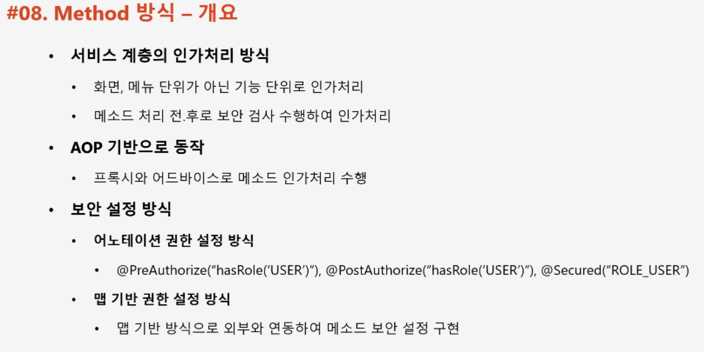
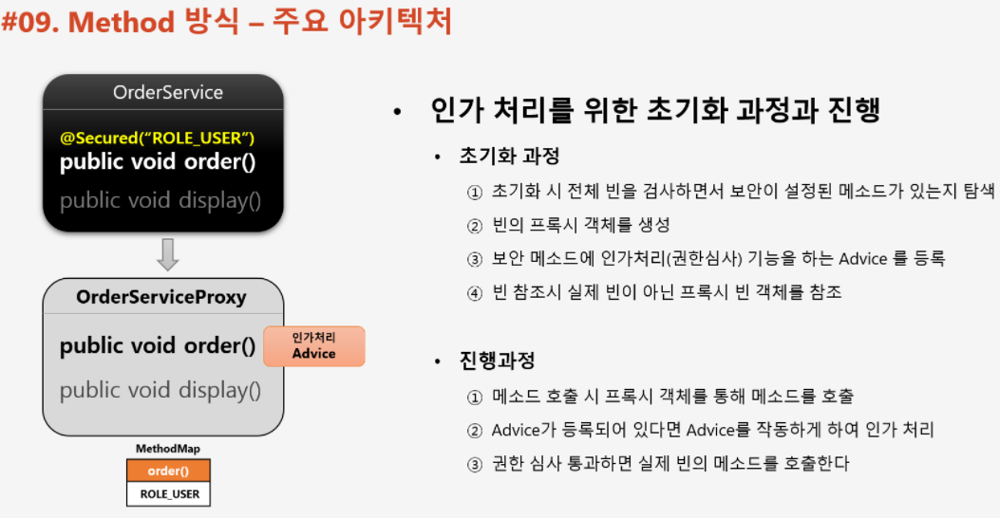
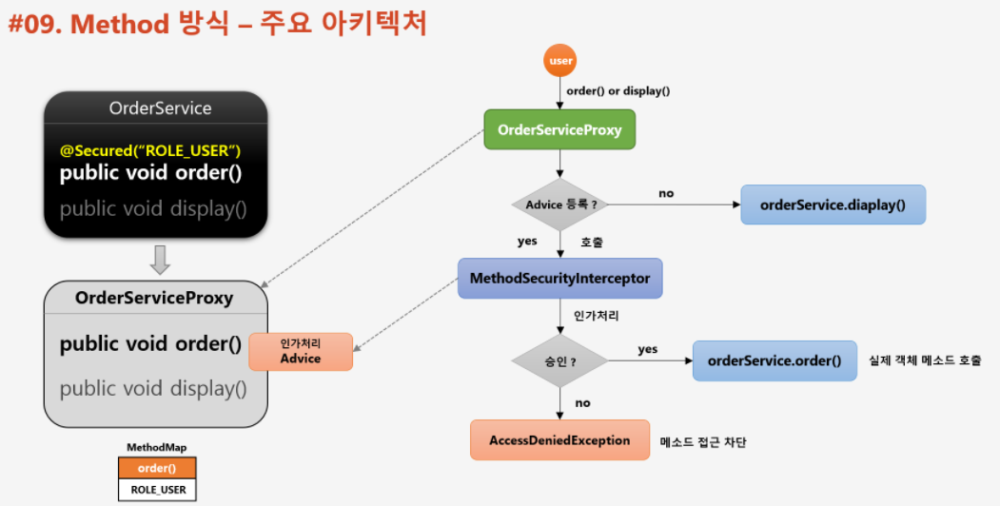
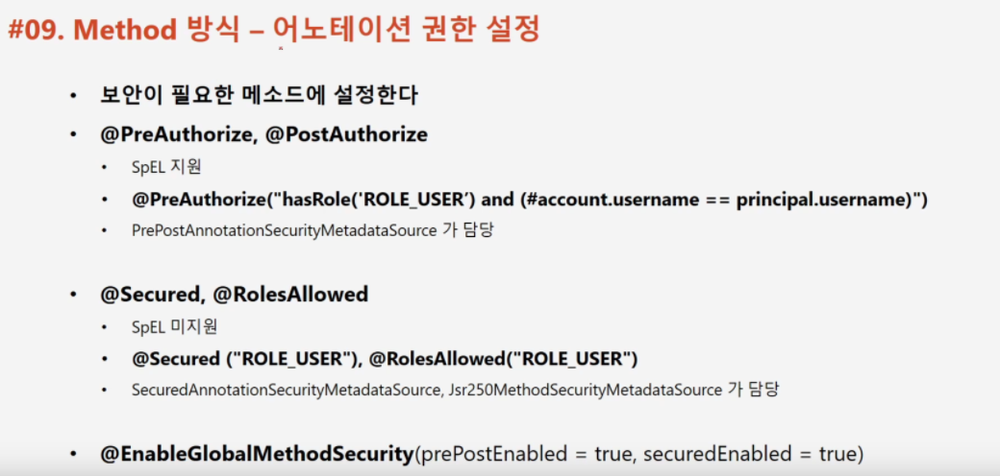
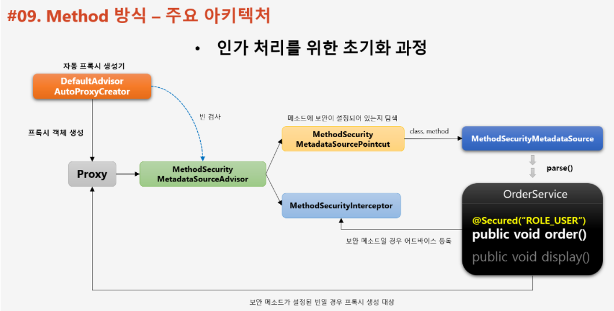
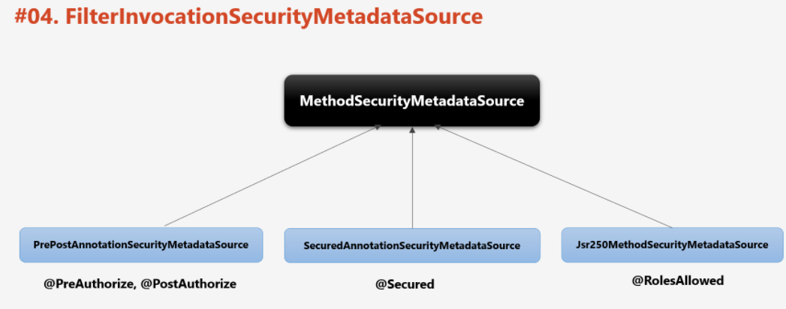
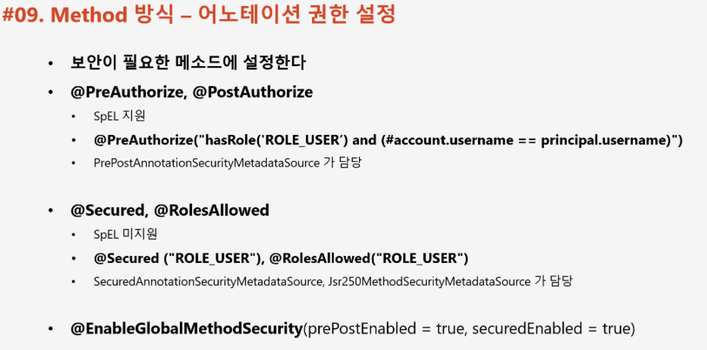
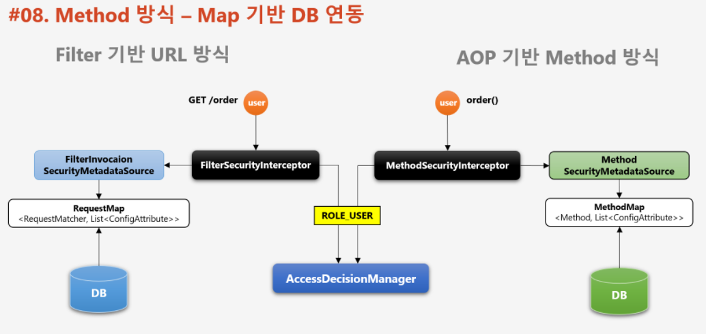
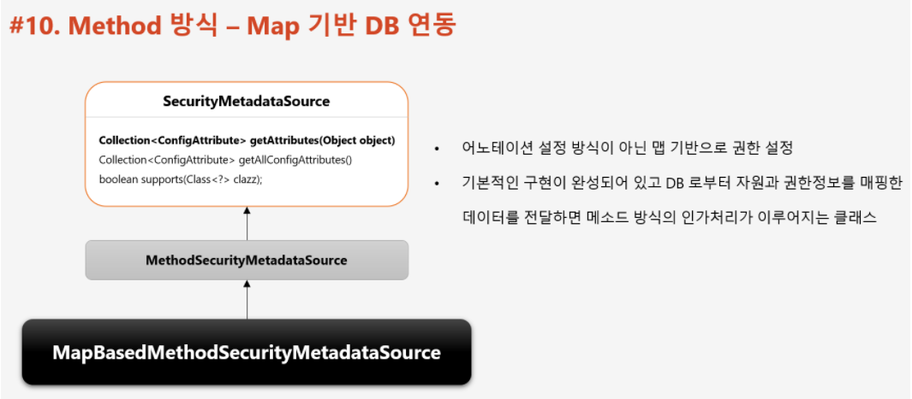
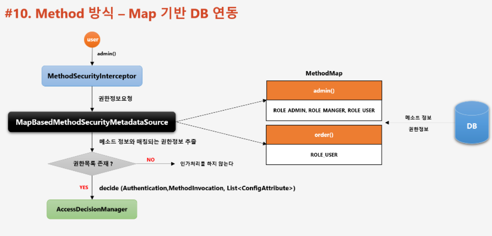

📌 인가 프로세스 DB 연동 (Method)
-



> Method 방식 VS Url 방식 
* Method 는 AOP 기반으로 자원을 실행하는 코드를 프록시로 감싸고 프록시 호출 이전 이후 검사를 해서, 등록된 어드바이스를 호출하는 방식
* Url 방식은 자원 url 에 해당하는 컨트롤러 전 후, Filter 를 실행하는 방식



* 초기화 시
    * 빈을 검사하면서 보안이 설정된 (어노테이션이 붙은) 메소드를 탐색
    * 해당 객체를 프록시로 생성
    * 보안 메소드에 인가 처리 (권한 심사)를 하는 Advice 를 등록했다면 해당 Advice 를 호출해서 권한 심사
    * 빈 참조시에, 실제 빈이 아니라, 프록시 빈을 참조
        * 당연히, 스프링 컨테이너에 등록되어야 어드바이스 호출이 가능하기 때문에 new로 직접 생성해서는 안된다.

* 진행 과정
    * 메소드를 호출하면, 프록시 객체를 호출한다.
    * Advice 가 등록되어 있다면 Advice를 호출
    * 권한 심사를 통과하면 실제 빈의 메소드 호출



* 인가 처리를 할 수 있는 Advice 가 등록된 프록시 객체가 생성 된 상태
    * Order 메소드를 호출한다.
    * OrderServiceProxy 가 대신 호출 된다.
    * Advice 에는 인가 처리를 위한 로직을 담고 있는데, 인가 처리가 성공하면 OrderService의 Order 메소드를 호출하는데, 승인이 되지 않으면 AccessDeniedException 메소드를 호출한다.


<br/>

📌 Method 방식 권한 설정
-

> 어노테이션 이용


* @PreAuthorize || @PostAuthorize
    * PrePostAnnotationSecurityMetadataSource 가 담당해서 처리
* @Secured || @RolesAllowed
    * SecuredAnnotationMetadataSource 와 Jsr250MethodSecurityMetadataSource 가 담당

> 어노테이션 기반 Method 보안을 위한 설정
* 설정 파일에 다음 내용을 활성화
```java
@EnableGlobalMethodSecurity(prePostEnabled = true, securedEnabled = true)
```
* PreAuthorize 를 사용하고자 하는 경우엔 => prePostEnabled = true
* Secured 를 사용하고자 하는 경우엔 => securedEnabled = true

> 초기화 디버깅 
* GlobalMethodSecurityConfiguration 클래스의 methodSecurityMetadataSource 부분
```java
boolean hasCustom = customMethodSecurityMetadataSource != null;
boolean isPrePostEnabled = this.prePostEnabled();
boolean isSecuredEnabled = this.securedEnabled();
boolean isJsr250Enabled = this.jsr250Enabled();
```
* 위에서 설정 내용을 통해 분기 처리가 됨을 알 수 있음

> 어드바이스 디버깅
* 어드바이스 역할은 MethodSecurityInterceptor 가 담당한다. 따라서 이 클래스와 부모클래스인 AbstractSecurityInterceptor 디버깅
* filter 기반이기 때문에 FilterChainProxy 는 디버깅 하지 않는다.


* DefaultAdvisorAutoProxyCreator 이라는 빈 후 처리기가 MethodSecurityMetadataSourceAdvisor 를 통해 빈을 검사. (MethodSecurityMetadataSourceAdvisor 을 프록시 객체로 만듬)
* MethodSecurityMetadataSourceAdvisor 는 MethodSecurityMetadataSourcePointcut 과 MethodInterceptor 를 가지고 있음
* MethodSecurityMetadataSourcePointcut 는 메소드 정보를 MethodSecurityMetadataSource 으로 넘기고, MethodSecurityMetadataSource는 데이터를 파싱해서 가지고 있다가 프록시가 호출될 때, 파싱된 데이터에서 권한 정보를 리턴한다.







> Filter vs AOP 기반 Method 방식 차이

>

동일한 구조로 동작을 할 수 있도록 되어 있음

- Filter 기반 : FilterSecurityInterceptor 가 동작
- Method 기반 : MethodSecurityInterceptor 가 동작

MetaDataSource 는 자원에 해당하는 권한 정보를 인터셉터에 반환하면 인터셉터는 인증, 요청, 권한 정보를 AccessDecisionManager 에 넘겨서 동작시킴
    * 따라서 DB 연동이 하고 싶으면 MetaDataSource 클래스를 건드려야 한다.

> Method 보안 DB 연동



* MapBasedMethodSecurityMetadataSource (MethodSecurityMetadataSource 자식 클래스)
* Map 기반이고, 어노테이션 기반이 아니다. 


* MethodSecurityInterceptor 어드바이스를 호출
* 이 때 내부적으로 자원에 대한 권한 정보를 MapBasedMethodSecurityMetadataSource 에 요청
* 권한 정보가 존재하면 AccessDecisionManager 에 전달

> 사용법
* <https://www.notion.so/6-DB-Method-9426920b8873444793fa3b600aee8fcd>
