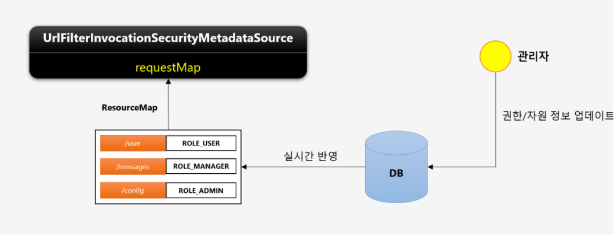
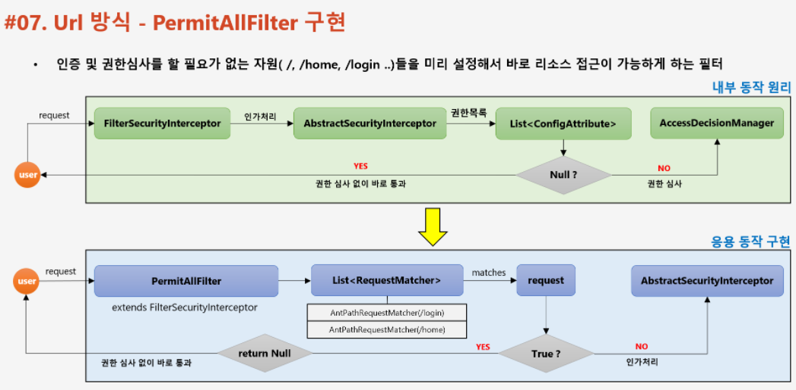

📌 URL 자원 인가 프로세스 DB 연동
-


* FilterSecurityInterceptor 에서 인가 처리가 일어나는데 FilterSecurityInterceptor 는 AccessDecisionManager 를 호출해서 인가 처리를 한다. 이때 다음과 같은 정보를 넘긴다.
    * 요청 정보 (url)
    * 권한 정보 (url 에 할당 된 role)
    * 인증 정보 (기본적으로 인증된 사용자만 접근 가능)


* getAttribute 는 권한 정보를 가져오는 핵심 메소드로 이를 오버라이드 하여, 권한 정보를 DB 와 연동할 수 있다.
* DefaultFilterInvocationSecurityMetadataSource (아래 ExpressionBasedFilterInvocationSecurityMetadataSource 클래스는 이 클래스를 상속한 클래스)클래스는 url 을 키로 권한 정보를 추출하기 위한 클래스이다.
* MethodSecurityMetadataSource 는 메소드를 키로 권한 정보를 추출하기 위한 클래스이다. 그리고, 우측 4개의 인터페이스는 어노테이션 방식으로 Method 권한 정보를 줄 때 사용하는 인터페이스 들이다. 
* 커스텀 할 때는 실제 MapBasedMethodSecurityMetadataSource 클래스를 상속 받아 구현할 것이다.


* 기본적으로 (Filter)SecurityInterceptor 클래스가 권한 정보를 추출해주는데 이 클래스를 보면 다음과 같은 줄이 있음


즉, Metadata 클래스만 상속해서 구현하면 권한 정보를 DB에서 가져오도록 연동할 수 있음


<br/>

📌 웹 인가 DB 연동을 위한 기본 설정 준비 (기본 환경 커스텀)
-


* FilterInvocationSecurityMetadataSource  인터페이스를 구현하여 UrlFilterInvocationSecurityMetadataSource 를 만들고, 이를 통해서 인가 처리를 할 것이다.


* 요청시 FilterSecurityInterceptor가 FilterInvocationSecurityMetaSource 에 자원 권한 정보 요청
* FilterInvocationSecurityMetaSource 이 내부에 RequestMap 라는 필드에 접근해서 권한 정보를 가져옴
    * 이 때 키로 사용하는 값은 "/admin" 이란 url 정보이다.


<br/>


📌 구현
-
> FilterInvocationSecurityMetadataSource 커스텀
* 구현 할 때 기존에 만들어진 DefaultFilterInvocationSecurityMetadataSource 클래스를 참고해서 만들면 된다.
* [UrlFilterInvocationSecurityMetadataSource.java](../src/main/java/com/slack/slack/appConfig/security/jwt/metadata/UrlFilterInvocationSecurityMetadataSource.java)


> 만든 MetadataSource 등록
* 이 때 FilterSecurityInterceptor Bean 과 같이 등록해주어야 한다.
* 이 때 AccessDecisionManager 와 AuthenticationManager 를 함께 주어야 함
    ```java
    @Bean
    public FilterSecurityInterceptor filterSecurityInterceptor() throws Exception {
      FilterSecurityInterceptor interceptor = new FilterSecurityInterceptor();
    
      interceptor.setSecurityMetadataSource(urlFilterInvocationSecurityMetadataSource());
      interceptor.setAccessDecisionManager(affirmativeBased());
      interceptor.setAuthenticationManager(authenticationManagerBean());
    
      return interceptor;
    }
    
    @Bean
    public UrlFilterInvocationSecurityMetadataSource urlFilterInvocationSecurityMetadataSource() {
      return new UrlFilterInvocationSecurityMetadataSource();
    }
    
    /**
    * 하나라도 접근 거부가 뜨면
    * 허가 거부
    * */
    @Bean
    public AffirmativeBased affirmativeBased() {
      return new AffirmativeBased(getAccessDecisionVoters());
    }
    
    /**
    * 보터 리스트
    * */
    private List<AccessDecisionVoter<?>> getAccessDecisionVoters() {
      return Arrays.asList(new RoleVoter());
    }
    ```
    
* 그리고 만든 FilterSecurityInterceptor 을 기존 FilterSecurityInterceptor과 대체 해준다.
    ```java
    @Override
    protected void configure(final HttpSecurity http) throws Exception {
        http
                .addFilterBefore(filterSecurityInterceptor(), FilterSecurityInterceptor.class);
    }
    ```
    * [JwtSecurityConfig.java](../src/main/java/com/slack/slack/appConfig/security/jwt/config/JwtSecurityConfig.java)

* 우리가 만든 interceptor가 먼저 작동을 하면, 기존의 interceptor가 하던 인가 작업은 하지 않는다. 이미 허가 심사를 마쳤기 때문에 작동하지 않는 것


<br/>

📌 흐름 정리
-

* /users 요청이 들어온다.
* FilterInvocationSecurityMetadataSource 에서 getAttributes를 호출해서 url 에 해당하는 권한정보를 요청
* url 을 키로 RequestMap 에 담긴 권한 정보 get
    * null 일 경우 인가 처리 X
    * 찾은 경우 FilterInvocationSecurityMetadataSource  에 권한 정보 반환
* getAttributes 를 호출해서 받은 권한 정보를 FilterSecurityInterceptor 가 받음


<br/>


📌 URL 인가 처리, DB 연동
-

* FilterInvocationSecurityMetadataSource 구현 클래스의 requestMap 에 data만 set 해주면 됨 
* 이를 위해서 LinkedHashMap<RequestMatcher, List<ConfigAttribute>> 타입의 자원을 리턴할 UrlResourcesMapFactoryBean 생성

> UrlResourcesMapFactoryBean 생성
* Bean 형태로 세팅
* [UrlResourcesMapFactoryBean.java](../src/main/java/com/slack/slack/appConfig/security/jwt/metadata/UrlResourcesMapFactoryBean.java)


> 자원 관리를 할 Service 작성
* DB와 직접 데이터 통신을 해서 data 를 setting
* [SecurityResourceService.java](../src/main/java/com/slack/slack/appConfig/security/form/service/SecurityResourceService.java)


> ResourceRepository 작성
* [ResourcesRepository.java](../src/main/java/com/slack/slack/appConfig/security/form/repository/ResourcesRepository.java)
    * 내부 쿼리에 보면 순서를 지정해서 가져오는 부분이 있는데
    ```java
    @Query("select r from Resources r join fetch r.resourcesRoles s join fetch s.role where r.resourceType = 'URL' order by r.orderNum desc")
    List<Resources> findAllResources();
    ```
    * 설정에 인가 처리가 적용될 경우 먼저 오는 설정 내용이 더 우선순가 높기 때문에 꼭 이렇게 처리를 해주어야 한다.
    

> UrlFilterInvocationSecurityMetadataSource 다음과 같이 변경
* 생성자로 UrlResourcesMapFactoryBean 을 받고, 해당 Bean 에서 권한 데이터를 로드하는 부분
```java
public class UrlFilterInvocationSecurityMetadataSource implements FilterInvocationSecurityMetadataSource {

    private LinkedHashMap<RequestMatcher, List<ConfigAttribute>> requestMap;

    private SecurityResourceService securityResourceService;

    public UrlFilterInvocationSecurityMetadataSource(LinkedHashMap<RequestMatcher, List<ConfigAttribute>> requestMap, SecurityResourceService securityResourceService) {
        this.requestMap = requestMap;
        this.securityResourceService = securityResourceService;
    }

    @Override
    public Collection<ConfigAttribute> getAttributes(Object o) throws IllegalArgumentException {

        HttpServletRequest request = ((FilterInvocation) o).getRequest();

        // requestMap 에 DB에서 추출한 권한 정보를 넣어놔야 한다.
        if (requestMap != null)
            for ( Map.Entry<RequestMatcher, List<ConfigAttribute>> entry : requestMap.entrySet()) {
                RequestMatcher matcher = entry.getKey();

                if (matcher.matches(request))
                    return entry.getValue();

            }

        return null;
    }


    @Override
    public Collection<ConfigAttribute> getAllConfigAttributes() {
        Set<ConfigAttribute> allAttributes = new HashSet();
        Iterator var2 = this.requestMap.entrySet().iterator();

        while(var2.hasNext()) {
            Map.Entry<RequestMatcher, List<ConfigAttribute>> entry = (Map.Entry)var2.next();
            allAttributes.addAll((Collection)entry.getValue());
        }

        return allAttributes;
    }

    @Override
    public boolean supports(Class<?> clazz) {
        return FilterInvocation.class.isAssignableFrom(clazz);
    }


		// 이 메소드 호출
    public void reload() {
        requestMap = securityResourceService.getResourceList();
    }
}
```


> config 에 UrlResourcesMapFactoryBean 생성 후 UrlFilterInvocationSecurityMetadataSource 에 등록
```java
@Bean
public UrlFilterInvocationSecurityMetadataSource urlFilterInvocationSecurityMetadataSource() {
    return new UrlFilterInvocationSecurityMetadataSource(urlResourcesMapFactoryBean().getObject(), securityResourceService);
}

private UrlResourcesMapFactoryBean urlResourcesMapFactoryBean() {
    UrlResourcesMapFactoryBean urlResourcesMapFactoryBean = new UrlResourcesMapFactoryBean();
    urlResourcesMapFactoryBean.setSecurityResourceService(securityResourceService);

    return urlResourcesMapFactoryBean;
}
```
* 여기 까지 마쳤다면 DB와 연동 되어서 인가 처리를 하는 것은 맞으나 이는 애플리케이션 로딩 시점에 딱 1번 DB와 연동하는 것이다.
* 따라서 권한 관리 처리를 하는 부분에 꼭 UrlFilterInvocationSecurityMetadataSource 메소드의 reload 를 호출하도록 한다.

> 실시간 인가처리를 위해서 자원을 insert 하는 부분에도 리로드 호출




<br/>

📌 permit All Filter
-

* 위 구조를 쉽게 풀어 표현하면 FilterSecurityInterceptor 를 상속 받아 구현하고 이를 시스템이 사용하도록 하면 요청이 FilterSecurityInterceptor 으로 넘겨지기 전에 내가 만든 클래스가 받도록 할 수 있는데 여기서 "필요한 권한이 없음" 상태로 만들어 줄 수 있다는 것이다.

    * 위와 같이 권한 심사를 하면 안되는 (할 필요가 없는) 자원들을 언제든 permit 할 수 있도록 설정하는 filter 이다.
    * 우리가 PermitAllFilter 라는 것을 만들어서, FilterSecurityInterceptor 쪽에 대신 추가해주고, 권한 심사 없이 통과할 수 있도록 필요한 권한을 null 로 처리할 것이다.
    * 기존에 FilterSecurityInterceptor 는 인가 처리를 위한 심사를 진행한다고 했다.
    * **따라서 이 필터를 상속 받아 필요한 부분 (권한 정보를 받아오는 메소드 부분만) 재정의 할 것이다.**
    * **PermitAllFilter 생성 (FilterSecurityInterceptor 상속)**

> 필터 생성

* [UrlFilterSecurityInterceptor.java](../src/main/java/com/slack/slack/appConfig/security/jwt/interceptor/UrlFilterSecurityInterceptor.java)
* 이 클래스는 FilterSecurityInterceptor 을 참고해서 만들면 되는데 다음과 같은 주의 사항이 있다.
    * invoke 메소드가 권한 정보를 심사 하는 부분으로 beforeInvocation이 호출 되는 메소드를 변경해주어야 한다.
    * 이 때 beforeInvocation 는 super 가 아니라, 이 클래스 내부에서 재정의 할 메소드를 호출하기 위해 this로 변경해준다.
    * 생성자 호출시 저장해둔 permitAllRequestMatcher 으로 부터 검사해서, 매칭 되는 요청이 오면 null 리턴 해야한다.
    * beforeInvocation 재정의 해야한다.

> 설정파일 추가(변경)
```java
private final RequestMatcher[] permitAllResources = {
        new AntPathRequestMatcher("/**", HttpMethod.OPTIONS.name())
        , new AntPathRequestMatcher("/h2-console*")
        , new AntPathRequestMatcher("/getImage*")
        , new AntPathRequestMatcher("/users/login*")

        , new AntPathRequestMatcher("/users/join*")
        , new AntPathRequestMatcher("/users*")
        , new AntPathRequestMatcher("/socket*")
        , new AntPathRequestMatcher("/rt*")
        , new AntPathRequestMatcher("/teams/join*")
        , new AntPathRequestMatcher("/rt*")
};

@Bean
public FilterSecurityInterceptor filterSecurityInterceptor() throws Exception {
    UrlFilterSecurityInterceptor interceptor = new UrlFilterSecurityInterceptor(permitAllResources);

    interceptor.setSecurityMetadataSource(urlFilterInvocationSecurityMetadataSource());
    interceptor.setAccessDecisionManager(affirmativeBased());
    interceptor.setAuthenticationManager(authenticationManagerBean());

    return interceptor;
}
```
