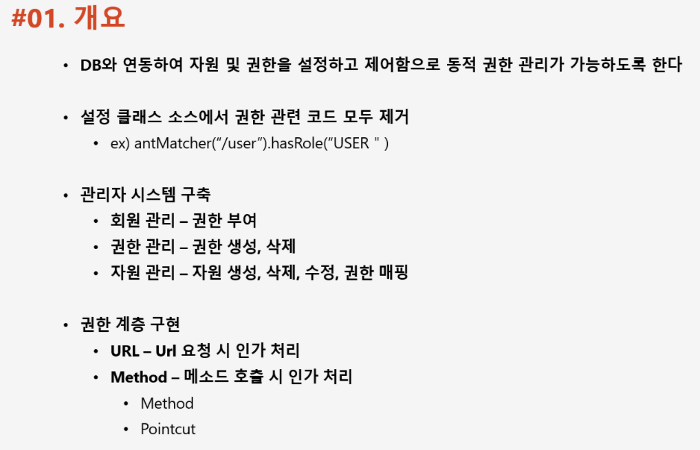
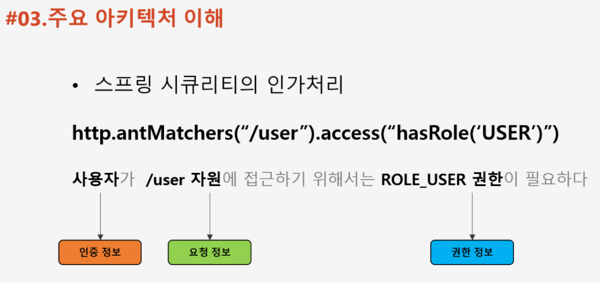
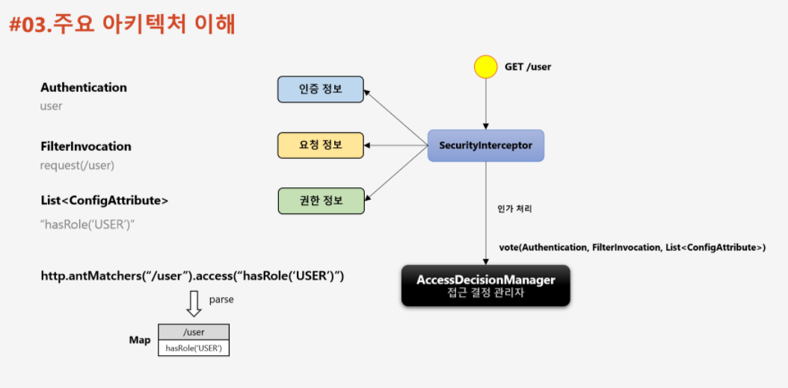
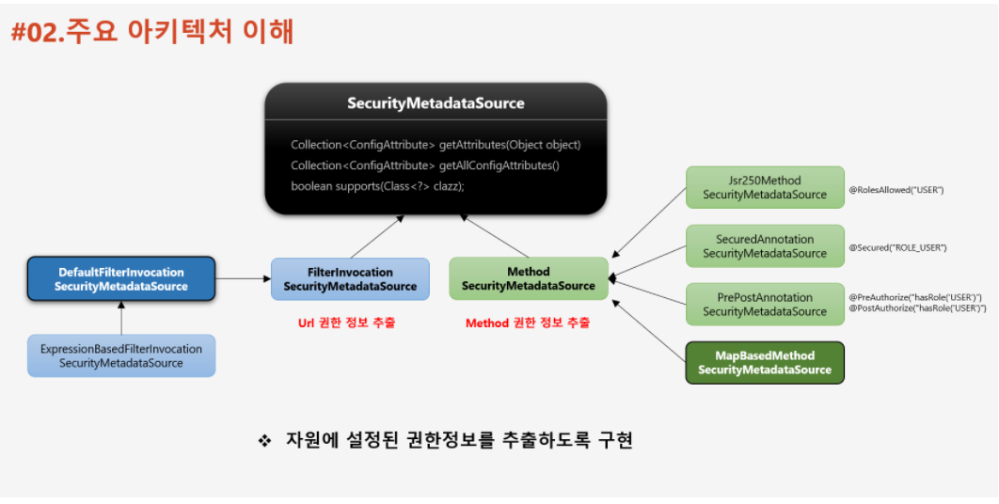
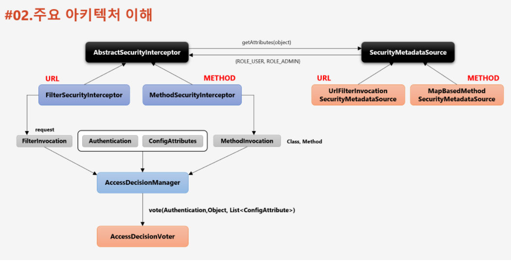
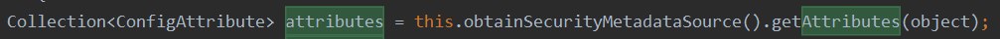
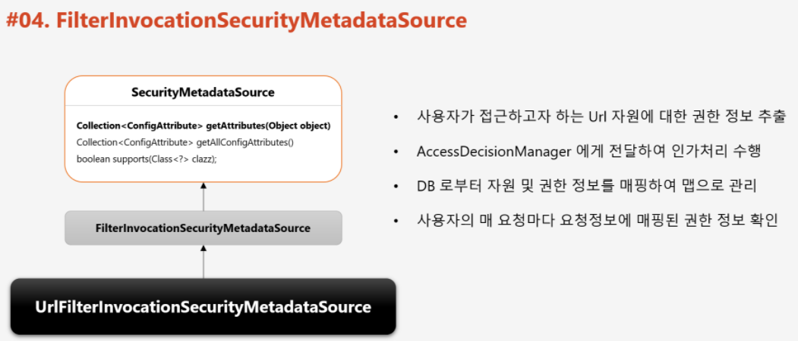
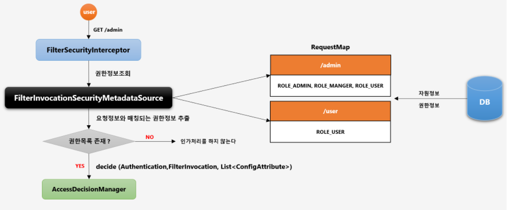
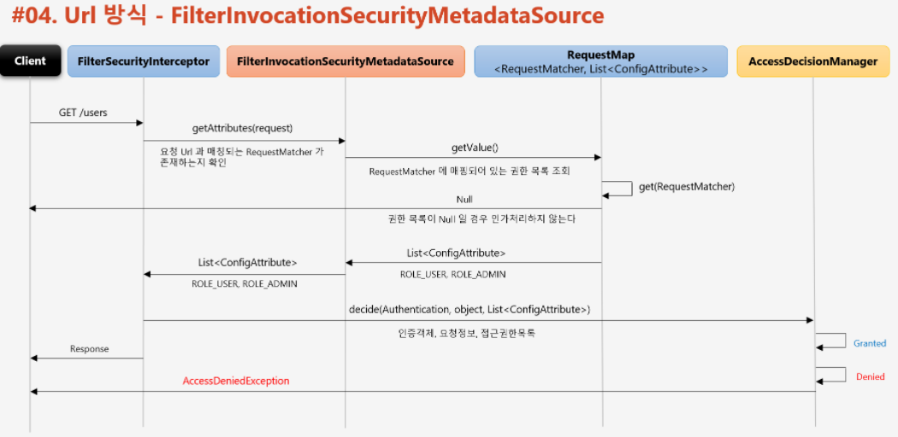
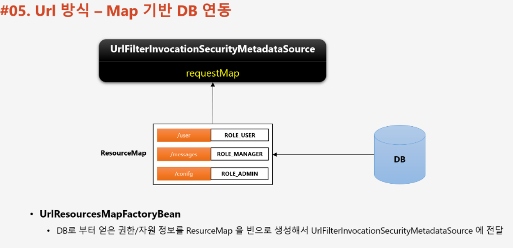

📌 URL 자원 인가 프로세스 DB 연동
-



* FilterSecurityInterceptor 에서 인가 처리가 일어나는데 FilterSecurityInterceptor 는 AccessDecisionManager 를 호출해서 인가 처리를 한다. 이때 다음과 같은 정보를 넘긴다.
    * 요청 정보 (url)
    * 권한 정보 (url 에 할당 된 role)
    * 인증 정보 (기본적으로 인증된 사용자만 접근 가능)




* getAttribute 는 권한 정보를 가져오는 핵심 메소드로 이를 오버라이드 하여, 권한 정보를 DB 와 연동할 수 있다.
* DefaultFilterInvocationSecurityMetadataSource (아래 ExpressionBasedFilterInvocationSecurityMetadataSource 클래스는 이 클래스를 상속한 클래스)클래스는 url 을 키로 권한 정보를 추출하기 위한 클래스이다.
* MethodSecurityMetadataSource 는 메소드를 키로 권한 정보를 추출하기 위한 클래스이다. 그리고, 우측 4개의 인터페이스는 어노테이션 방식으로 Method 권한 정보를 줄 때 사용하는 인터페이스 들이다. 
* 커스텀 할 때는 실제 MapBasedMethodSecurityMetadataSource 클래스를 상속 받아 구현할 것이다.


* 기본적으로 (Filter)SecurityInterceptor 클래스가 권한 정보를 추출해주는데 이 클래스를 보면 다음과 같은 줄이 있음


즉, Metadata 클래스만 상속해서 구현하면 권한 정보를 DB에서 가져오도록 연동할 수 있음


<br/>

📌 웹 인가 DB 연동을 위한 기본 설정 준비 (기본 환경 커스텀)
-


* FilterInvocationSecurityMetadataSource  인터페이스를 구현하여 UrlFilterInvocationSecurityMetadataSource 를 만들고, 이를 통해서 인가 처리를 할 것이다.


* 요청시 FilterSecurityInterceptor가 FilterInvocationSecurityMetaSource 에 자원 권한 정보 요청
* FilterInvocationSecurityMetaSource 이 내부에 RequestMap 라는 필드에 접근해서 권한 정보를 가져옴
    * 이 때 키로 사용하는 값은 "/admin" 이란 url 정보이다.


<br/>


📌 구현
-
> FilterInvocationSecurityMetadataSource 커스텀
* 구현 할 때 기존에 만들어진 DefaultFilterInvocationSecurityMetadataSource 클래스를 참고해서 만들면 된다.
* [UrlFilterInvocationSecurityMetadataSource.java](../src/main/java/com/slack/slack/appConfig/security/jwt/metadata/UrlFilterInvocationSecurityMetadataSource.java)


> 만든 MetadataSource 등록
* 이 때 FilterSecurityInterceptor Bean 과 같이 등록해주어야 한다.
* 이 때 AccessDecisionManager 와 AuthenticationManager 를 함께 주어야 함
    ```java
    @Bean
    public FilterSecurityInterceptor filterSecurityInterceptor() throws Exception {
      FilterSecurityInterceptor interceptor = new FilterSecurityInterceptor();
    
      interceptor.setSecurityMetadataSource(urlFilterInvocationSecurityMetadataSource());
      interceptor.setAccessDecisionManager(affirmativeBased());
      interceptor.setAuthenticationManager(authenticationManagerBean());
    
      return interceptor;
    }
    
    @Bean
    public UrlFilterInvocationSecurityMetadataSource urlFilterInvocationSecurityMetadataSource() {
      return new UrlFilterInvocationSecurityMetadataSource();
    }
    
    /**
    * 하나라도 접근 거부가 뜨면
    * 허가 거부
    * */
    @Bean
    public AffirmativeBased affirmativeBased() {
      return new AffirmativeBased(getAccessDecisionVoters());
    }
    
    /**
    * 보터 리스트
    * */
    private List<AccessDecisionVoter<?>> getAccessDecisionVoters() {
      return Arrays.asList(new RoleVoter());
    }
    ```
    
* 그리고 만든 FilterSecurityInterceptor 을 기존 FilterSecurityInterceptor과 대체 해준다.
    ```java
    @Override
    protected void configure(final HttpSecurity http) throws Exception {
        http
                .addFilterBefore(filterSecurityInterceptor(), FilterSecurityInterceptor.class);
    }
    ```
    * [JwtSecurityConfig.java](../src/main/java/com/slack/slack/appConfig/security/jwt/config/JwtSecurityConfig.java)

* 우리가 만든 interceptor가 먼저 작동을 하면, 기존의 interceptor가 하던 인가 작업은 하지 않는다. 이미 허가 심사를 마쳤기 때문에 작동하지 않는 것


<br/>

📌 흐름 정리
-

* /users 요청이 들어온다.
* FilterInvocationSecurityMetadataSource 에서 getAttributes를 호출해서 url 에 해당하는 권한정보를 요청
* url 을 키로 RequestMap 에 담긴 권한 정보 get
    * null 일 경우 인가 처리 X
    * 찾은 경우 FilterInvocationSecurityMetadataSource  에 권한 정보 반환
* getAttributes 를 호출해서 받은 권한 정보를 FilterSecurityInterceptor 가 받음


<br/>


📌 URL 인가 처리, DB 연동
-

* FilterInvocationSecurityMetadataSource 구현 클래스의 requestMap 에 data만 set 해주면 됨 
* 이를 위해서 LinkedHashMap<RequestMatcher, List<ConfigAttribute>> 타입의 자원을 리턴할 UrlResourcesMapFactoryBean 생성

> UrlResourcesMapFactoryBean 생성
* Bean 형태로 세팅
* [UrlResourcesMapFactoryBean.java](../src/main/java/com/slack/slack/appConfig/security/jwt/metadata/UrlResourcesMapFactoryBean.java)


> 자원 관리를 할 Service 작성
* DB와 직접 데이터 통신을 해서 data 를 setting
* [SecurityResourceService.java](../src/main/java/com/slack/slack/appConfig/security/form/service/SecurityResourceService.java)


> ResourceRepository 작성
* [SecurityResourceService.java](../src/main/java/com/slack/slack/appConfig/security/form/service/SecurityResourceService.java)


> config 에 UrlResourcesMapFactoryBean 생성 후 UrlFilterInvocationSecurityMetadataSource 에 등록
