* 자세한 디버깅과 이론 내용은, 별도로 정리했고 여기에는 기본적인 이론과 흐름을 정리 했습니다.

📌 인증과 인가
-
* 인증이란?
    * Authentication
    * 클라이언트가 누구인지 확인하는 과정
    * 회원가입 & 로그인이 대표 예시
* 인가란?
    * Authorization
    * 인증된 클라이언트가 이 자원에 접근 권한이 있는지 확인하는 과정
    * 대표적으로 "이 포스팅에 대한 권한이 없습니다" 라는 글을 마주쳤을 때가 인가 과정을 통해 권한이 없다는 것을 확인한 대표적인 예시


<br/>

📌 설정 방법
-


* WebSecurityConfigureAdapter 를 상속 받아서, 설정 내용을 추가할 수 있음


* 다음과 같이 WebSecurityConfigureAdapter 를 상속 받은 뒤, configure 메소드를 오버라이드 하여, 설정할 수 있음
* @EnableWebSecurity 는 기본적인 보안 관련 클래스를 import 하고 호출하기 위한 어노테이션으로 꼭 추가 되어야 한다.
* 이제 여기에, 인증정책과 인가정책 보안 설정 등등을 추가하면 된다.


<br/>

📌 Form 인증 정책 
-

* 이렇게 Form 인증 정책을 설정했을 때, Form 방식으로 인증 요청이 들어오면 이 설정 클래스가 요청을 처리 한다.
* [AdminSecurityConfig.java](../src/main/java/com/slack/slack/appConfig/security/config/AdminSecurityConfig.java)

> 인증 성공시 캐시해둔 url 으로 접속하도록 하고 싶다면

```java
.successHandler((httpServletRequest, httpServletResponse, authentication) -> {
    RequestCache requestCache = new HttpSessionRequestCache();
    SavedRequest savedRequest = requestCache.getRequest(httpServletRequest, httpServletResponse);
    httpServletResponse.sendRedirect(savedRequest.getRedirectUrl());
})
```


<br/>


📌 Form 인증 요청이 들어왔을 때
-


1. UsernamePasswordAuthenticationFilter 가 요청을 받는다.
2. AntPathRequestMatcher 이 들어온 요청을 확인하여, 인증을 처리하기로 한 url(/login)이 맞는지 확인
3. 맞으면 Authentication 객체를 감싼 Token을 생성해서 AuthenticationManager(ProviderManager) 에게 인증 처리를 위임
4. AuthenticationManager 가 처리를 할 적절한 AuthenticationProvider 를 찾고, 찾은 AuthenticationProvider 에게 인증 처리를 위임
    * 만약 AuthenticationManager가 적절한 AuthenticationProvider를 못 찾았을 때에는 AuthenticationManager에 저장된 부모 AuthenticationManager의 참조값을 타고 가서 적절한 매니저를 찾음
    
        * 인증 실패시 Exception throw
        * 인증 성공시 Authentication 객체를 UsernamePasswordAuthenticationFilter 에 리턴
5. 인증이 되었다면, 인증된 Authentication 객체를 받은 UsernamePasswordAuthenticationFilter가 부모 클래스인  AbstractAuthenticationProcessingFilter 에 Authentication를 리턴
6. AbstractAuthenticationProcessingFilter 는 successfulAuthentication 메소드를 호출해서, SecurityContext 를 가져오고 거기에 Authentication 객체를 저장

<br/>

📌 Form 인증 - CSRF (사이트 간 요청 위조) 방어
-
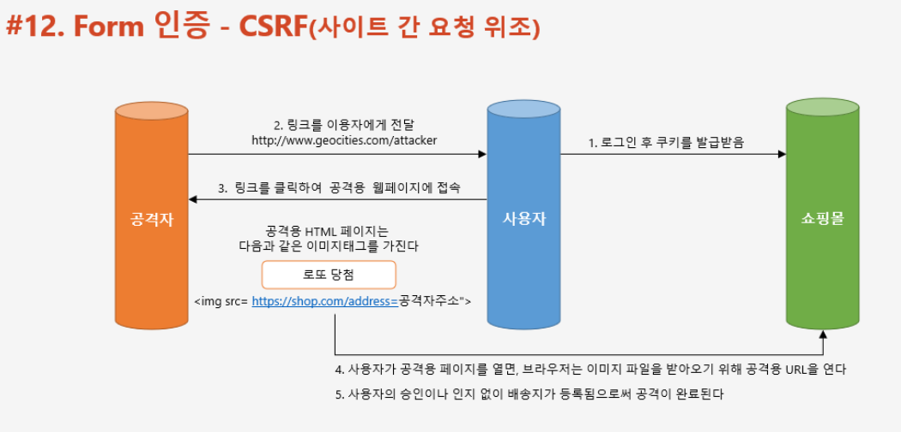
* 쉽게 말해서, 사용자의 인증된 브라우저를 이용해 공격자가 준비해둔 request (img 태그, form 태그를 이용해서 요청. form 인 경우 사용자가 button을 눌러 submit) 를 날려 사용자가 원치 않는 작동을 시키는 과정
* 이를 방지하기 위해서 서버 사이드가 발급한 form 이 맞는지 검사하기 위해 별도의 토큰을 발급


<br/>

📌 RememberMe 인증
-

* Remember Me 쿠키를 남겨서 Remember Me 쿠키의 유효 기간이 지나지 않은 이상, 계속 로그인을 시켜주는 기능


> RememberMe 처리 방식


* 토큰의 유효성 검사를 진행 한 뒤에, 새로운 Authentication 객체를 생성해 재인증 요구


📌 Form Logout
-

* [AdminSecurityConfig.java](../src/main/java/com/slack/slack/appConfig/security/config/AdminSecurityConfig.java)


* 로그아웃 필터가 요청을 잡음
* logout url 이 맞다면, SecurityContext 에서 Authentication 객체를 가져와 SecurityContextLogoutHandler 에 넘긴다.
* SecurityContextLogoutHandler 는 다음과 같은 3가지 동작
    * 세션 무효화
    * 쿠키 삭제
    * 컨텍스트 클리어
* 이 후 LogoutSuccessHandler 호출


<br/>


📌 익명 사용자 인증 과정
-
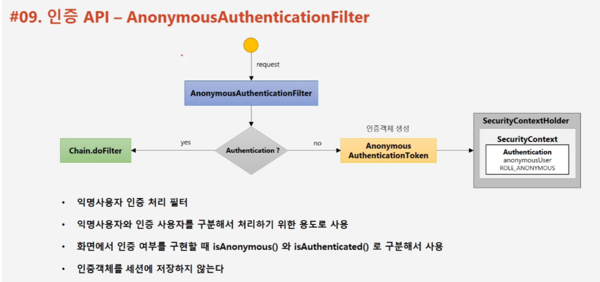
* 익명 사용자라는 개념이 있습니다. 이는 인증된 사용자와 구별하기 위한 개념 입니다.
* AnonymousAuthenticationFilter 에서 AnonymousAuthenticationToken (Authentication 객체는 null 이 아닙니다.) 을 SecurityContext 에 저장합니다.
* SecurityContext 에서 얻은 Authentication 객체를 아래 두 메소드로 인증된 사용자 인지, 익명의 사용자인지 구분이 가능합니다.
    * isAnonymous
    * isAuthenticated 
* 익명 사용자의 인증 객체는 Session 에 저장하지 않습니다.


<br/>


📌 세션 정책 - 동시 세션 제어
-
* SessionManagementFilter 에서 이 동작 처리
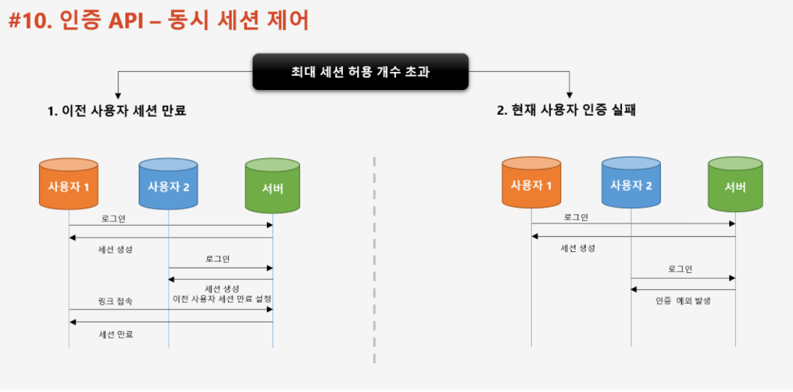
* 스프링 시큐리티는 기본적으로 중복 로그인을 허용하나, 설정을 통해 이를 막을 수 있습니다. 사용자의 중복 로그인을 막는 방법으로는 다음과 같이 2가지 방법이 있습니다.
    * 이전 인증 세션을 만료시킴
    * 새로 받으려는 인증 시도를 불가능하게 막음
    
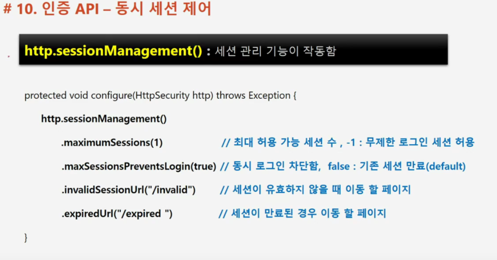
* maxSessionPreventsLogin 옵션은 다음과 같이 줄 수 있습니다.
    * true : 세션이 최대값을 넘는 것을 허용하지 않습니다. 로그인이 되지 않습니다.
    * false : 최대 세션을 허용 합니다. 즉, 기존 세션이 있는 것을 허용하나 세션을 만료 시킨 상태로 가지고 있습니다. 
* [AdminSecurityConfig.java](../src/main/java/com/slack/slack/appConfig/security/config/AdminSecurityConfig.java)

    
📌 세션 정책 - 세션 고정 보호
-
* SessionManagementFilter 에서 이 동작 처리
* 세션을 통한 로그인은 다음과 같이 진행이 됩니다.
    1. 클라이언트가 서버에 최초 접속합니다.
        * 이 때 쿠키로 세션 ID 를 하나 발급 받습니다.
    2. 인증을 성공합니다.
        * 이 때 서버는 세션에 클라이언트가 인증을 성공했다는 정보를 저장합니다.
    3. 클라이언트는 자원에 접근할 때 마다 쿠키로 발급 받은 세션 ID 를 통해서 자신이 누구인지 증명하기 때문에, 추가적인 인증 작업이 필요 없습니다.
* 위 시스템의 문제점은, 인증된 사용자의 세션 ID 를 탈취하면 마치 인증이 된 것 처럼 자원에 접근할 수 있다는 점입니다
* 따라서 인증을 완료 했을 때 기존과는 다른 세션 ID를 다시 발급 받음으로서 이 문제를 해결합니다.

> 설정

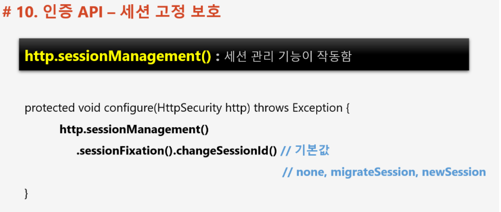
* changeSessionId (default) : 새로운 세션을 만들지 않고 세션 ID 만 변경 합니다.
* newSession : 기존 세션과 다른 새로운 세션을 만듭니다.
* none : 세션과 세션 ID 모두 변경하지 않습니다.
* migrateSession : changeSessionId 와 동일. 시큐리티 3.1 이하 버전에서 사용


* [AdminSecurityConfig.java](../src/main/java/com/slack/slack/appConfig/security/config/AdminSecurityConfig.java)


<br/>

📌 기본 세션 정책
-
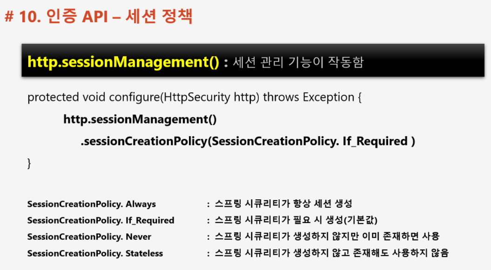
* RESTful API 라면 인증을 위해 쿠키를 사용하지 않기 때문에 sessionCreationPolicy.Stateless 를 사용해도 됩니다.


<br/>

📌 세션 만료 정책
-
* ConcurrentSessionFilter 에서 세션의 만료를 체크합니다.

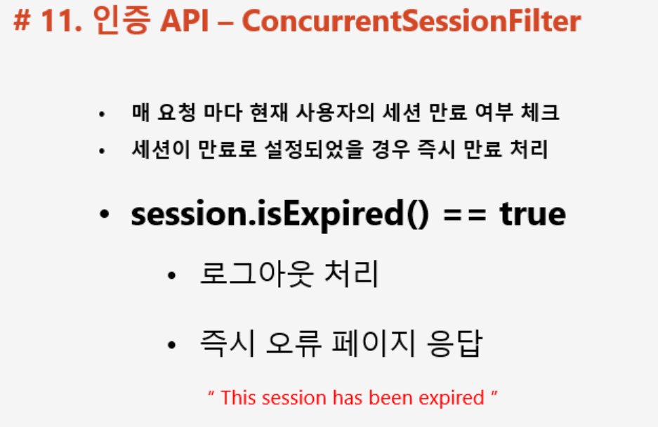

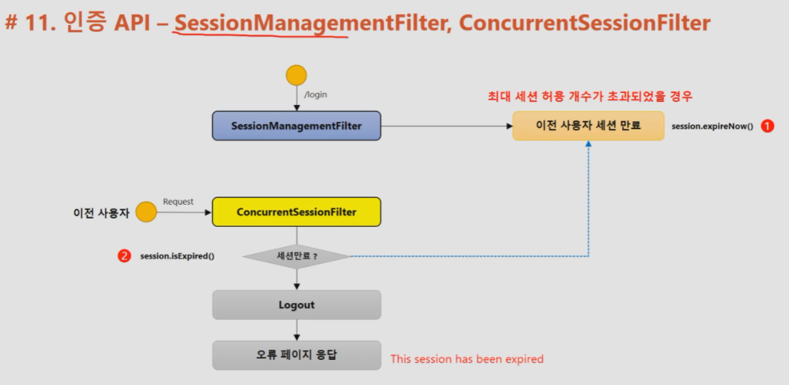

* 동시 세션 제어 정책이 "기존 세션 만료"이거나, 세션 유효 시간이 지났을 때 이를 제거 합니다.
* 동시 세션 제어 정책이 "기존 세션 만료" 인데, 기존 시스템에 로그인 된 사용자가 재 인증을 요구할 경우 SessionManagementFilter 에서 기존 세션을 즉시 만료 시킴. 그리고 다음 요청이 왔을 때에는 ConcurrentSessionFilter 가 기존 세션을 시스템에서 제거합니다.


<br/>

📌 세션 정책 SessionManagementFilter & ConcurrentSessionFilter 정리
-
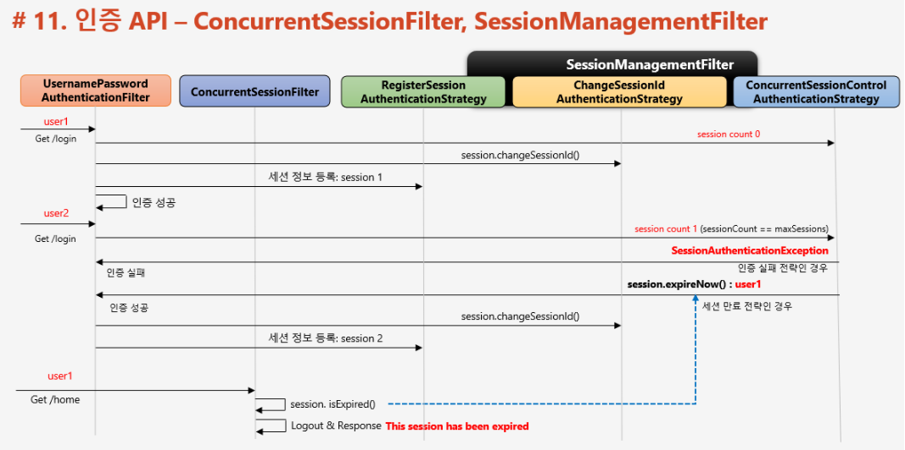
* 최초 인증시 UsernamePasswordFilterAuthentication 이 인증 처리 후 다음과 같이 동작
    * ConcurrentSessionControlAuthenticationStrategy 를 호출해서 sessionCount 를 1 증가 시킴
    * ChangeSessionIdAuthenticationStrategy 를 호출해서 기존 세션 ID 변경 할지 말지 결정
    * RegisterSessionAuthenticationStrategy 를 호출해서 세션 정보 (+sessionCount) 저장
* 재인증시 UsernamePasswordFilterAuthentication 가 ConcurrentSessionControlAuthenticationStrategy 를 호출해서 세션 정보를 확인 => sessionCount 가 1 임을 확인
    * 인증 실패 전략일 경우
        * 인증 실패
    * 세션 만료 전략인 경우
        * ConcurrentSessionControlAuthenticationStrategy 를 호출해서 기존 세션을 만료시킴
        * ChangeSessionIdAuthenticationStrategy 를 호출해서 세션 아이디 변경
        * RegisterSessionAuthenticationStrategy 를 호출해서 세션 정보를 저장
    * 이 후 기존 세션으로 요청이 오면 ConcurrentSessionFilter 가 세션을 제거


<br/>


📌 인가 정책 - 권한 설정
-
* URL과 Method 방식으로 권한 설정이 가능
    * DB와 연동해서도 사용 가능
   

<br/>
 
📌 URL 인가 정책
-

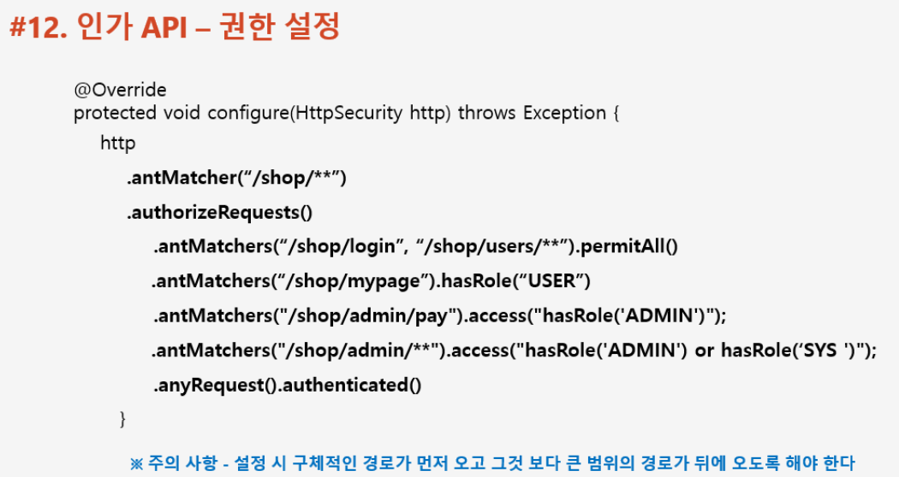
* antMatcher : 이 정책을 적용할 URL 자원을 명시합니다.
* authorizeRequests : 인가 정책을 명시할 것임을 선언합니다.
* authenticated : 자원에 대해 인증을 요구합니다.
* antMatchers : 권한 명시와 함께 사용하며, 구체적인 자원에 대해 어떤 권한을 요구할지 적는 부분입니다.
* hasRole : 매개 변수로 넘겨준 권한을 요구합니다.
    * access :  표현식으로 권한을 명시하고 싶을 때 사용
* permitAll : 권한 없이 자원 요청을 허용합니다.

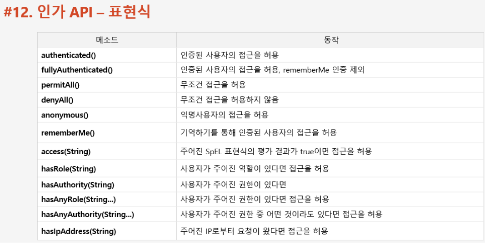


<br/>


📌 예외 처리 
-
* 아래와 같은 예외가 발생할 수 있음. 예외 발생시 ExceptionTranslationFilter 가 처리 합니다.
    * AuthenticationException : 인증 예외
        * AuthenticationEntryPoint 호출
            * 로그인 페이지로 이동, 401 오류 코드 전달
        * RequestCache 에 사용자의 이전 요청 정보를 저장하는 것이 가능합니다.
            * SavedRequest : 사용자가 요청했던 request 파라미터 값들이 저장 됨
        * FailureHandler 호출
            * AuthenticationEntryPoint 가 하는 작업을 제외하고 추가 적인 작업을 시스템에서 해주어야 하는 경우 호출 (IP 저장)
    
    * AccessDeniedException : 인가 예외

> 예외 처리 흐름

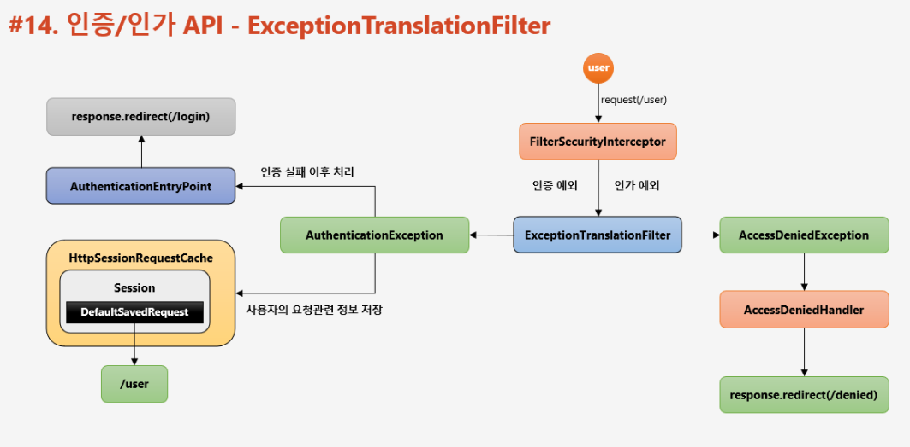

* 인증 예외 발생
    * 인증 되지 않은 사용자, 시스템에 접근 => 인증 예외 발생 (AuthenticationException)
    * Security Context 를 null 처리 후, AuthenticationEntryPoint 호출 => 로그인 페이지로 이동
    * HttpSessionRequestCache 가 session 에 DefaultSavedRequest 를 생성해서 저장해둠

* 인가 예외 발생
    * 인증 된 사용자, 시스템에 접근. 
    * 권한 심사, 권한이 없음 => 인가 예외 발생 (AccessDeniedException)


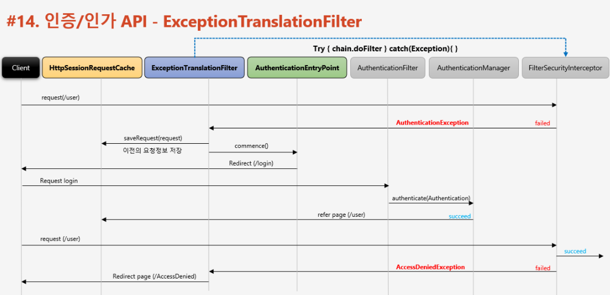
* 최초 접근 시 (인증 후 또는 인증 전, 권한이 없는 자원에 접근함)
    * ExceptionTranslationFilter 에서 FilterSecurityInterceptor 를 호출하는 구조
    * FilterSecurityInterceptor 는 인가 심사를 하는 역할 또한 맞고 있음
        * 인가 예외 발생시 ExceptionTranslationFilter에 Exception throw
    * ExceptionTranslationFilter 에서 다음과 같은 처리
        * SecurityContext clear
        * save request info into HttpSessionRequestCache
        * AuthenticationEntryPoint 호출 => 로그인 요청 
* 권한이 있는 계정으로 인증 후 접근 시
    * Cache 해둔 데이터로 redirect (선택)

> 인증 예외 처리 

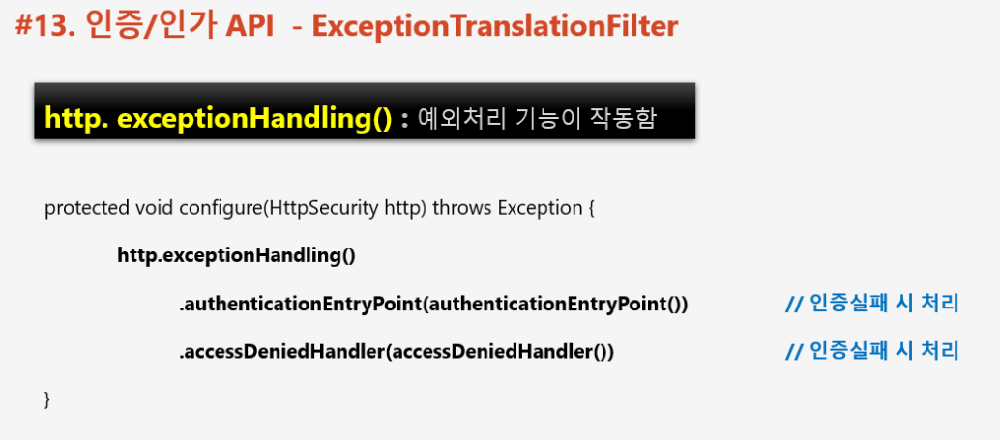

> 인가 예외 처리

```java
// 인증 예외 처리
RequestCache requestCache = new HttpSessionRequestCache();
SavedRequest savedRequest = requestCache.getRequest(httpServletRequest, httpServletResponse);
httpServletResponse.sendRedirect(Optional.ofNullable(savedRequest).map(SavedRequest::getRedirectUrl).orElse("/"));
```
* 이 때 redirect 한 자원에 대해서는 권한(인가)을 요구하지 않습니다.


