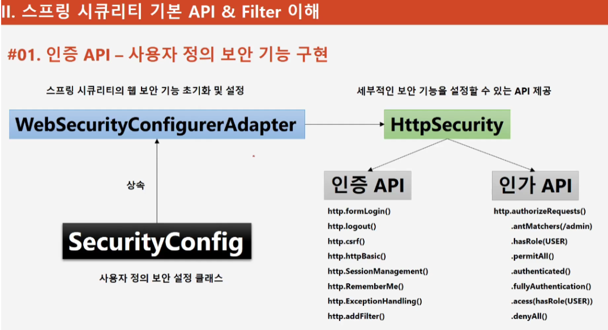
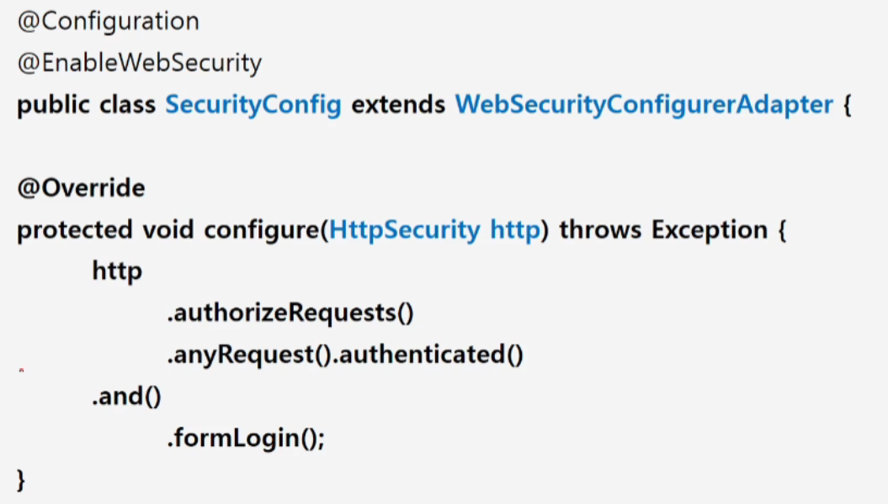
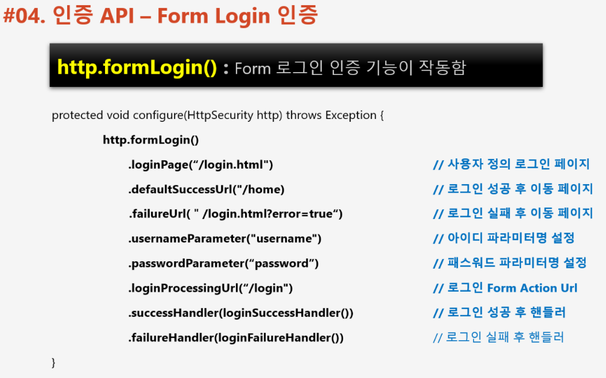
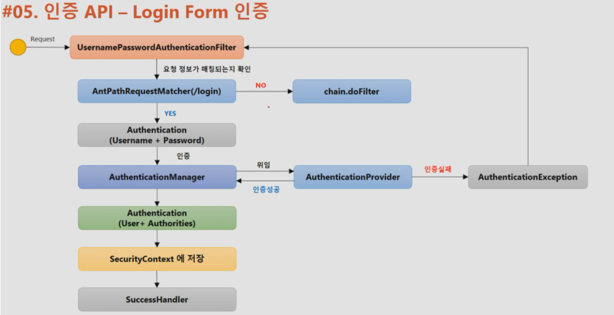
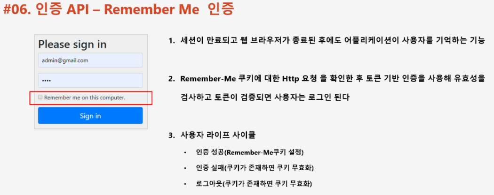
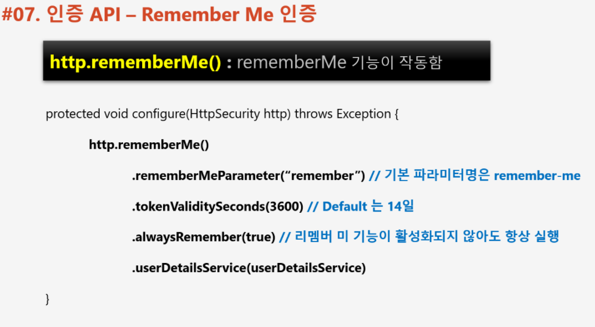
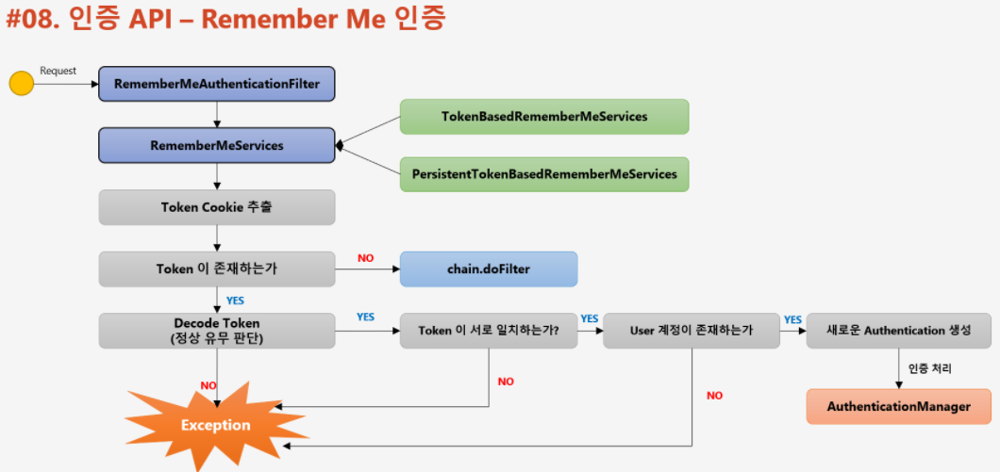
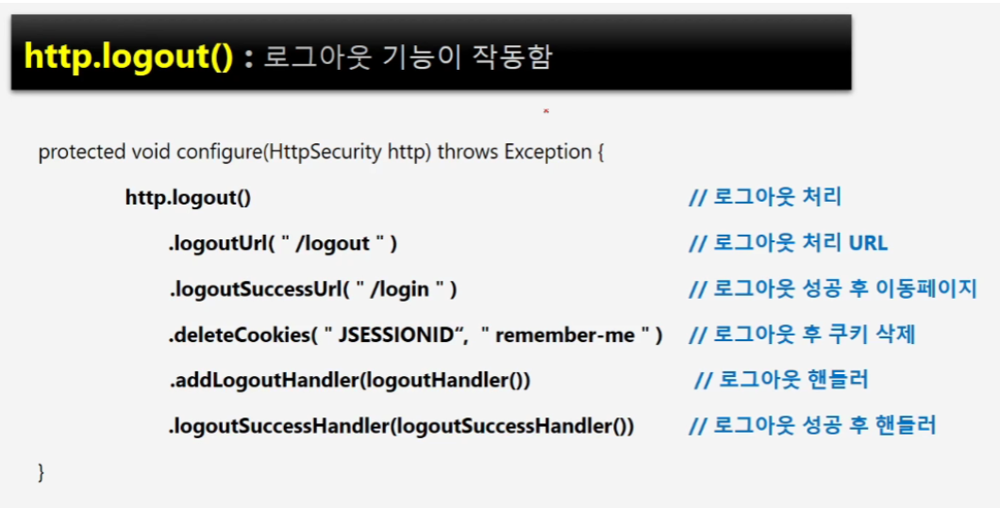
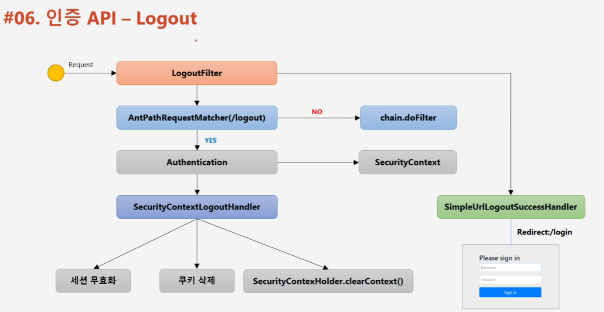
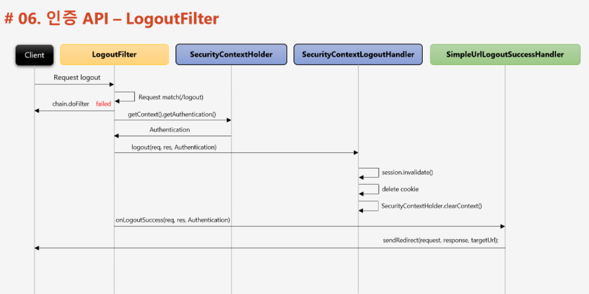

📌 인증과 인가
-
* 인증이란?
    * Authentication
    * 클라이언트가 누구인지 확인하는 과정
    * 회원가입 & 로그인이 대표 예시
* 인가란?
    * Authorization
    * 인증된 클라이언트가 이 자원에 접근 권한이 있는지 확인하는 과정
    * 대표적으로 "이 포스팅에 대한 권한이 없습니다" 라는 글을 마주쳤을 때가 인가 과정을 통해 권한이 없다는 것을 확인한 대표적인 예시

 

📌 설정 방법
-

* WebSecurityConfigureAdapter 를 상속 받아서, 설정 내용을 추가할 수 있음

* 다음과 같이 WebSecurityConfigureAdapter 를 상속 받은 뒤, configure 메소드를 오버라이드 하여, 설정할 수 있음
* @EnableWebSecurity 는 기본적인 보안 관련 클래스를 import 하고 호출하기 위한 어노테이션으로 꼭 추가 되어야 한다.
* 이제 여기에, 인증정책과 인가정책 보안 설정 등등을 추가하면 된다.

 

📌 Form 인증 정책 
-

* 이렇게 Form 인증 정책을 설정했을 때, Form 방식으로 인증 요청이 들어오면 이 설정 클래스가 요청을 처리 한다.
* [AdminSecurityConfig.java](../src/main/java/com/slack/slack/appConfig/security/config/AdminSecurityConfig.java)

 

📌 Form 인증 요청이 들어왔을 때
-

1. UsernamePasswordAuthenticationFilter 가 요청을 받는다.
2. AntPathRequestMatcher 이 들어온 요청을 확인하여, 인증을 처리하기로 한 url(/login)이 맞는지 확인
3. 맞으면 Authentication 객체를 감싼 Token을 생성해서 AuthenticationManager(ProviderManager) 에게 인증 처리를 위임
4. AuthenticationManager 가 처리를 할 적절한 AuthenticationProvider 를 찾고, 찾은 AuthenticationProvider 에게 인증 처리를 위임
    * 만약 AuthenticationManager가 적절한 AuthenticationProvider를 못 찾았을 때에는 AuthenticationManager에 저장된 부모 AuthenticationManager의 참조값을 타고 가서 적절한 매니저를 찾음
    
        * 인증 실패시 Exception throw
        * 인증 성공시 Authentication 객체를 UsernamePasswordAuthenticationFilter 에 리턴
5. 인증이 되었다면, 인증된 Authentication 객체를 받은 UsernamePasswordAuthenticationFilter가 부모 클래스인  AbstractAuthenticationProcessingFilter 에 Authentication를 리턴
6. AbstractAuthenticationProcessingFilter 는 successfulAuthentication 메소드를 호출해서, SecurityContext 를 가져오고 거기에 Authentication 객체를 저장

 

📌 RememberMe 인증
-

* Remember Me 쿠키를 남겨서 Remember Me 쿠키의 유효 기간이 지나지 않은 이상, 계속 로그인을 시켜주는 기능

> RememberMe 처리 방식

* 토큰의 유효성 검사를 진행 한 뒤에, 새로운 Authentication 객체를 생성해 재인증 요구

📌 Form Logout
-

* [AdminSecurityConfig.java](../src/main/java/com/slack/slack/appConfig/security/config/AdminSecurityConfig.java)

* 로그아웃 필터가 요청을 잡음
* logout url 이 맞다면, SecurityContext 에서 Authentication 객체를 가져와 SecurityContextLogoutHandler 에 넘긴다.
* SecurityContextLogoutHandler 는 다음과 같은 3가지 동작
    * 세션 무효화
    * 쿠키 삭제
    * 컨텍스트 클리어
* 이 후 LogoutSuccessHandler 호출

 
