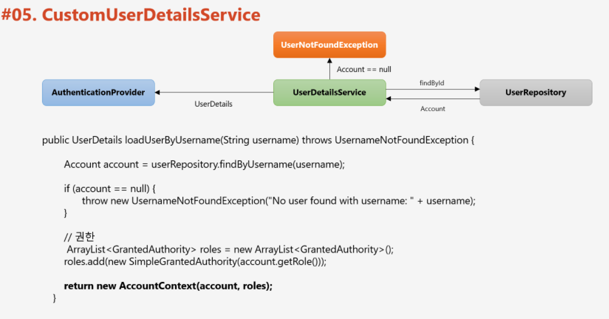
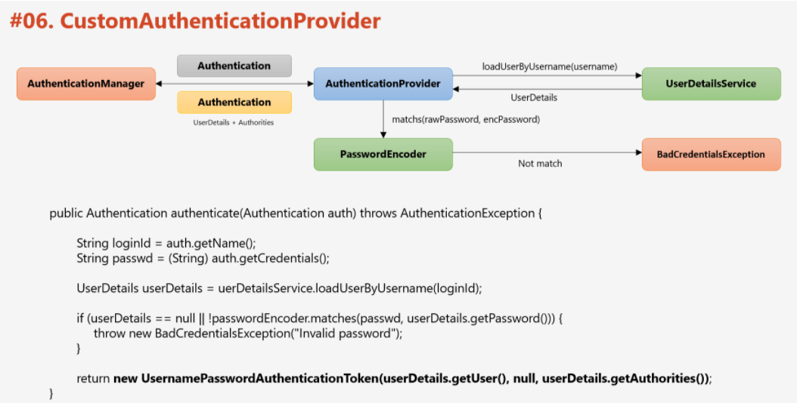
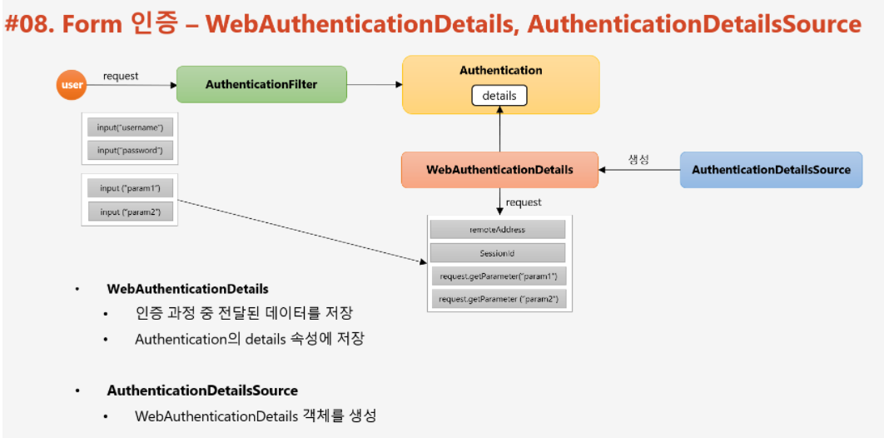
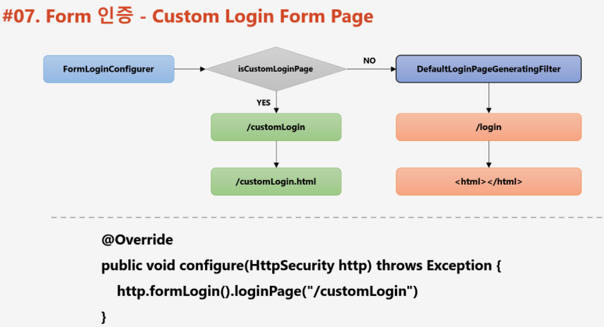
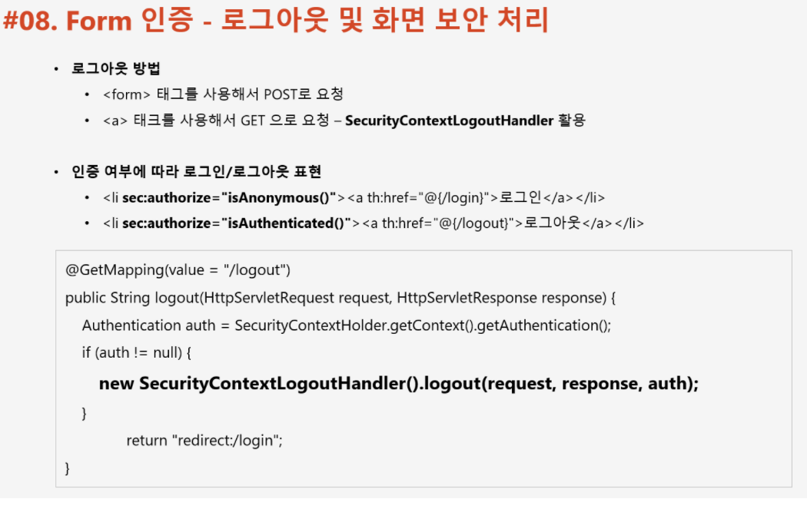
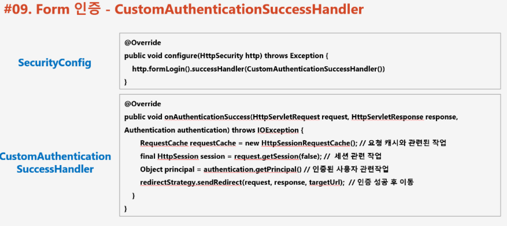
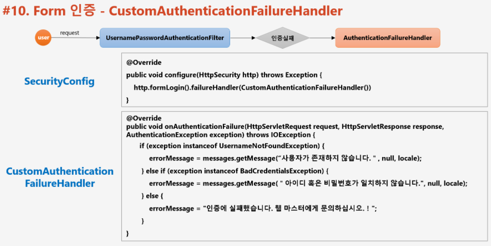
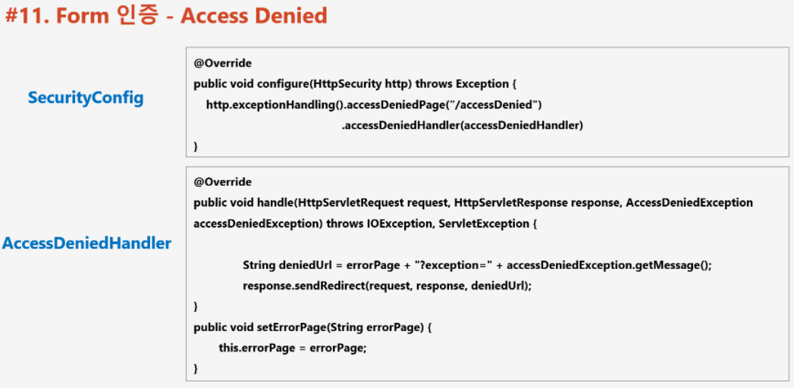

📌 DB 인증
-
* 비밀번호 암호화 
* [패스워드 인코더](../src/main/java/com/slack/slack/appConfig/security/common/BeanFactory.java)
```java
@Bean
public PasswordEncoder passwordEncoder() {
    return PasswordEncoderFactories.createDelegatingPasswordEncoder();
}
```
* encode와 matches 두가지 메소드를 지원
* 암호화 포멧 : "{포멧}encodedPassword"


<br/>


📌 WebIgnore
-
* static 자원의 경우에도 기본적으로 스프링 시큐리티가 인증을 요구함. 따라서 인증을 별도로 관리할 필요가 있음
```java
@Override
public void configure(WebSecurity web) throws Exception {
    web.ignoring().requestMatchers(PathRequest.toStaticResources().atCommonLocations());
}
```
* PathRequest 의 atCommonLocations 메소드 내부의 StaticResourceLocation 를 열어보면 다음과 같은 경로를 정의하고 있음
```java
CSS(new String[]{"/css/**"}),
JAVA_SCRIPT(new String[]{"/js/**"}),
IMAGES(new String[]{"/images/**"}),
WEB_JARS(new String[]{"/webjars/**"}),
FAVICON(new String[]{"/**/favicon.ico"});
```
* 따라서 이미지 파일의 경우 images 폴더 아래에 정의해야 WebIgnore 설정에 정의된 대로 Filter 를 통과 할 수 있음
* permitAll 과는 다르게, FilterSecurityInterceptor (인가) 자체를 거치지 않는다는 점이 다르다.


<br/>


📌 필드 카피를 위한 준비
-
* ModelMapper 라이브러리가 있다.
```xml
<dependency>
    <groupId>org.modelmapper</groupId>
    <artifactId>modelmapper</artifactId>
    <version>2.3.0</version>
</dependency>
```
* 다음과 같이 사용
```java
ModelMapper modelMapper = new ModelMapper();
Account account = modelMapper.map(accountDTO, Account.class);
```
* accountDTO 의 필드 중 이름이 같은 필드 값을 새로운 Account 클래스로 옮겨 반환


<br/>

📌 스프링 시큐리티 DB 연동 인증 처리
-
* UserDetailsService 를 커스텀 하여, DB 와 계정을 연동하도록 설정할 수 있음
    * 이 때 UserDetails 객체를 반환해야함

* UserDetailsService 를 구현하고 UserDetails(이미 구현한 User 를 상속받는게 편하다) 를 구현한 클래스를 설정 파일에 등록해서 연동 가능

> UserDetailsService

* [AccountDetailsServiceImpl.java](../src/main/java/com/slack/slack/appConfig/security/service/AccountDetailsServiceImpl.java)

> UserDetails

* [AccountContext.java](../src/main/java/com/slack/slack/appConfig/security/service/AccountContext.java)

> configure 등록
* 커스텀한 service 를 시스템이 사용하도록 설정 등록
```java
@Override
protected void configure(AuthenticationManagerBuilder auth) throws Exception {
    auth.userDetailsService(userDetailsService);
}
```

> remember me 옵션을 사용한다면 옵션에도 service를 추가해준다.

```java
http
    .rememberMe()
    .rememberMeParameter(remember)
    .tokenValiditySeconds(3600 * 24 * 14)
    .userDetailsService(accountDetailsService);
```


<br/>

📌 AuthenticationProvider 커스텀 (details set)
-

* AuthenticationProvider 구현체를 만들고, 설정 파일에 Bean 으로 등록 후, provider 등록

> AuthenticationProvider 를 커스텀하면
* details 에 setting 할 내용을 커스텀할 수 있게 됨
* 인증 시 추가적인 작업을 진행할 수 있게 됨


> AuthenticationProvider 생성
* [FormAuthenticationProvider.java](../src/main/java/com/slack/slack/appConfig/security/provider/FormAuthenticationProvider.java)
* ProviderManager 를 디버깅하면 support 를 호출한다는 사실을 할 수 있음

> Bean 으로 등록하기

```java
@Bean
public AuthenticationProvider authenticationProvider() {
    return new FormAuthenticationProvider(accountDetailsService, passwordEncoder);
}
```

> 만든 AuthenticationProvider 를 시스템에 등록

```java
@Override
protected void configure(AuthenticationManagerBuilder auth) throws Exception {
    auth.authenticationProvider(authenticationProvider());
}
```


> WebAuthenticationDetails
* 스프링 시큐리티는 인증에 필요한 파라미터인 username, password 이외에 정보들을 가지고 있을 수 있도록 Authentication 클래스에 details 라는 필드가 있는데, 여기에 WebAuthenticationDetails을 담을 수 있다.

* Authentication 객체 내부의 WebAuthenticationDetails 에 기본적으로 remoteAddress, sessionId 를 가지고 있다.
* AuthenticationDetailsSource 객체가 WebAuthenticationDetails를 생성해준다.

> WebAuthenticationDetails 사용법
* WebAuthenticationDetails 상속
    ```java
    public class FormWebAuthenticationDetails extends WebAuthenticationDetails {
    
        private String secretKey;
    
        public FormWebAuthenticationDetails(HttpServletRequest request) {
            super(request);
            secretKey = request.getParameter("secret_key");
        }
    
        public String getSecretKey() {
            return secretKey;
        }
    }
    ```
    
* FormWebAuthenticationDetailsSource 상속 클래스를 만들어 Component로 등록 (또는 Config 에 함수로 생성)
    ```java
    // config 함수로 등록했다.
    private AuthenticationDetailsSource<HttpServletRequest, WebAuthenticationDetails> authenticationDetailsSource() {
        return request -> new FormWebAuthenticationDetails(request);
    }
    ```
    
* config 에 details 등록
    ```java
    // 이 config 의 인증 정책
    http
            .formLogin()
            // detail
            .authenticationDetailsSource(authenticationDetailsSource())
            ...
    ```
    
* 사용할 때
    ```java
    Authentication authentication = SecurityContextHolder.getContext().getAuthentication();
    FormWebAuthenticationDetails details = (FormWebAuthenticationDetails) authentication.getDetails();
    ```
    

<br/>

📌 로그인 커스텀 & 로그아웃 커스텀
-


* 이 때 ".loginProcessingUrl("/login_proc")" 으로 명시한 경로와 form 의 action 경로가 일치햐야 한다.




<br/>

📌 인증 핸들러 커스텀
-

* 성공 핸들러는 페이지 리다이렉트 등등을 위해 사용


* 실패 핸들러는 페이지 에러를 알리기 위해서 사용


> 핸들러 생성


* [FormAuthenticationSuccessHandler.java](../src/main/java/com/slack/slack/appConfig/security/handler/FormAuthenticationSuccessHandler.java)
* [FormAuthenticationFailureHandler.java](../src/main/java/com/slack/slack/appConfig/security/handler/FormAuthenticationFailureHandler.java)
    * FormAuthenticationFailureHandler 의 경우 redirect 로 페이지를 이동하는 것이 아니기에, permitAll 해주어야 한다.

> 핸들러 등록
```java
// 이 config 의 인증 정책
http
    .formLogin()
    ...
    // 자격 증명에 성공 했을 때
    .successHandler(authenticationSuccessHandler)
    // 실패 핸들러
    .failureHandler(authenticationFailureHandler)
    ...
```
* 이 때 Bean 으로 등록하는게 바람직 한데, 왜냐하면 defualt url을 외부로 부터 주입받고 싶기 때문이다.


<br/>

📌 인가 핸들러 커스텀
-

* AccessDeniedHandler 구현
    * [FormAccessDeniedHandler.java](../src/main/java/com/slack/slack/appConfig/security/handler/FormAccessDeniedHandler.java)

* 설정 파일에 핸들러 등록 (Bean 으로 등록하는 이유는 url 을 외부로 부터 주입받기 위함)
    ```java
    private AccessDeniedHandler accessDeniedHandler() {
        return new FormAccessDeniedHandler().setErrorPage(denied);
    };

    @Override
    protected void configure(final HttpSecurity http) throws Exception {
      // 인증 예외 처리
      http
          .exceptionHandling()
          // AccessDeniedHandler 를 구현한 구현체
          .accessDeniedHandler(accessDeniedHandler());
    }
    ```
    
* denied 를 처리할 컨트롤러 구성
    ```java
    // 관리자 인가 거부
    @GetMapping("/denied")
    public String denied(HttpServletRequest request, Model model) {
        Optional opt_exception = Optional.ofNullable(request).map(req -> req.getParameter("exception"));
        model.addAttribute("exception", opt_exception.orElse(null));
        return "denied/denied";
    }
    ```


<br/>
    
---
---
---

📌 Ajax 인증 시큐리티 환경 구성하기
* <https://www.notion.so/4-Ajax-ea10647f1b4040f2ad3f8d0d6c8974bd>
