📌 주요 아키텍쳐
-
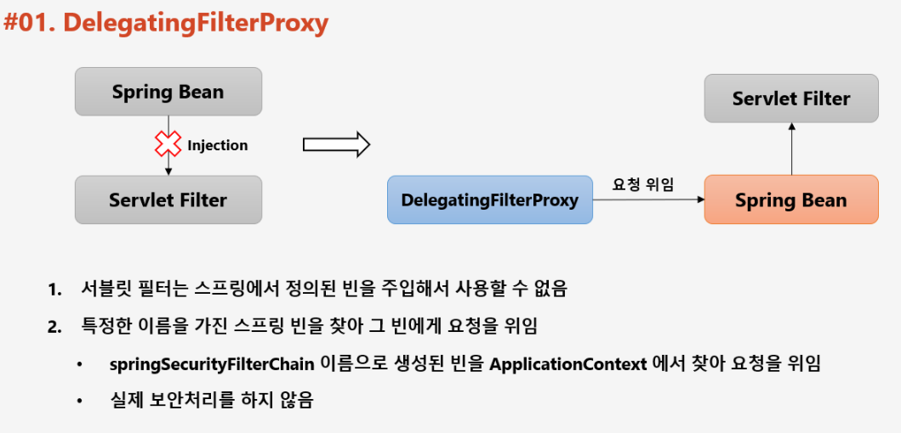
* 스프링 시큐리티는 url 자원을 보안할 때, 필터 기반으로 동작
* 필터(스프링 컨테이너에 요청이 오기 전 처리)는 서블릿 컨테이너의 기술, 그러나 스프링 시큐리티는 스프링 컨테이너(빈)의 기술이 필요 (세션 등등)
* 따라서 Servlet 컨테이너의 DelegatingFilterProxy가 springSecurityFilterChain 이라는 이름을 가진 Proxy(대리인) 빈을 ApplicaionContext 에서 찾아 요청을 위임함
    * 이 Proxy 는 FilterChainProxy 이다.

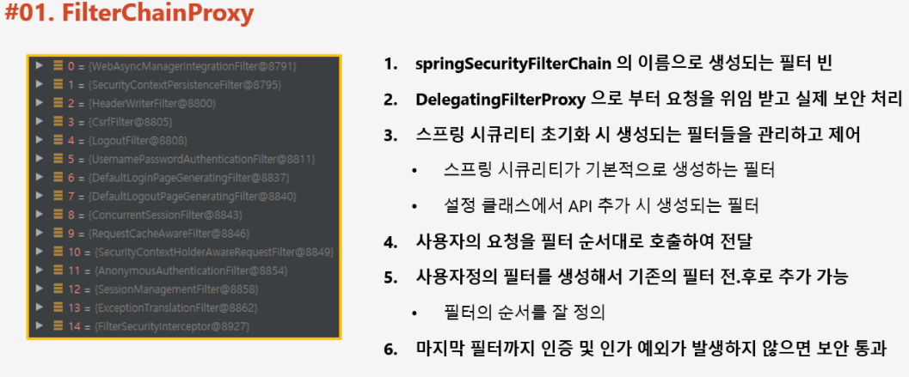
* 필터 순서를 잘 정의 하면 서 사이에 Filter를 끼워 넣는 것이 가능하다.

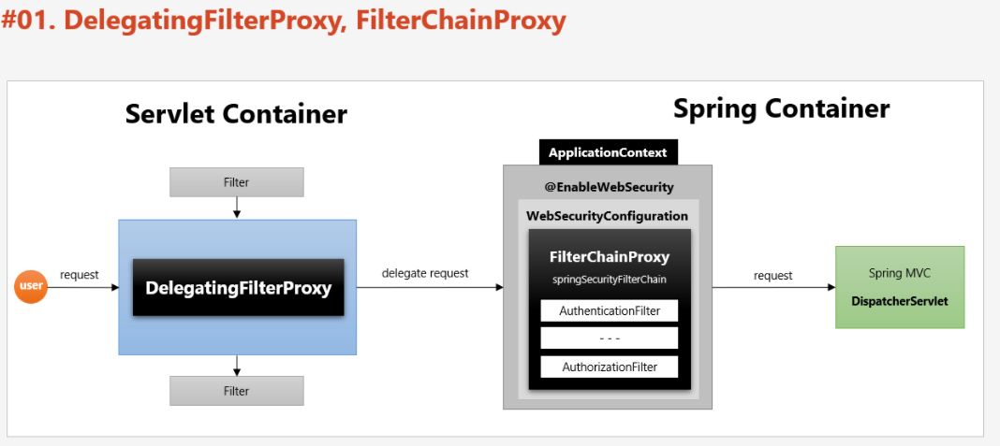
* 클라이언트 요청 시 Servlet 은 springSecurityFilterChain 빈 (DelegatingFilterProxy) 을 찾아 보안 처리 위임
* DelegatingFilterProxy 은 Application 에서 springSecurityFilterChain 이름의 빈(FilterChainProxy)을 찾아 보안 처리 위임
* FilterChainProxy은 보안 처리 후 (필터를 거쳐) dispatcher servlet 으로 요청을 넘김
* 이 때 DelegatingFilterProxy를 호출하는 클래스는 SecurityFilterAutoConfiguration 입니다.

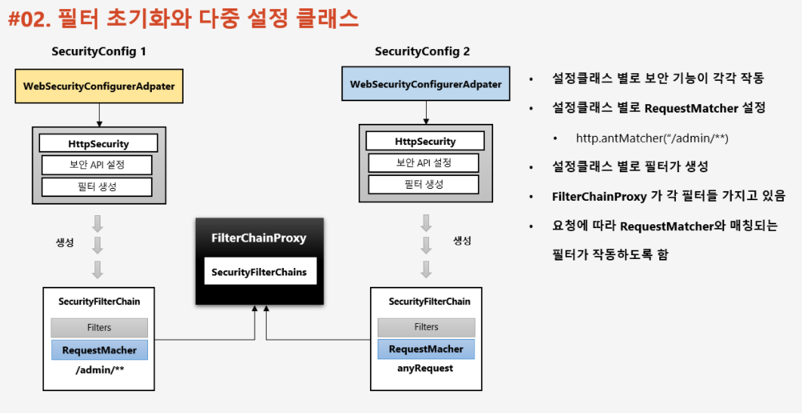
* WebSecurityConfigurerAdapter 는 HttpSecurity(http) 클래스를 읽어 들여서 SecurityFilterChain 을 생성하고 이를 FilterChainProxy로 넘긴다.
* 요청이 들어오면 FilterChainProxy 는 적절한 FilterChain 을 찾아서 처리를 한다.


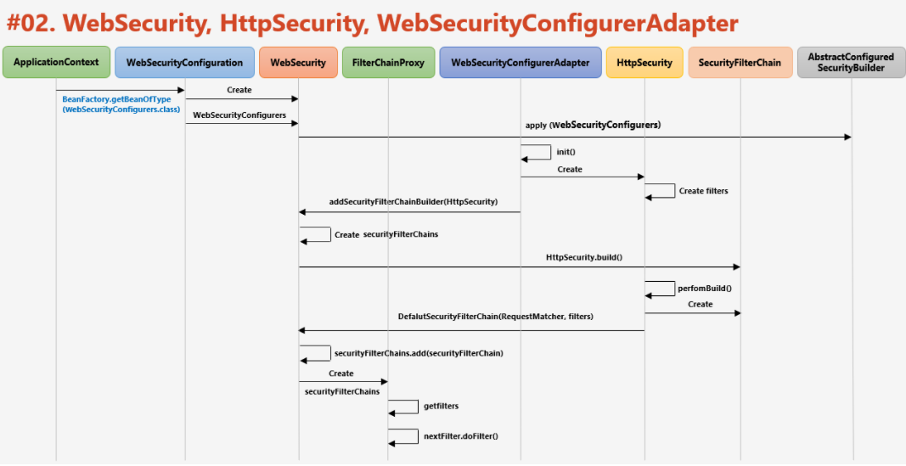
* ApplicationContext 는 WebSecurityConfiguration 호출
* WebSecurityConfiguration 는 WebSecurity 생성
* WebSecurity 는 FilterChainProxy 생성
* WebSecurityConfigurerAdapter 가 HttpSecurity(http) 를 읽어들여 SecurityFilterChain 을 만들고 WebSecurity 에 반환하면 WebSecurity는 이를 FilterChainProxy에 등록


<br/>

📌 인증 프로세스
-

> Authentication 

* 당신이 누구인지 증명
* 인증 후 전역적으로 참조 가능
```java
Authentication authenticaion = SecurityContextHolder.getContext().getAuthentication();
```

* 구조
    * principal : User 아이디 or User 객체
    * credential : 비밀번호
    * authorities : 인증된 사용자의 권한 목록
    * details : 인증 정보 이외, 부가정보
    * Authenticated : 인증 여부


<br/>


> SecurityContextHolder, SecurityContext

* SecurityContext
    * Authentication 객체가 저장되는 곳 
    * SecurityContextHolder 의 ThreadLocal 에 저장이 되어 아무곳에서나 참조가 가능하도록 설계됨
    * 인증이 완료되면 HttpSessionSecurityContextRepository가 SecurityContext 의 Authentication 객체를 Session 에 저장함
* SecurityContextHolder
    * SecurityContext 를 저장하는 저장소로 내부에 ThreadLocal 필드가 존재
    * SecurityContext 를 저장하는 방식이 다음과 같다.
        ```java
    // 자식 스레드에서도 context를 참조할 수 있도록 한다.
        SecurityContextHolder.setStrategyName(SecurityContextHolder.MODE_INHERITABLETHREADLOCAL);
        ```
        
        * MODE_THREADLOCAL : 스레드당 SecurityContext 객체를 할당. 기본 값
        * MODE_INHERITABLETHREADLOCAL : 메인 스레드와 자식 스레드에 관해 동일한 SecurityContext 를 유지(스레드를 새로 생성해도 같은 ThreadLocal 을 바라보도록)
            ```java
            @GetMapping("/thread")
            public String thread() {
                new Thread(() -> {
                    Authentication authentication = SecurityContextHolder.getContext().getAuthentication();
                    // default 가 main에만 저장을 할 수 있는 모드이기 때문에 자식 스레드에서는 SecurityContextHolder.getContext().getAuthentication();에서 참조할 수 없다.
                }).start();
            
                return "thread";
            }
            ```
            * 기본적으로 new Thread 내부에서는 스레드를 참조 할 수 없지만 (Thread Local 에 저장되어 있기 때문에) MODE_INHERITABLETHREADLOCAL 를 사용하면 참조가 가능해진다.
        * MODE_GLOBAL : 응용 프로그램 내에서 단 하나의 SecurityContext 저장
        
    * SecurityContextHolder.clear() 로 SecurityContextHolder 에 저장된 SecurityContext 를 제거

* Session 에서 Authentication 참조
    ```java
    Authentication authFromSession =
        ((SecurityContext) request
                                .getSession()
                                .getAttribute(HttpSessionSecurityContextRepository.SPRING_SECURITY_CONTEXT_KEY)
        ).getAuthentication();
    ```
  * HttpSessionSecurityContextRepository 에서 "SPRING_SECURITY_CONTEXT" 으로 저장을 해두는 부분이 있음

    


<br/>
    
    
> SecurityContextPersistenceFilter

* SecurityContext 객체를 생성, 저장, 조회하는 역할
* SecurityContext 를 꺼내어 Session 에 넣어주는 것도 이 객체
* 다음과 같은 처리
    * 익명 사용자 접속 시 
        * 새로운 SecurityContext 객체 생성 후 SecurityContextHolder 에 저장
        * 이 후, AnonymousAuthenticationFilter 에서 AnonymousAuthenticationToken 을 생성해 SecurityContext 에 저장
    * 인증 시 
        * 새로운 SecurityContext 객체 생성 후 SecurityContextHolder 에 저장
        * Authentication filter 가 인증을 마치면, SecurityContext 에 Authentication 객체 저장
    * 인증 후 요청이 들어올 때마다
        * Session 에서 SecurityContext 를 꺼내어 SecurityContextHolder 에 저장
            * SecurityContext 내부에 Authentication 객체를 넣어서 인증 상태를 유지한다.
    * 최종 응답시 
        * SecurityContextHolder.clearContext()

> 전체 흐름

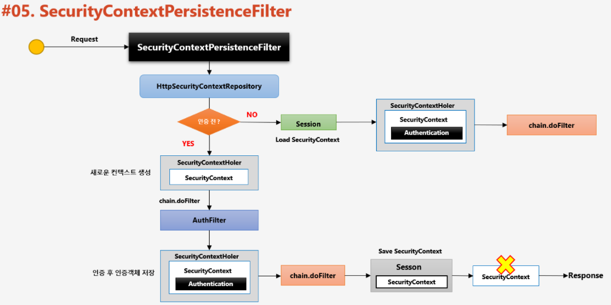
* SecurityContextPersistenceFilter 는 HttpSessionSecurityContextRepository 를 호출해서 Session 에 SecurityContext 객체가 있는지 확인
    * 없다면 SecurityContextHolder 생성 후, 인증을 인증 필터에 인증을 맞김
    * 있다면 SecurityContextHolder 생성 후 Session 에 있는 SecurityContext (HttpSessionSecurityContextRepository 에서 get)을 가져와 setting (이 때에는 설정해둔, SecurityContextHolderStrategy 호출)

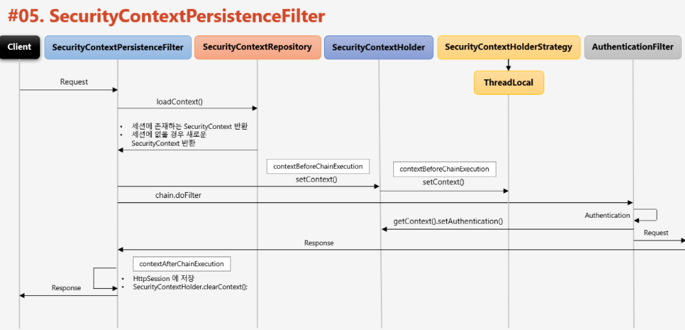


 
<br/>


📌 인증 흐름
-
> 전체

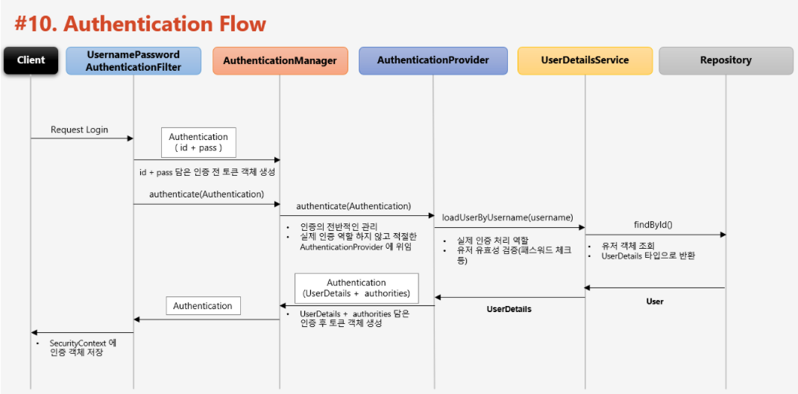

> AuthenticationManager

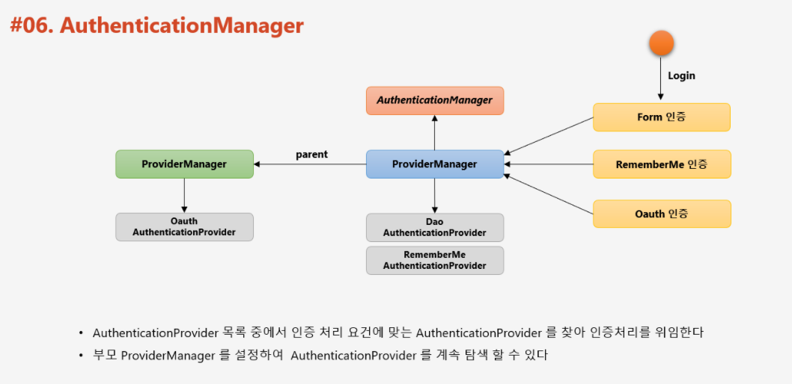

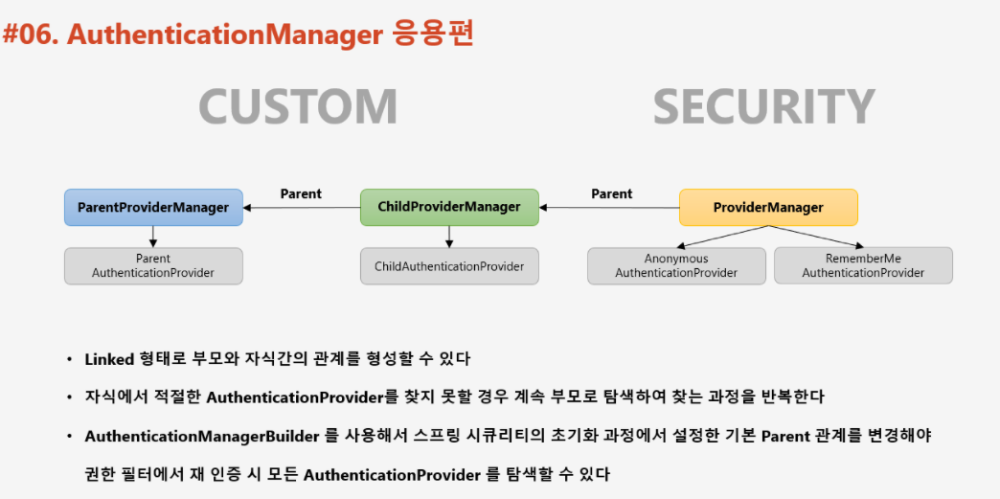
* 이 때 AuthenticationManager 는 인증 처리를 할 적절한 Provider 를 찾는데 만약 찾지 못하면 AuthenticationManager 부모에 대한 참조를 확인하며 적절한 Provider 를 가진 AuthenticationManager 를 찾는다.

> AuthenticationProvider

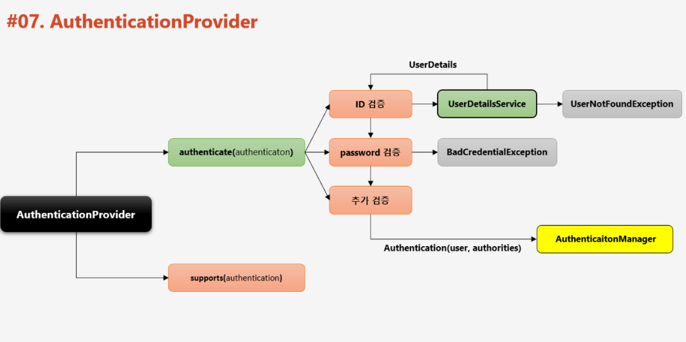
* support 메소드를 통해서, 전달 받은 Authentication 객체에 대한 처리를 지원하는지 여부를 리턴한다.


<br/>

📌 인가 프로세스
-

> Authorization
* 이 자원이 허가 되었는가 확인하는 절차

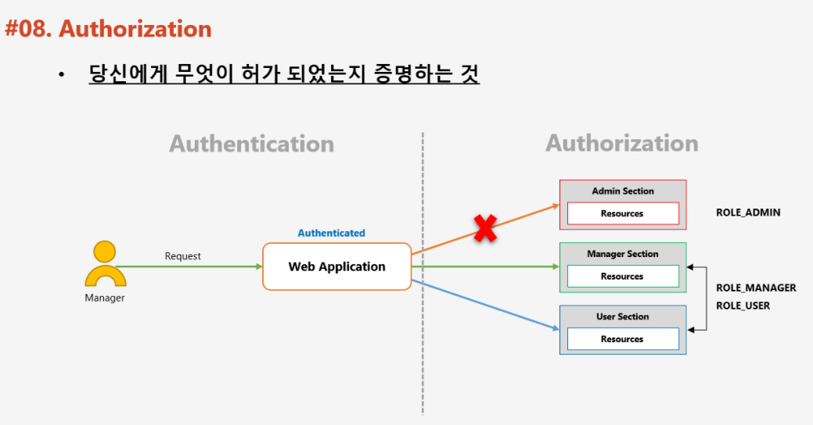

> 인가 처리의 계층

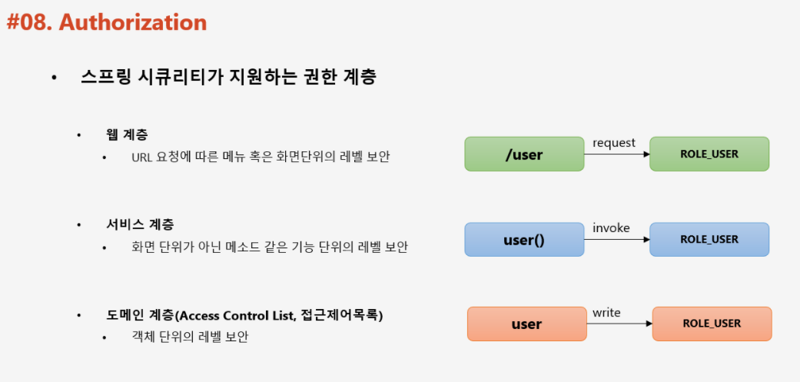
* 스프링 시큐리티는 3가지 계층에 대해 인가 처리할 수 있도록 제공하고 있음
    1. 웹 계층 : URL 단위
    2. 서비스 계층 : Method 단위
    3. 도메인 계층 : 각 객체 단위 


> FilterSecurityInterceptor
* 마지막에 위치한 필터로서 인가 처리를 함 (최종 승인 여부를 결정함)
* 인증 객체 없이 보호 자원에 접근을 시도할 경우 AuthenticationException 발생
* 인증 후 자원에 대한 권한이 없을 경우 AccessDeniedException 발생
* 권한 제어 방식 중 HTTP 자원의 보안을 처리하는 필터 (URL 요청)
* 직접적인 권한 처리는 AccessDeniedManager 에게 위임

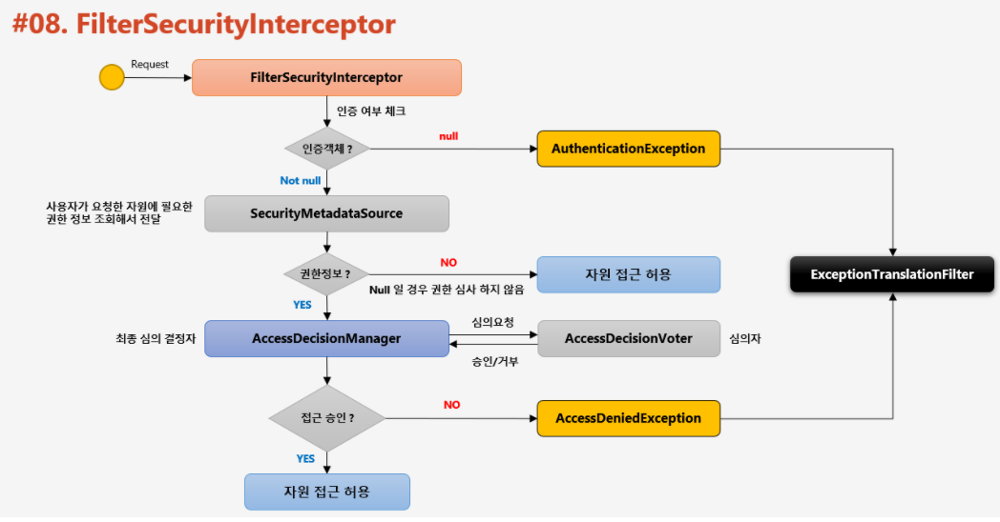
* 요청 정보, 사용자 인증정보, SecurityMetadataSource에서 뽑은 권한 정보를 AccessDeniedManager 에게 넘겨 심사 요청
* AccessDecisionManager 는 적절한 AccessDecisionVoter 를 호출해서 심사를 맞기고, 이들의 결과를 종합하여 승인 여부를 AccessDecisionManager 에게 넘김
 
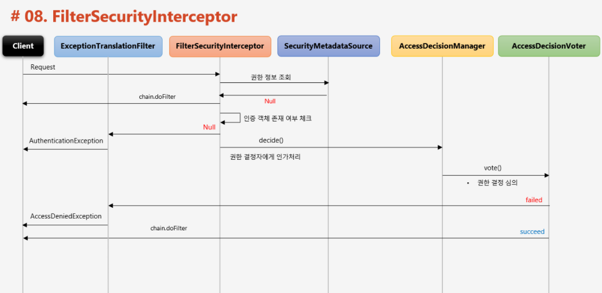


> AccessDecisionManager

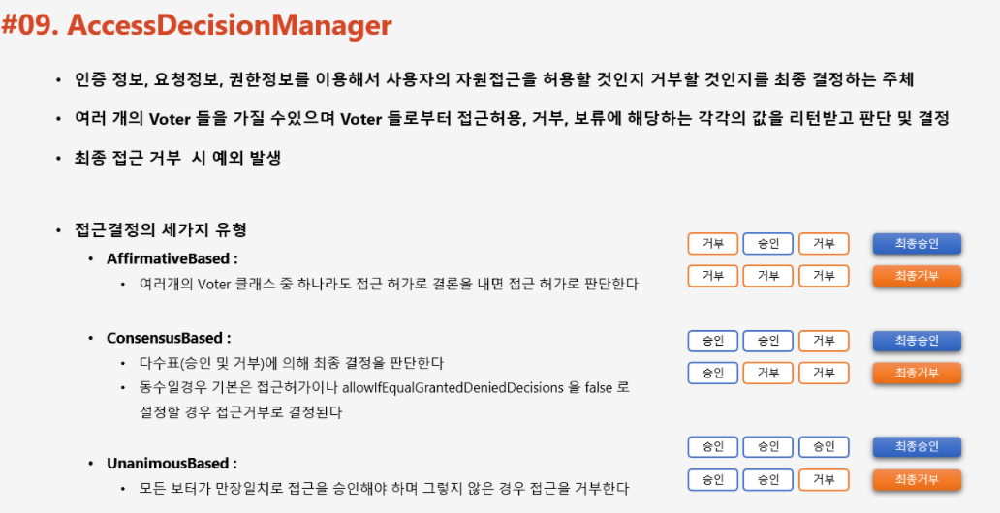
* AffirmativeBased : 하나라도 허가시 허가
* ConsensusBased : 과반수. 동수일 때에는 allowIfEqualGrantedDeniedDecisions 옵션이 true 일 때 허가
* UnanimousBased : 만장일치시 허가


> AccessDecisionVoter
* FilterSecurityInterceptor => AccessDecisionManager => AccessDecisionVoter 으로 심사에 필요한 정보가 넘어옴 
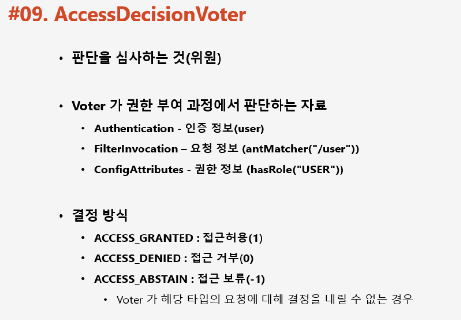

> AccessDecisionManager & AccessDecisionVoter 흐름 정리

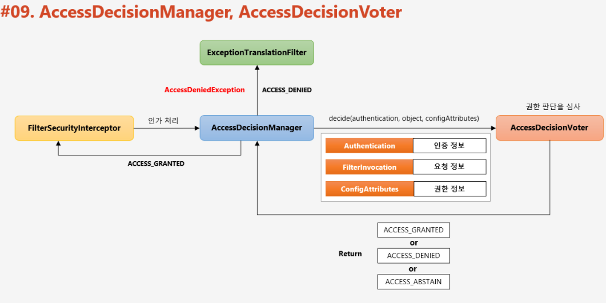

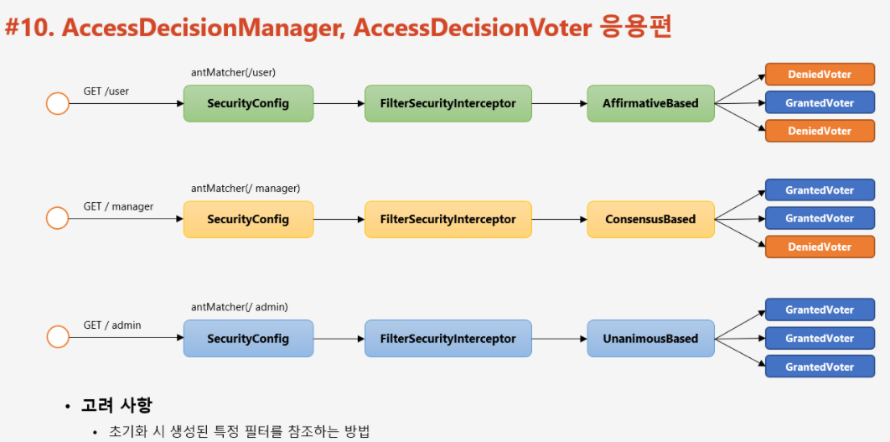
* 이는 voter 를 커스텀 할 때, AccessDecisionManager 작동하는 방식에 따라서 AccessDecisionVoter 간의 순서 등등을 고려해야 함


> 주요 아키텍쳐 총 정리

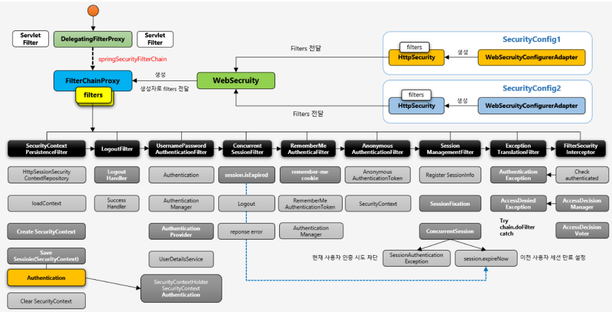

