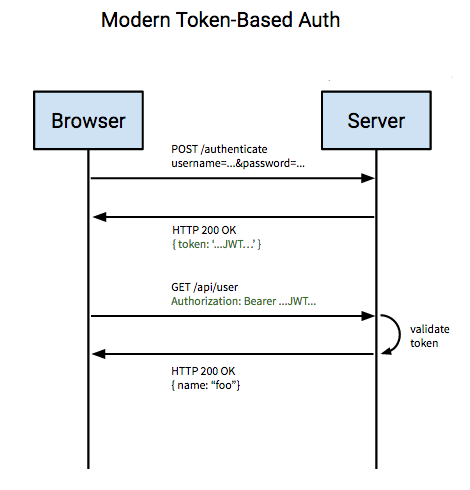
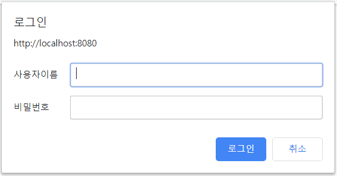

JWT 으로 사용저 정보 관리하기
-

* 인증(Authentication)은 보호된 리소스에 접근하는 대상, 즉 사용자에게 적절한 접근 권한이 있는지 확인하는 일련의 과정을 의미합니다. 
* 이 때 보호된 리소스에 접근하는 대상(사용자)을 접근 주체(Principal)이라고 합니다. 권한(Authorization)은 인증절차가 끝난 접근 주체가 보호된 리소스에 접근 가능한지를 결정하는 것을 의미합니다. 
* 이 때 권한을 부여하는 작업을 인가(Authorize)라고 합니다.
* 쉽게 말하면 인증은 아이디와 비밀번호를 입력 받아 로그인 하는 과정 자체를 의미하는 것이고 권한이 필요한 리소스에 접근하기 위해서는 당연히 이러한 인증 과정을 거쳐야 합니다. 스프링 시큐리는 이런 인증 매커니즘을 간단하게 만들 수 있도록 다양한 옵션들을 제공하고 있습니다. 또한 스프링 시큐리티는 웹 요청이나 메소드 호출, 도메인 인스턴스에 대한 접근 등 상당히 깊은 수준의 권한 부여를 제공하고 있습니다.


<br/>

📌 스프링 시큐리티의 구조
-
* 스프링 시큐리티는 주로 서블릿 필터와 이들로 구성된 필터체인을 사용하고 있습니다.
* 실제 로그인 시에 스프링 시큐리티의 동작 플로우를 바탕으로 인증과 관련된 스프링 시큐리티의 아키텍쳐를 알아 보도록 하겠습니다.


위 그림의 동작 플로우를 간단히 설명하면 다음과 같습니다.

1. 사용자가 로그인 정보와 함께 인증 요청(Http Request)
2. AuthenticationFilter가 이 요청을 가로챕니다. 이 때 가로챈 정보를 통해 UsernamePasswordAuthenticationToken이라는 인증용 객체를 생성합니다.
3. AuthenticationManager의 구현체인 ProviderManager에게 UsernamePasswordAuthenticationToken 객체를 전달합니다.
4. 다시 AuthenticationProvider에 UsernamePasswordAuthenticationToken 객체를 전달합니다.
5. 실제 데이터베이스에서 사용자 인증정보를 가져오는 UserDetailsService에 사용자 정보(아이디)를 넘겨줍니다.
6. 넘겨받은 사용자 정보를 통해 DB에서 찾은 사용자 정보인 UserDetails 객체를 만듭니다. 이 때 UserDetails 는 인증용 객체와 도메인용 객체를 분리하지 않고 인증용 객체에 상속해서 사용하기도 합니다.
7. AuthenticationProvider는 UserDetails를 넘겨받고 사용자 정보를 비교합니다.
8. 인증이 완료되면 권한 등의 사용자 정보를 담은 Authentication 객체를 반환합니다.
9. 다시 최초의 AuthenticationFilter에 Authentication 객체가 반환됩니다.
10. Authentication 객체를 SecurityContext에 저장합니다.

최종적으로 SecurityContextHolder는 세션 영역에 있는 SecurityContext에 Authentication 객체를 저장합니다. 세션에 사용자정보를 저장한다는 것은 스프링 시큐리티가 전통적인 세션-쿠키 기반의 인증 방식을 사용한다는 것을 의미합니다.


<br/>


📌 Spring Security Filter
-
* 실제로 스프링 시큐리티는 훨씬 다양한 필터체인을 사용하여 다양한 커스터마이징을 할 수 있도록 돕습니다. 
* 모든 필터를 다 외우고 있을 필요까지는 없겠지만 대략적인 내용을 이해하고 있으면 사용할 때 훨씬 쉽게 관련된 정보를 찾아볼 수 있을 것입니다.


* SecurityContextPersistentFilter : SecurityContextRepository에서 SecurityContext를 가져와서 SecurityContextHolder에 주입하거나 반대로 저장하는 역할을 합니다.
* LogoutFilter : logout 요청을 감시하며, 요청시 인증 주체(Principal)를 로그아웃 시킵니다.
* UsernamePasswordAuthenticationFilter : login 요청을 감시하며, 인증 과정을 진행합니다.
* DefaultLoginPageGenerationFilter : 사용자가 별도의 로그인 페이지를 구현하지 않은 경우, 스프링에서 기본적으로 설정한 로그인 페이지로 넘어가게 합니다.
* BasicAuthenticationFilter : HTTP 요청의 (BASIC)인증 헤더를 처리하여 결과를 SecurityContextHolder에 저장합니다.
* RememberMeAuthenticationFilter : SecurityContext에 인증(Authentication) 객체가 있는지 확인하고 RememberMeServices를 구현한 객체 요청이 있을 경우, RememberMe를 인증 토큰으로 컨텍스트에 주입합니다.
* AnonymousAuthenticationFilter : 이 필터가 호출되는 시점까지 사용자 정보가 인증되지 않았다면 익명 사용자로 취급합니다.
* SessionManagementFilter : 요청이 시작된 이후 인증된 사용자인지 확인하고, 인증된 사용자일 경우 SessionAuthenticationStrategy를 호출하여 세션 고정 보호 매커니즘을 활성화 하거나 여러 동시 로그인을 확인하는 것과 같은 세션 관련 활동을 수행합니다.
* ExceptionTranslationFilter : 필터체인 내에서 발생되는 모든 예외를 처리합니다.
* FilterSecurityInterceptor : AccessDecisionManager로 권한부여처리를 위임하고 HTTP 리소스의 보안 처리를 수행합니다.


<br/>


📌 JWT(Json Web Token)
-
* JWT(Json Web Token)은 JSON 객체를 통해 안전하게 정보를 전송할 수 있는 웹표준(RFC7519) 입니다. JWT는 '.'을 구분자로 세 부분으로 구분되어 있는 문자열로 이루어져 있습니다. 각각 헤더는 토큰 타입과 해싱 알고리즘을 저장하고, 내용은 실제로 전달할 정보, 서명에는 위변조를 방지하기위한 값이 들어가게 됩니다.


* JWT는 JSON 객체를 암호화 하여 만든 문자열 값으로 위, 변조가 어려운 정보라고 할 수 있습니다. 또, 다른 토큰들과 달리 토큰 자체에 데이터를 가지고 있다는 특징이 있습니다. JWT의 이러한 특징 때문에 사용자의 인증 요청시 필요한 정보를 전달하는 객체로 사용할 수 있습니다.
* 쉽게 말해서 인증에 필요한 정보를 담은 json을 변조가 어려운 값으로 암호화 한 문자열 값을 의미한다.
* 변조가 어렵다는 특정 때문에 인증에 필요한 민감한 정보를 가지고 있을 수 있는 것이다.
* 회원을 구분할 수 있는 정보가 담기는 곳이 바로 JWT의 payload 부분이고 이곳에 담기는 정보의 한 '조각'을 Claim 이라고 합니다. Claim은 name / value 한 쌍으로 이루어져 있으며 당연히 여러개의 Claim들을 넣을 수 있습니다.


📌 JWT 사용 흐름
-


* API 서버는 로그인 요청이 완료되면 클라이언트에게 회원을 구분할 수 있는 정보를 담은 JWT를 생성하여 전달합니다. 그러면 클라이언트는 이 JWT를 헤더에 담아서 요청을 하게 됩니다. 권한이 필요한 요청이 있을 때 마다 API 서버는 헤더에 담긴 JWT 값을 확인하고 권한이 있는 사용자인지 확인하고 리소스를 제공하게 됩니다.

이렇게 기존의 세션-쿠키 기반의 로그인이 아니라 JWT같은 토큰 기반의 로그인을 하게 되면 세션이 유지되지 않는 다중 서버 환경에서도 로그인을 유지할 수 있게 되고 한 번의 로그인으로 유저정보를 공유하는 여러 도메인에서 사용할 수 있다는 장점이 있습니다.
JWT을 사용함으로써, 세션을 공유하지 않는 환경에서도 사용자를 식별할 수 있다. 서버가 여러대로 나뉘어도 사용자를 식별할 수 있게 되는 것이다. 


<br/>

# 시작하기

* 스프링 시큐리티 디팬던시 추가
```xml
<!-- 스프링 시큐리티 사용을 위한 라이브러리 -->
<dependency>
    <groupId>org.springframework.boot</groupId>
    <artifactId>spring-boot-starter-security</artifactId>
</dependency>
```

* 사용자 정보를 담을 Entity 객체와 Repository 생성. 이 때 컨트롤러에서는 Repository 의존성을 주입받을 수 있도록 생성자 사용
    * Entity
    ```java
    @AllArgsConstructor
    @Getter
    @NoArgsConstructor(access = AccessLevel.PROTECTED)
    @Entity
    @JsonFilter("User")
    public class User {
        @Id
        @GeneratedValue
        private Integer id;
    
        private String email;
    
        private String password;
    
        private String name;
    
        private String Status;
    
        @Past 
        private Date date;
    
    }
    ```
    > 이때 사용자 정보를 인메모리 DB에 생성해두기 위해 아래와 같은 data.sql 파일을 resources 경로 아래에 생성
    ```sql
    insert into user(id, email, password, name, status, date) values(1, 'ehdgus5015@naver.com', '1234', '김동현', 'OK', sysdate())
    ```
    * UserRepository
    ```java
    public interface UserRepository extends JpaRepository<User, Integer> {
    }
    ```

* Spring Security를 사용하기 위해서는 Spring Security Filter Chain 을 사용한다는 것을 명시해 줘야 합니다. 이것은 WebSecurityConfigurerAdapter를 상속받은 클래스에 @EnableWebSecurity 어노테이션을 달아주면 해결됩니다. 

```java
@Configuration
public class SecurityConfig extends WebSecurityConfigurerAdapter {

    /**
     * h2-console 로 들어오는 모든 요청을 허용
     * 
     * url 요청에 대한 인증을 요구합니다.
     * */
    protected void configure(HttpSecurity http) throws Exception {
        http.authorizeRequests().antMatchers("/h2-console/**").permitAll();
        http.csrf().disable();
        http.headers().frameOptions().disable();

        // 스프링 시큐리티의 전통적인 방법으로 모든 요청에 대해 인증을 요구하고 있다.
        http.httpBasic()
                .and()
                .authorizeRequests()
                // /users 도메인으로 들어오는 모든 요청에 대해 USER 권한을 요구합니다.
                .antMatchers("/users/**").hasRole("USER")
                // 나머지의 경우 요청을 허용합니다.
                .antMatchers("/**").permitAll();
    }
}
```
* 위 코드는에서 아래 authorizeRequests() 메소드를 호출하는 부분은 사용자 요청에 대해 인증을 요구하는 부분입니다.
* /users 으로 시작하는 url에 대해서는 USER 라는 권한을 요구하고 나머지의 경우 모두 허용을 합니다.
* 따라서 TestController에는 별도의 인증 정보 없이 요청을 남길 수 있지만, UserController에 요청을 남기는 경우 아래와 같은 인증 정보를 요구합니다. 



> 인증 정보를 요구하는 모습

* 일단은 임시로, 아래와 같은 설정을 추가해서 인증된 사용자에게 USER 권한을 부여합니다.(인메모리 db에)
```java
@Configuration
public class SecurityConfig extends WebSecurityConfigurerAdapter {

    /**
     * 인메모리에 사용자 저장소를 만드는데,
     * 아이디 username
     * 비밀번호 passw0rd로 들어온 사용자의 권한을
     * USER으로 하여 인메모리 저장소에 저장해두겠다는 말이다.
     *
     * 이 부분에서 {noop} 부분을 적절하게 변경하면
     * 사용자 별로, 리소스별로 권한을 세세하게 부여할 수 있다.
     * */
    @Autowired
    public void configureGlobal(AuthenticationManagerBuilder auth) throws Exception {
        auth.inMemoryAuthentication()
                .withUser("username")
                .password("{noop}passw0rd")
                .roles("USER");
    }
}
```

<br/>

* 그러나 우리가 만들고자 하는것은 세션-쿠키 기반의 전통적인 로그인 방법이 아니라 JWT 를 이용한 방법입니다. JWT 형식의 토큰을 발행하고 검증하는 모듈이 필요합니다. 다음과 같은 dependency를 추가해 주도록 하겠습니다.

```xml
<!-- 스프링 시큐리티를 jwt 방식으로 인증하기 위함 -->
<dependency>
    <groupId>io.jsonwebtoken</groupId>
    <artifactId>jjwt</artifactId>
    <version>0.9.1</version>
</dependency>
```

* 추가된 라이브러리를 사용해서 JWT를 생성하고 검증하는 컴포넌트를 만들어 보도록 하겠습니다. JWT에는 토큰 만료 시간이나 회원 권한 정보등을 저장할 수 있습니다.

```java
@RequiredArgsConstructor
@Component
public class JwtTokenProvider {

    @Value("${spring.security.secretKey}")
    private String secretKey;

    // 토큰 유효시간 30분
    private long tokenValidTime = 30 * 60 * 1000L;

    private final UserDetailsService userDetailsService;

    // 객체 초기화, secretKey를 Base64로 인코딩한다.
    @PostConstruct
    protected void init() {
        secretKey = Base64.getEncoder().encodeToString(secretKey.getBytes());
    }

    // JWT 토큰 생성
    public String createToken(String userPk, List<String> roles) {
        Claims claims = Jwts.claims().setSubject(userPk); // JWT payload 에 저장되는 정보단위
        claims.put("roles", roles); // 정보는 key / value 쌍으로 저장된다.
        Date now = new Date();
        return Jwts.builder()
                .setClaims(claims) // 정보 저장
                .setIssuedAt(now) // 토큰 발행 시간 정보
                .setExpiration(new Date(now.getTime() + tokenValidTime)) // set Expire Time
                .signWith(SignatureAlgorithm.HS256, secretKey)  // 사용할 암호화 알고리즘과
                // signature 에 들어갈 secret값 세팅
                .compact();
    }

    // JWT 토큰에서 인증 정보 조회
    public Authentication getAuthentication(String token) {
        UserDetails userDetails = userDetailsService.loadUserByUsername(this.getUserPk(token));
        return new UsernamePasswordAuthenticationToken(userDetails, "", userDetails.getAuthorities());
    }

    // 토큰에서 회원 정보 추출
    public String getUserPk(String token) {
        return Jwts.parser().setSigningKey(secretKey).parseClaimsJws(token).getBody().getSubject();
    }

    // Request의 Header에서 token 값을 가져옵니다. "X-AUTH-TOKEN" : "TOKEN값'
    public String resolveToken(HttpServletRequest request) {
        return request.getHeader("X-AUTH-TOKEN");
    }

    // 토큰의 유효성 + 만료일자 확인
    public boolean validateToken(String jwtToken) {
        try {
            Jws<Claims> claims = Jwts.parser().setSigningKey(secretKey).parseClaimsJws(jwtToken);
            return !claims.getBody().getExpiration().before(new Date());
        } catch (Exception e) {
            return false;
        }
    }
}
```
* 여기서 secretKey 필드 값은 설정파일에서 가져와 사용하고 있지만, 아무 값이나 사용 해줘도 됩니다. 저는 설정파일에 추가했기 때문에 아래와 같은 내용을 설정파일에 추가합니다.

```yml
spring:
  security:
    secretKey: webfirewood # jwt 토큰을 발급할 때 사용할 키
```

* 토큰을 생성하고 검증하는 컴포넌트를 완성했지만 실제로 이 컴포넌트를 이용하는 것은 인증 작업을 진행하는 Filter 입니다. 이 필터는 검증이 끝난 JWT로부터 유저정보를 받아와서 UsernamePasswordAuthenticationFilter 로 전달해야 할 것입니다. 
  
```java
@RequiredArgsConstructor
public class JwtAuthenticationFilter extends GenericFilterBean {

    private final JwtTokenProvider jwtTokenProvider;

    @Override
    public void doFilter(ServletRequest request, ServletResponse response, FilterChain chain) throws IOException, ServletException {
        // 헤더에서 JWT 를 받아옵니다.
        String token = jwtTokenProvider.resolveToken((HttpServletRequest) request);
        // 유효한 토큰인지 확인합니다.
        if (token != null && jwtTokenProvider.validateToken(token)) {
            // 토큰이 유효하면 토큰으로부터 유저 정보를 받아옵니다.
            Authentication authentication = jwtTokenProvider.getAuthentication(token);
            // SecurityContext 에 Authentication 객체를 저장합니다.
            SecurityContextHolder.getContext().setAuthentication(authentication);
        }
        chain.doFilter(request, response);
    }
}
```


* 설정파일을 아래와 같이 변경
* 비밀번호 암호화를 위한 모듈과, authenticationManager, jwtTokenProvider 를 빈으로 등록하고 리소스에 대한 인증 정보를 요청하도록 설정합니다.
```java

@Configuration
@EnableWebSecurity
@RequiredArgsConstructor
public class SecurityConfig extends WebSecurityConfigurerAdapter {

    // find 키워드가 붙었기 때문에 @RequiredArgsConstructor 에 의해 모듈이 추가된다. 
    private final JwtTokenProvider jwtTokenProvider;


    /**
     * 암호화에 필요한 PasswordEncoder 를 Bean에 등록합니다.
     * */
    @Bean
    public PasswordEncoder passwordEncoder() {
        return PasswordEncoderFactories.createDelegatingPasswordEncoder();
    }

    /**
     * authenticationManager를 Bean에 등록합니다.
     * */
    @Bean
    @Override
    public AuthenticationManager authenticationManagerBean() throws Exception {
        return super.authenticationManagerBean();
    }


    /**
     * h2-console 로 들어오는 모든 요청을 허용
     *
     * url 요청에 대한 인증을 요구합니다.
     * */
    protected void configure(HttpSecurity http) throws Exception {

        http
                // rest api 만을 고려하여 기본 설정은 해제 => Authorization에 basic 항목은 사용하지 않음
                .httpBasic().disable()
                // csrf 보안 토큰 disable처리.
                .csrf().disable()
                // 토큰 기반 인증이므로 세션 역시 사용하지 않습니다.
                .sessionManagement().sessionCreationPolicy(SessionCreationPolicy.STATELESS)
                .and()
                // 요청에 대한 사용권한 체크
                .authorizeRequests()
                // DB 요청에 대한 응답은 허용
                .antMatchers("/h2-console/**").permitAll()
                // 로그인, 회원가입은 권한 필요 없음.
                .antMatchers("/users/login").permitAll()
                .antMatchers("/users/join").permitAll()
                // users url에 대한 요청은 USER 권한을 요청
                .antMatchers("/users/**").hasRole("USER")
                // 그외 나머지 요청은 누구나 접근 가능
                .anyRequest().permitAll()
                .and()
                // 만든  필터 등록
                .addFilterBefore(new JwtAuthenticationFilter(jwtTokenProvider),
                        UsernamePasswordAuthenticationFilter.class);
        // JwtAuthenticationFilter를 UsernamePasswordAuthenticationFilter 전에 넣는다


        http.headers().frameOptions().disable();
    }
}
```


* 이제 기본 준비를 마쳤으니 토큰에 저장된 사용자 정보를 추출해서 권한을 부여할 비지니스 로직을 작성해야 합니다만, 그러려면 앞서 사용자의 정보를 DB에서 불러와야 합니다. 아래와 같은 코드를 추가해줍니다.
    1. 서비스 클래스 추가. 이때 UserDetailsService는 스프링 시큐리티에서 기본 제공하는 클래스 입니다.
    ```java
    @RequiredArgsConstructor
    @Service
    public class UserService implements UserDetailsService {
        private final UserRepository userRepository;
    
        @Override
        public UserDetails loadUserByUsername(String username) throws UsernameNotFoundException {
            return userRepository.findByEmail(username)
                    .orElseThrow(() -> new UsernameNotFoundException("사용자를 찾을 수 없습니다."));
        }
        
    }
    ```
    2. JPA Repository 인터페이스에 Email로 유저 정보를 찾아오는 메소드 추가
    ```java
    public interface UserRepository extends JpaRepository<User, Integer> {
        Optional<User> findByEmail(String email);
    }
    ```
    3. Entity 클래스가 UserDetails 을 구현하도록 하고 인증에 필요한 메소드를 몇개 추가
    ```java
    ...
    // implements UserDetails
    @Builder
    public class User implements UserDetails {
        // id 타입을 Long으로 변경
        @Id
        @GeneratedValue
        private Long id;
  
        private String email;
    
        ... 
    
        /**
         * jwt 사용을 위함
         * 
         * 이 유저가 가진 권한의 목록을 저장하는 필드
         * */
        @ElementCollection(fetch = FetchType.EAGER)
        @Builder.Default
        private List<String> roles = new ArrayList<>();
    
        @Override
        public Collection<? extends GrantedAuthority> getAuthorities() {
            return this.roles.stream()
                    .map(SimpleGrantedAuthority::new)
                    .collect(Collectors.toList());
        }
    
        @Override
        public String getUsername() {
            return id.toString();
        }
    
        // 계정 정보가 만료 되진 않았는지
        @Override
        public boolean isAccountNonExpired() {
            return true;
        }
    
        // 계정이 잠기지 않았는지
        @Override
        public boolean isAccountNonLocked() {
            return true;
        }
    
        // 인증 정보가 만료 되지 않았는지
        @Override
        public boolean isCredentialsNonExpired() {
            return true;
        }
    
        // 수정 가능한지?
        @Override
        public boolean isEnabled() {
            return true;
        }
    }

    ```

<br/>
* getUsername을 통해 spring security에서 JWT 생성에 사용할 username을 가져갑니다. 
* 여기서 username으로 사용할 정보가 바로 email 입니다. 
* 이제 실제로 Controller 에서 회원 가입과 로그인을 통한 인증 과정을 진행해 보도록 하겠습니다.

* UserController에 로그인시 Jwt 발급, 회원가입시 권한을 함께 넣어주는 로직을 생성해봅시다.
```java
    // 생성자 생성하는 것을 잊지말기
    private PasswordEncoder passwordEncoder;
    private JwtTokenProvider jwtTokenProvider;

    @PostMapping("/login")
    public String login(@RequestBody UserDTO userDTO) {
        User member = userRepository
                .findByEmail(userDTO.getEmail())
                .orElseThrow(() -> new IllegalArgumentException("가입되지 않은 E-MAIL 입니다."));
    
        if (!passwordEncoder.matches(userDTO.getPassword(), member.getPassword())) {
            throw new IllegalArgumentException("잘못된 비밀번호입니다.");
        }
        // email로 토큰을 생성합니다.
        return jwtTokenProvider.createToken(member.getEmail(), member.getRoles());
    }

    // 회원가입
    @PostMapping("/join")
    public String join(@RequestBody Map<String, String> user) {
        return userRepository.save(User.builder()
                .email(user.get("email"))
                .password(passwordEncoder.encode(user.get("password")))
                .roles(Collections.singletonList("ROLE_USER")) // 최초 가입시 USER 로 설정
                .build()).getEmail();
    }

```

* 인증된 사용자를 임시로 한명 생성하기 위해 data.sql을 아래와 같이 수정
```sql
// 넣지 말고 하는 것도 방법
INSERT INTO USER(id, email, password, name, status, date) VALUES(1000, 'ehdgus5015@naver.com', '{여기에는 암호화된 비밀번호가 들어가야 합니다. => 그냥 join 하는 것이 편합니다.}', '김동현', 'OK', sysdate())
INSERT INTO USER_ROLES (USER_ID, ROLES) VALUES (1000, 'ROLE_USER')
```
> ROLE_USER 을 추가해야한다!

* 또는 회원가입 api를 통해서 유저를 생성 후 로그인 하면 된다.
* 회원가입 시도 후 리턴 코드가 2XX 이면 해당 해당 정보로 login을 한다. 
* 그러면 토큰을 하나 주는데 이것을 X-AUTH-TOKEN 항목에 넣어서 요청을 보내면 된다.


보통은 회원가입할 때 생성된 id값을 주고 해당 id로 토큰을 만드는 것이 맞기 때문에 필요하면 수정해서 사용하도록 한다.


출처 : <https://webfirewood.tistory.com/115>


